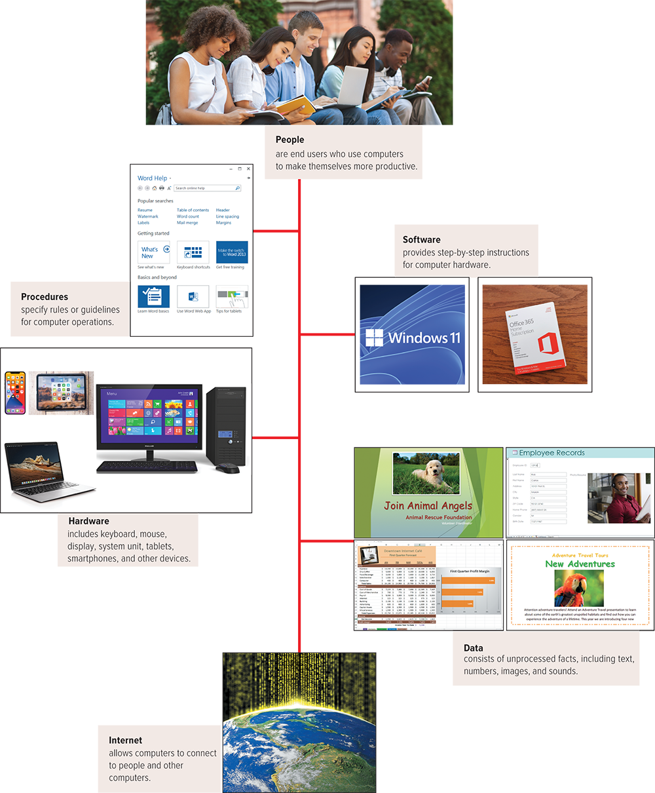

# Module 1 - Information Technology, The Internet, and You

<!-- TOC -->
* [Module 1 - Information Technology, The Internet, and You](#module-1---information-technology-the-internet-and-you)
* [General Notes](#general-notes)
* [Information Technology, The Internet, and You](#information-technology-the-internet-and-you)
  * [Dictionary](#dictionary)
  * [Information Systems](#information-systems)
  * [Software](#software)
    * [System Software](#system-software)
    * [Application Software](#application-software)
      * [General Purpose Applications](#general-purpose-applications)
      * [Specialized Applications](#specialized-applications)
      * [Mobile Apps](#mobile-apps)
  * [Hardware](#hardware)
    * [Types of Computers](#types-of-computers)
    * [Cell Phones](#cell-phones)
    * [Personal Computer Hardware](#personal-computer-hardware)
  * [Data](#data)
  * [Connectivity and The Mobile Internet](#connectivity-and-the-mobile-internet)
  * [Careers In IT](#careers-in-it)
* [Three Things To Keep You Safe Online](#three-things-to-keep-you-safe-online)
<!-- TOC -->

# General Notes

- [Free Antivirus](https://free.avg.com)

# Information Technology, The Internet, and You

## Software

There are two major kinds of software:

- System Software
- Application Software

### System Software

- The user interacts primarily with application software.
- System Software enables the application software to interact with the computer
  hardware.
    - System software is "background" software that helps the computer manage
      its
      own internal resources.

System software is not a single program, rather it is a collection of programs
including the following:

- **Operating Systems**
    - Programs that coordinate computer resources, provide an interface between
      users and the computer, and run applications.
    - Smartphones and many other mobile devices use **embedded operating
      systems**, also known as **real-time operating systems (RTOS)**.
    - Desktop computers use **stand-alone operating systems** like Windows 10 or
      MacOS
    - Networks use **network operating systems**.
- **Utilities**
    - Perform specific tasks related to managing computer resources.
    - One of the most essential utility programs for every computer system is an
      antivirus program.

### Application Software

Application software might be described as end-user software. Three types of
application software are:

- General-purpose
- Specialized
- Apps

#### General Purpose Applications

Used widely in nearly all career areas. They are the kinds of programs you have
to know to be considered an efficient and effective end user. Some of the best
known:

| Type                        | Description                                    |
|:----------------------------|:-----------------------------------------------|
| Word Processors             | Prepare written documents                      |
| Spreadsheets                | Analyze and summarize numerical data           |
| Database Management Systems | Organize and manage data and information       |
| Presentation Software       | Communicate a message or persuade other people |

#### Specialized Applications

Include thousands of other programs that are more narrowly focused on specific
disciplines and occupations. Two of the best known are graphics and web
authoring programs.

#### Mobile Apps

Also known as mobile applications, or just apps, are small programs primarily
designed for mobile devices such as smartphones and for tablets.

- The most popular apps are for social networking, playing games, and
  downloading music and videos.

## Hardware

Computers are electronic devices that can follow instructions to accept input,
process that input, and produce information.

- Much content covered focuses principally on personal computers.

### Types of Computers

There are four types of computers:

- **Supercomputers**
    - Special, high-capacity computers used by very large organizations.
    - Typically used to process massive amounts of data.
    - IBM's Blue Gene supercomputer is one of the fastest computers in the
      world.
- **Mainframe Computers**
    - Occupy specially wired, air-conditioned rooms.
    - Not as powerful as a supercomputer, but capable of great processing speeds
      and
      data storage.
    - Insurance companies use mainframes to process information about millions
      of
      policyholders.
- **Midrange Computers**
    - Also known as **servers**.
    - Less processing power than a mainframe computer, but more than a personal
      computer.
- **Personal Computers**
    - Least powerful, yet most widely used and fastest-growing type of computer.
    - There are five types of personal computers:
        - Desktops
        - Laptops
        - Tablets
        - Smartphones
        - Wearables

### Cell Phones

The cell phone is a computer and has many of the same components as desktops,
laptops, and tablets.

### Personal Computer Hardware

Physical equipment falls into four basic categories:

1. **System Unit**

- Container that houses most of the electronic components that make up a
  computer system.
- Two important components of the system unit are:
    - Microprocessors
        - Controls and manipulates data to produce information.
    - Memory
        - A holding area for data, instructions, and information.
        - **RAM** is an example of memory that holds the program and data that
          are
          currently being processed.

2. **Input / Output**

- Translate data nad programs that humans can understand into a form that the
  computer can process.
- **Output devices** translate the processed information from the computer into
  a form that humans can understand.
    - The most common output device is the **display / monitor**.

3. **Secondary Storage**

- Unlike memory, secondary storage holds data and programs even after electric
  power to the computer system has been turned off. The most important kinds
  of secondary media are:
    - Hard Disks
    - Solid-state Storage
    - Optical Discs
- **Hard Disks** Use rigid metallic platters and read/write heads that move
  across the platters. Data and information are stored in magnetic charges on
  the disk's surface.
    - **Solid-state storage** does not have any moving parts, is more reliable,
      and requires less power. It saves data and information electronically,
      similar to RAM, except that it is not volatile.
- **Optical discs** use laser technology to store data and programs. Three types
  optical discs:
    - **Compact Discs (CD)**
    - **Digital Versatile (or Video) (DVDs)**
    - **Blu-ray Discs (BD)**

4. **Communication**

- Computers use **communication devcies** to routinely communicate with other
  computer systems.
    - A **modem** is a widely used communication device that modifies audio,
      video,
      and other types of data into a form that can be transmitted across the
      internet.

## Data

Data is raw, unprocessed facts, including text, numbers, images, and sound.

When stored electronically in files, data can be used directly as input for the
system unit.

Common filetypes:

- Document files
- Worksheet files
- Database files
- Presentation files

## Connectivity and The Mobile Internet

Connectivity is the capability of your personal computer to share information
with other computers.

- Central to the concept of connectivity is the network.

Three things that are driving the impact of technology on our lives:

- **Cloud Computing**
- **Wireless Communication**
- **Internet of Things**

## Careers In IT

| Career                      | Description                                                                                       |
|-----------------------------|---------------------------------------------------------------------------------------------------|
| Web Developer               | Develops and maintains websites and web resources.                                                |
| Software Engineer           | Analyzes users' needs and creates application software.                                           |
| Computer Support Specialist | Provides technical support to customers and other users.                                          |
| Computer Technician         | Repairs and installs computer components and systems.                                             |
| Technical Writer            | Prepares instruction manuals, technical reports, and other scientific or technical documents. |
| Network Administrator       | Creates and maintains computer networks.                                                          |

# Three Things To Keep You Safe Online

- Article 1: <https://www.getsafeonline.org/protecting-your-computer/>
- Article 2: <https://usa.kaspersky.com/resource-center/preemptive-safety/top-10-internet-safety-rules-and-what-not-to-do-online>
- Article 3: <https://edu.gcfglobal.org/en/internetsafety/creating-strong-passwords/1/>
- Article 4: <https://www.nortonsecurityonline.com/security-center/safety-tips-using-public-computer.html>
