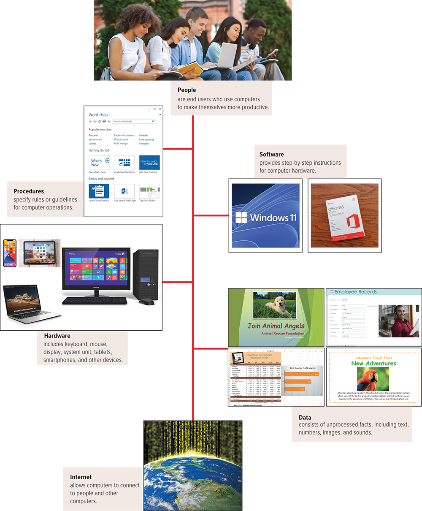

# Module 1 - Information Technology, The Internet, and You

# Table of Contents

- [General Notes](#general-notes)
- [Information Technology, The Internet, and You](#information-technology-the-internet-and-you)
  - [Dictionary](#dictionary)
  - [Information Systems](#information-systems)
  - [Software](#software)
    - [System Software](#system-software)
    - [Application Software](#application-software)
  - [Hardware](#hardware)
    - [Types of Computers](#types-of-computers)
    - [Cell Phones](#cell-phones)
    - [Personal Computer Hardware](#personal-computer-hardware)
  - [Data](#data)
  - [Connectivity and The Mobile Internet](#connectivity-and-the-mobile-internet)
  - [Careers In IT](#careers-in-it)
- [Three Things To Keep You Safe Online](#three-things-to-keep-you-safe-online)

# General Notes

- [Free Antivirus](https://free.avg.com)

# Information Technology, The Internet, and You

## Dictionary

- **App:** _See Application software._
- **Application Software:** Also referred to as apps. Software that can perform
  useful work, such as word processing, cost estimating, or accounting tasks.
  The user primarily interacts with application software.
- **Blue-ray Disc (BD):** A type of high-definition disc with a capacity of 25
  to 50 gigabytes.
- **Cloud Computing:** Data stored at a server on the Internet and available
  anywhere the Internet can be accessed.
- **Communication Device:** Computer systems that communicate with other
  computer systems using modems. For example, it modifies computer output into a
  form that can be transmitted across standard telephone lines.
- **Compact Disk (CD):** Widely used optical disc format. It holds 650 MB
  (megabytes) to 1 GB (gigabyte) of data on one side of the CD.
- **Connectivity:** Capability of the personal computer to use information from
  the world beyond one’s desk. Data and information can be sent over telephone
  or cable lines and through the air so that computers can talk to each other
  and share information.
- **Data:** Raw, unprocessed facts that are input to a computer system that will
  give compiled information when the computer processes those facts.
    - Data is also defined as facts or observations about people, places,
      things,
      and events.
- **Database File:** File containing highly structured and organized data
  created by database management programs.
- **Desktop Computer:** Computer small enough to fit on top of or along the side
  of a desk and yet too big to carry around.
- **Digital Versatile Disc (DVD):** A type of optical disc similar to CD-ROMs
  except that more data can be packed into the same amount of space. See also
  DVD (digital versatile disc).
- **Display:** Output device like a television screen that displays data
  processed by the computer.
    - Same as **Monitor**.
- **Document File:** File created by a word processor to save documents such as
  letters, research papers, and memos.
- **Embedded Operating System:** An operating system that is completely stored
  within the ROM (read-only memory) of the device that it is in; used for
  handheld computers and smaller devices like PDAs. Also known as a
  **real-time operating system (RTOS)**.
- **End Users:** Person who uses personal computers or has access to larger
  computers.
- **Hard Disk:** Enclosed disk drive containing one or more metallic disks. Hard
  disks use magnetic charges to record data and have large storage capacities
  and fast retrieval times.
- **Hardware:** Equipment that includes a keyboard, monitor, printer, the
  computer itself, and other devices that are controlled by software
  programming.
- **Information System:** Collection of hardware, software, people, data, and
  procedures that work together to provide information essential to running an
  organization
- **Information Technology (IT):** Computer and communication technologies,
  such as communication links to the Internet, that provide help and
  understanding to the end user.
- **Internet of Things (IoT):** Continuing development of the Internet that
  allows everyday objects embedded with electronic devices to send and receive
  data over the Internet.
- **Internet:** A huge computer network available to everyone with a personal
  computer and a means to connect to it. It is the actual physical network made
  up of wires, cables, and satellites as opposed to the web, which is the
  multimedia interface to resources available on the Internet.
- **Keyboard:** Input device that looks like a typewriter keyboard but has
  additional keys.
- **Laptop Computer:** Portable computer, also known as a notebook computer,
  weighing between 4 and 10 pounds.
- **Mainframe Computer:** This computer can process several million program
  instructions per second. Sizable organizations rely on these room-size systems
  to handle large programs and a great deal of data.
- **Memory:** Memory is contained on chips connected to the system board and is
  a holding area for data instructions and information (processed data waiting
  to be output to secondary storage). RAM, ROM, and CMOS are three types of
  memory chips.
- **Microprocessor:** The central processing unit (CPU) of a personal computer
  controls and manipulates data to produce information. The microprocessor is
  contained on a single integrated circuit chip and is the brains of the system.
  Also known as a processor.
- **Midrange Computer:** Refrigerator-sized machines falling in between personal
  computers and mainframes in processing speed and data-storing capacity.
  Medium-sized companies or departments of large companies use midrange
  computers.
- **Mobile Apps (Application):** Add-on features for a variety of mobile
  devices, including smartphones, netbooks, and tablets.
- **Modem:** Short for modulator-demodulator. It is a communication device that
  translates the electronic signals from a computer into electronic signals that
  can travel over telephone lines.
- **Mouse:** Device that typically is moved across the desktop and directs the
  cursor on the display screen.
- **Network:** The arrangement in which various communications channels are
  connected through two or more computers. The largest network in the world is
  the Internet.
- **Networking Operating System (NOS):** Interactive software between
  applications and computers coordinating and directing activities between
  computers on a network. This operating system is located on one of the
  connected computers’ hard disks, making that system the network server.
- **Notebook Computer:** _See Laptop and Laptop computer._
- **Operating System (OS):** Software that interacts between application
  software and the computer, handling such details as running programs,
  storing and processing data, and coordinating all computer resources,
  including attached peripheral devices.
- **Optical Disk:** Storage device that can hold over 17 gigabytes of data,
  which is the equivalent of several million typewritten pages. Lasers are used
  to record and read data on the disc. The three basic types of optical discs
  are compact discs (CDs), digital versatile or video discs (DVDs), and Blu-ray
  discs (BDs).
- **Output Device:** Equipment that translates processed information from the
  central processing unit into a form that can be understood by humans. The most
  common output devices are monitors and printers.
- **People:** End users who use computers to make themselves more productive.
- **Presentation File:** A file created by presentation software to save
  presentation materials. For example, a file might contain audience handouts,
  speaker notes, and electronic slides.
- **Procedure:** Rule or guideline to follow when using hardware, software, and
  data.
- **Program:** Instructions for the computer to follow to process data. See
  _also_ Software.
- **Random-access Memory (RAM):** Volatile, temporary storage that holds the
  program and data the CPU is presently processing. It is called temporary
  storage because its contents will be lost if electrical power to the computer
  is disrupted or the computer is turned off.
- **Real-time Operating System (RTOS):** _See Embedded Operating System_
- **Secondary Storage:** Permanent storage used to preserve programs and data
  that can be retained after the computer is turned off. These devices include
  hard disks, magnetic tape, CDs, DVDs, and more.
- **Server:** A host computer with a connection to the Internet that stores
  document files used to display web pages. Depending on the resources shared,
  it may be called a file server, printer server, communication server, web
  server, or database server.
- **Smartphone:** A type of cell phone that offers a variety of advanced
  functionality, including Internet and e-mail.
- **Software:** Computer program consisting of step-by-step instructions,
  directing the computer on each task it will perform.
- **Specialized Applications:** Program that are narrowly focused on specific
  disciplines and occupations. Some of the best known are multimedia, web
  authoring, graphics, virtual reality, and artificial intelligence.
- **Stand-alone Operating System:** Also called desktop operating system; a
  type of operating system that controls a single desktop or notebook computer.
- **Supercomputer:** Fastest calculating device ever invented, processing
  billions of program instructions per second. Used by very large organizations
  like NASA.
- **System Software:** “Background” software that enables the application
  software to interact with the computer. System software consists of the
  operating system, utilities, device drivers, and language translators.
  It works with application software to handle the majority of technical
  details.
- **System Unit:** Part of a personal computer that contains the CPU. Also known
  as the system cabinet or chassis, it is the container that houses most of the
  electronic components that make up the computer system.
- **Tablet:** A type of personal computer that contains a thin system unit, most
  of which is the monitor.
- **Virus:** Hidden instructions that migrate through networks and operating
  systems and become embedded in different programs. They may be designed to
  destroy data or simply to display messages.
- **Wearable Device:** A type of mobile computer such as Apple’s Watch that
  contains an embedded computer chip. Also known as a smartwatch.
- **Web:** Prior to the introduction of the web in 1992, the Internet was all
  text. The web made it possible to provide a multimedia interface that includes
  graphics, animations, sound, and video.
- **Wireless Communication:** The revolutionary way we now communicate on
  devices like tablets, smartphones, and wearable devices.
- **Wireless revolution:** A revolution that is expected to dramatically affect
  the way we communicate and use computer technology.
- **Worksheet File:** Created by electronic spreadsheets to analyze things like
  budgets and to predict sales.

## Information Systems

A personal computer is part of an **Information System**, and an information
system
has many parts:

- **People**
    - The most important part of an information system.
- **Procedures**
    - Typically documented in manuals written by computer specialists. Software
      and hardware manufacturers provide manuals with their products, typically
      in
      printed or electronic form.
- **Software**
    - Another name for a program or programs. Programs are the instructions that
      tell the computer how to process data into the form you want. In most
      cases,
      the words _software_ and _programs_ are interchangeable.
- **Hardware**
    - Equipment that processes the data to create information.
- **Data**
- **Internet**
    - Almost all information systems provide a way to connect to other people
      and
      computers, typically using the internet.

## Software

There are two major kinds of software:

- System Software
- Application Software

### System Software

- The user interacts primarily with application software.
- System Software enables the application software to interact with the computer
  hardware.
    - System software is "background" software that helps the computer manage
      its
      own internal resources.

System software is not a single program, rather it is a collection of programs
including the following:

- **Operating Systems**
    - Programs that coordinate computer resources, provide an interface between
      users and the computer, and run applications.
    - Smartphones and many other mobile devices use **embedded operating
      systems**, also known as **real-time operating systems (RTOS)**.
    - Desktop computers use **stand-alone operating systems** like Windows 10 or
      MacOS
    - Networks use **network operating systems**.
- **Utilities**
    - Perform specific tasks related to managing computer resources.
    - One of the most essential utility programs for every computer system is an
      antivirus program.

### Application Software

Application software might be described as end-user software. Three types of
application software are:

- General-purpose
- Specialized
- Apps

#### General Purpose Applications

Used widely in nearly all career areas. They are the kinds of programs you have
to know to be considered an efficient and effective end user. Some of the best
known:

| Type                        | Description                                    |
|:----------------------------|:-----------------------------------------------|
| Word Processors             | Prepare written documents                      |
| Spreadsheets                | Analyze and summarize numerical data           |
| Database Management Systems | Organize and manage data and information       |
| Presentation Software       | Communicate a message or persuade other people |

#### Specialized Applications

Include thousands of other programs that are more narrowly focused on specific
disciplines and occupations. Two of the best known are graphics and web
authoring programs.

#### Mobile Apps

Also known as mobile applications, or just apps, are small programs primarily
designed for mobile devices such as smartphones and for tablets.

- The most popular apps are for social networking, playing games, and
  downloading music and videos.

## Hardware

Computers are electronic devices that can follow instructions to accept input,
process that input, and produce information.

- Much content covered focuses principally on personal computers.

### Types of Computers

There are four types of computers:

- **Supercomputers**
    - Special, high-capacity computers used by very large organizations.
    - Typically used to process massive amounts of data.
    - IBM's Blue Gene supercomputer is one of the fastest computers in the
      world.
- **Mainframe Computers**
    - Occupy specially wired, air-conditioned rooms.
    - Not as powerful as a supercomputer, but capable of great processing speeds
      and
      data storage.
    - Insurance companies use mainframes to process information about millions
      of
      policyholders.
- **Midrange Computers**
    - Also known as **servers**.
    - Less processing power than a mainframe computer, but more than a personal
      computer.
- **Personal Computers**
    - Least powerful, yet most widely used and fastest-growing type of computer.
    - There are five types of personal computers:
        - Desktops
        - Laptops
        - Tablets
        - Smartphones
        - Wearables

### Cell Phones

The cell phone is a computer and has many of the same components as desktops,
laptops, and tablets.

### Personal Computer Hardware

Physical equipment falls into four basic categories:

1. **System Unit**

- Container that houses most of the electronic components that make up a
  computer system.
- Two important components of the system unit are:
    - Microprocessors
        - Controls and manipulates data to produce information.
    - Memory
        - A holding area for data, instructions, and information.
        - **RAM** is an example of memory that holds the program and data that
          are
          currently being processed.

2. **Input / Output**

- Translate data nad programs that humans can understand into a form that the
  computer can process.
- **Output devices** translate the processed information from the computer into
  a form that humans can understand.
    - The most common output device is the **display / monitor**.

3. **Secondary Storage**

- Unlike memory, secondary storage holds data and programs even after electric
  power to the computer system has been turned off. The most important kinds
  of secondary media are:
    - Hard Disks
    - Solid-state Storage
    - Optical Discs
- **Hard Disks** Use rigid metallic platters and read/write heads that move
  across the platters. Data and information are stored in magnetic charges on
  the disk's surface.
    - **Solid-state storage** does not have any moving parts, is more reliable,
      and requires less power. It saves data and information electronically,
      similar to RAM, except that it is not volatile.
- **Optical discs** use laser technology to store data and programs. Three types
  optical discs:
    - **Compact Discs (CD)**
    - **Digital Versatile (or Video) (DVDs)**
    - **Blu-ray Discs (BD)**

4. **Communication**

- Computers use **communication devcies** to routinely communicate with other
  computer systems.
    - A **modem** is a widely used communication device that modifies audio,
      video,
      and other types of data into a form that can be transmitted across the
      internet.

## Data

Data is raw, unprocessed facts, including text, numbers, images, and sound.

When stored electronically in files, data can be used directly as input for the
system unit.

Common filetypes:

- Document files
- Worksheet files
- Database files
- Presentation files

## Connectivity and The Mobile Internet

Connectivity is the capability of your personal computer to share information
with other computers.

- Central to the concept of connectivity is the network.

Three things that are driving the impact of technology on our lives:

- **Cloud Computing**
- **Wireless Communication**
- **Internet of Things**

## Careers In IT

| Career                      | Description                                                                                       |
|-----------------------------|---------------------------------------------------------------------------------------------------|
| Web Developer               | Develops and maintains websites and web resources.                                                |
| Software Engineer           | Analyzes users' needs and creates application software.                                           |
| Computer Support Specialist | Provides technical support to customers and other users.                                          |
| Computer Technician         | Repairs and installs computer components and systems.                                             |
| Technical Writer            | Prepares instruction manuals, technical reports, and other scientific or technical documents. |
| Network Administrator       | Creates and maintains computer networks.                                                          |

# Three Things To Keep You Safe Online

- Article 1: <https://www.getsafeonline.org/protecting-your-computer/>
- Article 2: <https://usa.kaspersky.com/resource-center/preemptive-safety/top-10-internet-safety-rules-and-what-not-to-do-online>
- Article 3: <https://edu.gcfglobal.org/en/internetsafety/creating-strong-passwords/1/>
- Article 4: <https://www.nortonsecurityonline.com/security-center/safety-tips-using-public-computer.html>
