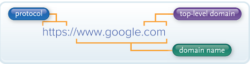

# Module 2

# Dictionary

- **Address:** Located in the header of an e-mail message; the e-mail
  address of the persons sending, receiving, and, optionally, anyone else
  who is to receive copies.
- **Advanced Research Project Agency Network (ARPANET):** A national
  computer network from which the Internet developed.
- **Attachment:** A file, such as a document or worksheet, that is
  attached to an e-mail message.
- **Bitcoin:** A form of digital cash. Bitcoin currency exists only on
  the Internet.
- **BitTorrent:** A peer-to-peer file-sharing protocol used for
  distributing large amounts of data over the Internet.
- **Blog:** A type of personal website where articles are regularly
  posted.
- **Browser:** Special Internet software connecting you to remote
  computers; opens and transfers files, displays text and images, and
  provides an uncomplicated interface to the Internet and web documents.
  Examples of browsers are Internet Explorer, Mozilla Firefox, and Google
  Chrome.
- **Business-to-business (B2B):** A type of electronic commerce that
  involves the sale of a product or service from one business to another.
  This is typically a manufacturer-supplier relationship.
- **Business-to-consumer (B2C):** A type of electronic commerce that
  involves the sale of a product or service to the general public or end
  users.
- **Cable:** Cords used to connect input and output devices to the
  system unit.
- **Cascading style sheets (CSS):** Files inserted into an HTML document
  that control the appearance of web pages, including layout, colors, and
  fonts.
- **Blog:** A type of personal website where articles are regularly
  posted.
- **Cloud computing:** Data stored at a server on the Internet and
  available anywhere the Internet can be accessed.
- **Consumer-to-consumer (C2C):** A type of electronic commerce that
  involves individuals selling to individuals.
- **Cryptocurrency:** A digital currency with no traditional cash
  equivalent. Cryptocurrencies use an encrypted public ledger, known as a
  blockchain, to ensure accuracy and security.
- **Deep fake:** Altering an individual’s appearance or message in a way
  designed to mislead others.
- **Desktop browser:** Browser designed for laptop and desktop computer.
- **Digital currency:** Currency for Internet purchases. Buyers purchase
  digital cash from a third party (a bank that specializes in electronic
  currency) by transferring funds from their banks.
- **Domain name:** The second part of the URL; it is the name of the
  server where the resource is located. For example, www.mtv.com.
- **Downloading:** Process of transferring information from a remote
  computer to the computer one is using.
- **Digital subscriber line (DSL):** Provides high-speed connection
  using existing telephone lines.
- **E-commerce:** Buying and selling goods over the Internet.
- **E-learning:** A web application that allows one to take educational
  courses online.
- **Electronic commerce (e-commerce):** Buying and selling goods over
  the Internet.
- **Electronic mail:** Transmission of electronic messages over the
  Internet. Also known as e-mail.
- **E-mail:** Allows you to communicate with anyone in the world who has
  an Internet address or e-mail account with a system connected to the
  Internet. You can include a text message, graphics, photos, and file
  attachments.
- **E-mail client:** A special program that communicates with the e-mail
  service provider and must be installed on the computer first.
- **Facebook:** One of the best-known social networking sites.
- **Fake news:** Information that is inaccurate or biased.
- **File transfer protocol (FTP):** Internet service for uploading and
  downloading files.
- **Filter:** (1) A filter blocks access to selected websites. (2) A
  filter will locate or display records from a table that fit a set of
  conditions or criteria when using programs like Excel.
- **Friend:** An individual on a list of contacts for an instant
  messaging server.
- **Groups:** In Microsoft Word, each tab is organized into groups that
  contain related items. In social media, communities of individuals who
  share a common interest.
- **Header:** A typical e-mail has three elements: header, message, and
  signature. The header appears first and includes addresses, subject, and
  attachments.
- **:** Hyperlink Connection or link to other documents or web pages
  that contain related information.
- **Hypertext Markup Language (HTML):** Programming language that
  creates document files used to display web pages.
- **Instagram:** Microblogging site designed to share images and videos
  posts, with little to no written content.
- **Instant messaging (IM):** A program allowing communication and
  collaboration for direct, “live” connections over the Internet between
  two or more people.
- **Internet:** A huge computer network available to everyone with a
  personal computer and a means to connect to it. It is the actual
  physical network made up of wires, cables, and satellites as opposed to
  the web, which is the multimedia interface to resources available on the
  Internet.
- **Internet of Things (IoT):** Continuing development of the Internet
  that allows everyday objects embedded with electronic devices to send
  and receive data over the Internet.
- **Internet security suite:** Collection of utility programs designed
  to make using the Internet easier and safer.
- **Internet service provider (ISP):** Provides access to the Internet.
- **JavaScript:** A scripting language that adds basic interactivity to
  web pages.
- **Link:** A connection to related information.
- **LinkedIn:** The premier business-oriented social networking site.
- **Location:** For browsers to connect to resources, locations or
  addresses must be specified. Also known as uniform resource locators or
  URLs.
- **Message:** The content portion of e-mail correspondence.
- **Microblog:** Publishes short sentences that only take a few seconds
  to write, rather than long stories or posts like a traditional blog.
- **Multimedia messaging service (MMS):** Supports the sending of
  images, video, and sound using text messaging.
- **Mobile browser:** Special browsers designed to run on portable
  devices.
- **News feed:** The first page you see after logging into a social
  networking site. It typically consists of a collection of recent posts
  from friends, trending topics on the site, people’s responses to your
  posts, and advertisements.
- **Online:** Being connected to the Internet is described as being
  online.
- **Page:** A social networking tool often used by companies to promote
  their business. These pages can include hours of operations, upcoming
  sales, and information about their products.
- **Podcast:** An Internet-based medium for delivering music and movie
  files from the Internet to a computer.
- **PHP:** A language often used within HTML documents to improve a
  website’s interactivity.
- **Profile:** A social networking tool used by individuals to share
  information and often include photos, personal details, and contact
  information.
- **Protocol:** Rules for exchanging data between computers. The
  protocol http:// is the most common.
- **Search engine:** Specialized programs assisting in locating
  information on the web and the Internet.
- **Search service:** Organization that maintains databases relating to
  information provided on the Internet and also provides search engines to
  locate information.
- **Secure file transfer protocol (SFTP):** See File transfer protocol.
- **Share setting:** A feature on social media accounts that determines
  who can see your social networking data.
- **Signature:** Provides additional information about a sender of an
  e-mail message, such as name, address, and telephone number.
- **SMS (short messaging service):** Texting or process of sending a
  short electronic message using a wireless network to another person.
- **Social networking:** Using the Internet to connect individuals.
- **Spam:** Unwelcome and unsolicited e-mail that can carry attached
  viruses.
- **Spam blocker:** Also referred to as spam filter. Software that uses
  a variety of different approaches to identify and eliminate spam or junk
  mail.
- **Spam filter:** See Spam blocker.
- **Spam blocker:** Also referred to as spam filter. Software that uses
  a variety of different approaches to identify and eliminate spam or junk
  mail.
- **Subject:** Located in the header of an e-mail message; a one-line
  description used to present the topic of the message.
- **Text messaging (texting):** The process of sending a short
  electronic message, typically fewer than 160 characters, using a
  wireless network to another person who views the message on a mobile
  device, such as a smartphone.
- **Top-level domain (TLD):** Last part of an Internet address;
  identifies the geographic description or organizational identification.
  For example, using www.aol.com, the .com is the top-level domain code
  and indicates it is a commercial site. See also Domain name.
- **Tweet:** A twitter message.
- **Twitter:** The most popular microblogging site that enables you to
  add new content from your browser, instant messaging application, or
  even a mobile phone.
- **Uniform resource locator (URL):** For browsers to connect you to
  resources on the web, the location or address of the resources must be
  specified. These addresses are called URLs.
- **Uploading:** Process of transferring information from the computer
  the user is operating to a remote computer.
- **Virus:** Hidden instructions that migrate through networks and
  operating systems and become embedded in different programs. They may be
  designed to destroy data or simply to display messages.
- **Web:** Prior to the introduction of the web in 1992, the Internet
  was all text. The web made it possible to provide a multimedia interface
  that includes graphics, animations, sound, and video.
- **Web 1.0:** The first generation of the web, which focused on linking
  existing information.
- **Web 2.0:** The second generation of the web, which evolved to
  support more dynamic content creation and social interaction.
- **Web 3.0:** The third generation of the web, which focuses on
  computer-generated information requiring less human interaction to
  locate and to integrate information.
- **Web 4.0:** The fourth generation of the web, which uses mobile
  devices to gather data and seamlessly inform and respond to the user’s
  needs.
- **Web 5.0:** The fifth generation of the web, which focuses on
  programs that can recognize and respond to a user’s emotional state.
- **Web auction:** Similar to traditional auctions except that all
  transactions occur over the web; buyers and sellers seldom meet face to
  face.
- **Web-based e-mail system:** An e-mail system that does not require an
  e-mail program to be installed on your computer.
- **Web-based e-mail system:** An e-mail system that does not require an
  e-mail program to be installed on your computer.
- **Webmail:** E-mail that uses a webmail client.
- **Webmail client:** A special program that runs on an e-mail
  provider’s computer that supports webmail.
- **Web developer:** Develops and maintains websites and web resources.
- **Web page:** Browsers interpret HTML documents to display web pages.
- **Web suffix:** Identifies type of organization in a URL.
- **Web utilities:** Specialized utility programs making the Internet
  and the web easier and safer. Some examples are plug-ins that operate as
  part of a browser and filters that block access and monitor use of
  selected websites.
- **Wiki:** A website that allows people to fill in missing information
  or correct inaccuracies on it by directly editing the pages.
- **Wikipedia:** An online encyclopedia, written and edited by anyone
  who wants to contribute.
- **Wireless modem:** Typically a small plug-in USB or ExpressCard
  device that provides very portable high-speed connectivity from
  virtually anywhere.
- **WWW (World Wide Web):** Provides a multimedia interface to the
  Internet. Also known as the web.

# General Notes

# The Internet and the Web

- The internet was launched in 1969 when the United States funded a project that
  developed a national computer network called **Advanced Research Project 
  Agency Network (ARPANET)**.
- **WWW** stands for **W**orld **W**ide **W**eb
- The web was introduced in 1991. Prior, the internet was all text.
  - The web allowed graphics, animations, sound, and video.

## Different Web Generations

- **Web 1.0** is defined by the use of search engines that connect everyone to
  web pages of interest.
  - Web pages were difficult to create and required a background in computers and
    programming.
- **Web 2.0** is defined by the use of social media that connect friends and
  family to social media posts about each others' lives.
- **Web 3.0** is defined by the innovation of the semantic web. The semantic web
  allows programs to identify the relationships between data.
  - Like Amazon's Alexa and Google Assistant can inform a user that a flight they
    are planning to take has been delayed. This is accomplished by identifying the
    relationship between a flight scheduled on your calendar and flight  delay
    information available on the Internet.
    - The content creator is now a computer program, and the content audience is 
      a single person - the user.
- **Web 4.0** called the mobile web, is defined by the use of mobile tools that
  provide new sources of information for programs to provide users with
  information. This is an extension of Web 3.0, where programs draw
  relationships among data to assist individuals, but now the information
  available to these programs includes the information gathered by mobile
  devices.
  - For example, your cell phone can provide your current location, or your
    smartwatch can report your heart rate. A program like Apple's Siri can use
    your current location, the location of your next calendar event, and local
    traffic reports on the Internet to alert you to leave early for an
    appointment because of a traffic jam between your current location and your
    next event.

We continue to see innovations in Web 1.00 and Web 2.0 technologies even as
Web 3.0 and Web 4.00 technologies are still being incorporated into our lives.

**Web 5.0** is on the horizon-called the emotional web, this generation may
include programs that anticipate our needs based on our moods and behaviors.

- This future is not yet realized, and the specifics of Web 5.0 are still to be determined.

## Internet Vs Web

The **internet** is the physical network. It is made up of wires, cables,
satellites, and rules for exchanging information between computers connected to
the network.

- Being connected to this network is often described as being online.
- The internet connects millions of computers and resources throughout the world.

The **web** is a multimedia interface to the resources available on the Internet.

# Internet Access

## Providers

**Internet Service Providers (ISP)** are already connected to the internet and
provide a path or connection for individuals to access the Internet.

- The mose widely used commercial Internet service providers use telephone
  lines, cable, and / or wireless connections.
- Some of the best known providers in the United States are:
  - AT&T
  - Comcast
  - Sprint
  - T-Mobile
  - Verizon

Users connect to ISPs using on of a variet of connection technologies including:

- **Digital Subscriber Line (DSL)**
- **Cable**
- **Wireless Modems**

## Browsers

Browsers provide access to web resources. These programs connect you to remote
computers; open and transfer files; display text, images, and multimedia; and
provide in one tool an uncomplicated interface to the internet and web
documents.

For browsers to connect to resources ,the **location** or **address** of the
resource must be specified. These addresses are called **uniform resource
locators (URLs)**. All URLs hav eat lesat two basic parts:

1. The first part presents the protocl used to connect to the resource.
   - The protocol _https_ is used for web traffic and is one of the most widely
     used Internet Protocols.
2. The second part presents the **domain name**. It indicates the specific
   address where the resource is located.
   - The last part of the domain following the dot (.) is the **top-level domain
     (TLD)**, also known as the **web suffix**.
     - For example, _.com_ indicates a commercial site.

Once the browser has connected to the website, a document file is sent back to
your computer. This document typically contains **Hypertext Markup Language
(HTML)**, a markup language for displaying web pages.

The browser interprets the HTML formatting instructions and displays the
document as a **web page**.

Various technologies are used to provide highly interactive and animated
websites:

- **JavaScript**
  - language often used within HTML documents to trigger interactive features,
    such as opening new browser windows and checking information entered in online
    forms.
- **PHP**
  - Like JavaScript, a language often used within HTML documents to improve a 
    website's interactivity. 
  - Unlike JavaScript, which typically executes on the user's computer, PHP
    executes on the website's computer.
- **Cascading Style Sheets (CSS)**
  - Separate files referenced by, or lines inserted into, an HTML document that
    controls the appearance of a web page.
  - CSS helps ensure that related web pages have a consistent presentation or
    look.

# Web Utilities

**Web Utilities** are specialized utility programs that make the Internet and
web easier and safer to use. Some of these utilities are browser-related
programs that either become part of your browser or are executed from your
browser, while others work as separate stand-alone applications.

- Common uses for web utilities include filtering content and transferring files.

## Filters

**Filters** block access to selected sites.

- Filter programs allow parents as well as organizations to block out selected
  sites and set time limits.
- These programs can monitor use and generate reports detailing the total time
  spent on the Internet and the time spent at individual websites.

Some well-known filters:

- [Net Nanny](https://netnanny.com)
- [Qustodio Parental Control](https://qustodio.com)
- [Circle with Disney](https://meetcircle.com)
- [Symantec Norton Family Premier](https://us.norton.com/norton-familypremier)

## File Transfer Utilities

- **Downloading:** Using file transfer utility software to copy files to your
  computer form specially configured servers.
- **Uploading:** Using file transfer utility software to copy files from your
  computer to another computer on the Internet.

Three popular types of file transfer are:

- **Web-based File Transfer Services**
  - Make use of a web browser to upload and download files.
  - Microsoft's onedrive and Google's Google drive
- **BitTorrent**
  - Distributes file transfers across many different computers for more efficient
    downloads, unlike other transfer technologies whereby a file is copied from
    one computer on the Internet to another.
  - A single file might be located on dozes of individual computers.
  - When you download the file, each computer sends you a tiny piece of the larger
    file, making BitTorrent well suited for transferring very large files.
- **File Transfer Protocol (FTP)** and **Secure File Transfer Protocol (SFTP)**
  - Allows you to efficient copy files to and from your computer across the
    Internet.
  - Frequently used for uploading changes to a website hosted by an ISP.
  - FTP has been used for decased and still remains one of the most popular 
    methods of file transfer.

## Internet Security Suites

- **Internet Security Suite:** A collection of utility programs designed to
  maintain your security and privacy while you are on the web.
  - These programs control spam, protect against computer viruses, provide
    filters, and much more.
  - It's more cost-efficient to buy the suite than each tool individually.

## Summary of Web Utilities

| Web Utility             | Description                                             |
|:------------------------|:--------------------------------------------------------|
| Filter                  | Blocks access to selected sites and sets time limits    |
| File Transfer           | Upload and download files from servers                  |
| Internet Security Suite | Collection of utility programs for security and privacy |

# Communication

Communication is the most popular Internet activity. Some popular types of
Internet communication are:

- Social Networking
- Blogs
- Microblogs
- Podcasts
- WIkis
- E-mail
- Messaging

On the internet, community etiquette rules are called **netiquette**, a
combination of _Internet_ and _etiquette_.

## Social Networking

**Social Networking** is one of the fastest-growing and most significant Web 2.0
applications. These sites typically provide a wide array of tools that
facilitate meeting, communicating, and sharing. Some common features:

- **Profiles** or **Pages**
- **Groups** and **friends**
- **News Feed**
- **Share Settings**

A social network often has an overall focus. 

- LinkedIn is a popular business-oriented social networking site.
- Facebook originally had a focus on connecting friends and family, but has
  expanded to include news sites, entertainment sites, and a powerful way for
  businesses and organizations to connect with their audience.

# Blogs, Microblogs, Podcasts, and Wikis

- Many individuals create personal websites, called **blogs**, to keep in touch
  with friends and family.
- Two of the most widely used blog tools are Blogger and WordPress
- **Microblogs** allow an individual or company to share posts with an audience,
  but are designed to be used with mobile devices and limit the size of posts.
  - Twitter
  - Instagram
- A **Wiki** is a website specifically designed to allow visitors to use their
  browser to add, edit, or delete the site's content.

## Messaging

Electronic messaging is a popular way to communicate quickly and efficiently 
with friends, family, and co--workers.

- Common on cell phones
- Messages are short and informal
- Instantaneous responses

Thw two most widely used forms of electronic messaging are **text** and
**Instant Messaging**.

## E-mail

**E-mail (electronic mail)** is used to communicate longer and more formal text.

- E-mail exchanges tend to take longer to write and are more carefully crafted
  than text message exchanges, making them ideal for business communications and
  newsletters.
- E-mails contain the four basic elements:
  - Header
  - Message
  - Signature
  - Attachment

There are two basic types of e-mail systems:

- Client-based
  - Require a special program called an **e-mail client** to be installed on
    the computer.
- Web-based
  - Once your computer browser connects to an e-mail service provider, a special
    program called a **webmail client** is run on the e-mail provider's computer
    and then you can begin e-mailing.
  - Known as **webmail**.

> CAN-SPAM antispam law requires that every marketing-related e-mail provide an
> opt-out option. When the option is selected, the recipient's e-mail address is
> to be removed from future mailing lists.

# Search Tools

**Search Services** are organizations that help you locate the information you
need on the internet.

## Search Engines

**Search engines** are specialized programs that assist you in locating
information on the web and the Internet. To find information, you go to a search
service's website and use its search engine.

# Electronic Commerce (E-Commerce)

There's three types of e-commerce:

- **Business-to-consumer (B2C)**
- **Consumer-to-consumer (C2C)**
  - Web auctions are an example
- **Business-to-business (B2B)**

## Security

- Some digital currencies like **bitcoin** has no traditional cash equivalent,
  and their transactions do not involve third-party banks. SUch a currency is
  called a **cryptocurrency**.
  - Cryptocurrencies use public ledgers, known as blockchains, to record all
    transactions of the cryptocurrency.

# Cloud Computing

**Cloud computing** uses the internet and the web to shift many of application
programs from the user's computer to other computers on the Internet.

# The Internet of Things

**The Internet of THings (IoT)** is the continuing development of the Internet
that allows everyday objects embedded with electronic devices to send and
receive data over the Internet. These everyday objects include:

- Cell phones
- Wearable devices
- Coffee makers

# Careers in IT

**Web Developers** develop and maintain websites and resources.

- The job may include backup of the company website, updating of resources, or
  development of new resources.
- Web developers are often involved in the design and development of the website.
- Some web developers monitor traffic on the site and take steps to encourage
  users to visit the site.
- Web developers also may work with marketing personnel to increase site traffic
  and may be involved in the development of web promotions.

# What To Do When You Lose Something

- Article 1: <https://www.vivint.com/resources/article/keyless-entry-to-avoid-the-stress-of-losing-your-keys>
- Article 2: <https://emeraldlocksmithllc.com/blog/what-to-do-if-you-lose-your-home-keys/>
- Article 3: <https://www.wisebread.com/10-things-you-should-do-immediately-after-losing-your-wallet>
- Article 4: <https://www.inc.com/guides/2010/12/what-to-do-when-you-lose-your-computer.html>
- Article 5: <https://support.apple.com/en-us/HT201472>
- Article 6: <https://www.hongkiat.com/blog/lost-android-phone-what-to-do/>

## Lost Car / Home Keys

1. Contact your insurance companyChange your locks
2. Call the police
3. Change your locks
   - _Applies only to Keyless entry locks for homes and automatic locks for cars_
4. Watch out for locksmith scams

## Lost Home Keys

1. Use your spare key
2. Find another entry route
3. Try to circumvent your door
4. Hire the services of a professional technician
5. Protective measures to take if you lose your home keys
6. Change your locks
7. Rekey your locks
8. Cut new keys
9. Opt for keyless lock system
10. Get a home insurance

## Lost Wallet

1. First of All, Is It Actually Lost or Stolen, or Just Misplaced?
2. Call the Issuers of Your Credit, Debit, and ATM Cards
3. Put a Fraud Alert or Credit Freeze on Your Accounts
4. Report the Loss or Theft to the Local Authorities
5. Go to Your Local DMV to Report Your Missing Driver’s License
6. If Keys Are Missing, Change the Locks
7. If Your Social Security Card Is Missing, Inform the Authorities
8. Try to List Everything Else That Was in the Wallet
9. Order Credit Reports
10. Replace the Wallet With a New One

Some steps you can take to prepare before you lose your wallet:

- Strip Your Wallet of Anything You Don’t Really Need
- Scan or Photocopy Everything That’s in Your Wallet
- Try a “Lost Wallet” App

## Lost Computer

1. Change Your Passwords
2. Check the Lost-and-Found
3. Make Clients Aware 
4. Utilize Computer Tracking  
5. Invest in an Online Backup Service

## Lost Apple Product (iPhone, iPad, iPod)

1. Look for your device on a map
2. Mark as Lost
3. Report your missing device to local law enforcement
4. File a Theft and Loss claim
5. Remotely erase your device
6. Contact your wireless carrier
7. Remove your missing device from your account

## Lost Android

Four things you should immediately do:

1. Track your Android
2. Secure your Accounts
3. Block SIM Card
4. Unlink your accounts on Android

How to keep your device safe:

1. Always Enable Tracking Location
2. Always Enable Your Mobile Internet Data
3. Use A Lock Screen
4. Disable the Physical Power Button
5. Use Android Phones with Non-Removable Batteries
6. Backup your Data
