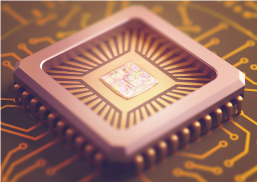

# Module 5 - The System Unit

<!-- TOC -->
* [Module 5 - The System Unit](#module-5---the-system-unit)
* [General Notes](#general-notes)
* [System Unit](#system-unit)
  * [Smartphones](#smartphones)
  * [Tablets](#tablets)
  * [Laptops](#laptops)
  * [Desktops](#desktops)
  * [Wearable Computers](#wearable-computers)
  * [Components](#components)
* [System Board](#system-board)
    * [Sockets](#sockets)
    * [Slots](#slots)
    * [Bus Lines](#bus-lines)
* [Microprocessor](#microprocessor)
  * [Microprocessor Chips](#microprocessor-chips)
    * [Popular Mobile Microprocessors](#popular-mobile-microprocessors)
    * [Popular Desktop Microprocessors](#popular-desktop-microprocessors)
  * [Specialty Processors](#specialty-processors)
* [Memory](#memory)
  * [RAM](#ram)
  * [ROM](#rom)
  * [Flash Memory](#flash-memory)
* [Expansion Cards and Slots](#expansion-cards-and-slots)
* [Bus Lines](#bus-lines-1)
  * [Expansion Buses](#expansion-buses)
* [Ports](#ports)
  * [Standard Ports](#standard-ports)
  * [Specialized Ports](#specialized-ports)
  * [Cables](#cables)
* [Power Supply](#power-supply)
* [Electronic Data and Instructions](#electronic-data-and-instructions)
  * [Numeric Representation](#numeric-representation)
  * [Character Encoding](#character-encoding)
* [Careers in IT](#careers-in-it)
  * [Brain - Computer Interfaces](#brain---computer-interfaces)
<!-- TOC -->

# General Notes

# System Unit

**System Unit**: The container that houses most of the electronic components
that make up a computer system.

- Also known as the **system chassis**
- Some are located in a separate case, whereas others share a case with other
  parts of the computer system.

<u>The five most common types of personal computers:</u>

- Cell phones
- Tablets
- Laptops
- Desktops
- Wearable computers

## Smartphones

- Smartphones are almost all monitor, with the system unit, secondary storage,
  and all electronic components located behind the monitor.

## Tablets

- Also known as **tablet computers**
- Cannot be connected to phone networks
- The smallest tablets _(mini tablets)_ are a little larger than the largest
  cell phones.

## Laptops

- Laptops have their system units housed with selected secondary storage and
  input devices.
- Their monitors are separate from the rest of the computer, attached to the
  system unit with a hinge.
- Specialized laptops:
    - **Two-in-on laptops**
        - 
        - Include a touchscreen and the ability to fold flat like a tablet
          computer.
    - **Gaming laptops**
        - Include high-end graphics hardware and very fast processors.
    - **Ultrabooks**
        - 
        - Also known as **ultra-portables** or **mini notebooks**
        - Lighter and thinner with longer battery life than most laptops.

## Desktops

- Most powerful type of personal computer.
- **all-in-one desktops** have their monitor and system unit housed together in
  the same case.
- Desktop system units that are in a separate case and are vertically places are
  referred to as a **tower unit** or **tower computer**.

## Wearable Computers

- Also known as a **wearable device**.
- One of the first evolutionary steps to the Internet of Things (IoT)
- Contain an embedded computer on a chip.
- The most common wearable computers are smartwatches and activity trackers.
    - **Smartwatches** like Apple's Watch act as a watch, fitness monitor, and
      communication device.
    - **Activity Trackers** like Garmin Vivoactive 4 monitors daily exercise and
      sleep patterns.
        - Also connects wirelessly to desktops, laptops, and smartphones to
          record
          and share their data.

## Components

Personal computers (cell phones, laptops, tablets, wearables, and desktops) all
share the same components:

- System boards
- Microprocessors
- Memory

# System Board

The **System board** controls communications for the entire computer system. All
devices and components connect to the system board, including external devices
and internal components.

- Also known as the **mainboard** or **motherboard**
- A flat circuit board covered with a variety of electric components:
    - sockets
    - slots
    - bus lines

The system board acts as a data path and traffic monitor, allowing the various
components to communicate efficiently with one another.

- Located behind the screen for cell phones, tablets, and wearable computers
- Located at the bottom of the system unit or along one side for laptops and
  desktops.

- _Chip mounted onto a chip carrier_

### Sockets

Provide a connection point for small electronic parts called chips.

- **Chips** consist of tiny circuit boards etched onto squares of sandlike
  material called silicon.
    - Also called a **silicon chip**, **semiconductor**, or 
      **integrated circuit**.
    - Typically mounted onto **chip carriers** that plug directly into sockets
      on the system board or onto cards that are then plugged into slots on the
      system board.
- Sockets are used to connect the system board to a variety of different types
  of chips.

### Slots

Slots provide a connection point for specialized cards or circuit boards.

- The cards, such as a wireless networking card, provide expansion capability
  for a computer system.

### Bus Lines

Bus lines provide pathways that support communication among the various
electronic components that are either located on the system board or attached to
the system board.

# Microprocessor

The **central processing unit (CPU)** or **processor** is contained on a single
chip called the **microprocessor**.

- _brains_ of the computer.

The CPU has two basic components:

- **Control Unit**
    - Tells the rest of the computer system how to carry out a program's
      instructions.
    - Directs the movement of electronic signals between memory, which
      temporarily
      holds data, instructions, and processed information, and the
      arithmetic-logic unit.
    - Also directs these control signals between th CPU and input / output
      devices.
- **Arithmetic-logic Unit**
    - Usually called the **ALU**.
    - Performs **arithmetic** and **logical** operations.
        - **Arithmetic operation:** Fundamental math operation such as addition,
          subtraction, multiplication, or division.
        - **Logical operation:** Consist of comparisons such as: **=**, **<**, *
          *>**.

## Microprocessor Chips

There are two major categories for microprocessors developed today:

- Mobile
    - Used in cell phones and tablets.
- Desktop
    - Used in computers and laptops.

Chip processing capabilities are expressed in **word*** sizes.

- A **word** is the number of bits (32 or 64) that can be accessed at one time
  by a CPU
- Eight bits group together to form a byte.
- A 32-bit computer can access 4 bytes at a time.
- A 64-bit computer can access 8 bytes at a time.

### Popular Mobile Microprocessors

| Processor      | Manufacturer |
|:---------------|:-------------|
| A14 Bionic     | Apple        |
| Snapdragon 888 | Qualcomm     |
| Exynos 2100    | Samsung      |

### Popular Desktop Microprocessors

| Processor  | Manufacturer |
|:-----------|:-------------|
| Ryzen 5000 | AMD          |
| M1         | Apple        |
| Alder Lake | Intel        |

---

The **clock speed** of a microprocessor is related to the number of times a CPU
can fetch and process data or instructions in a second.

- Older personal computers process data and instructions in millionths of a
  second, or microseconds
- Modern personal computers process data and instructions in billionths of a
  second, or nanoseconds.
- Supercomputers operate at speeds measured in picoseconds (1000 times faster
  than personal computers).
- In the future, we can expect speeds measuring in femtoseconds (1000 times
  faster than a supercomputer).

Some microprocessors can handle multiple instructions per cycle or tick of the
clock; This means that speed comparisons can only be made between processors
that work the same way.

|    Unit     | Speed                     |
|:-----------:|:--------------------------|
| Microsecond | Millionth of a second     |
| Nanosecond  | Billionth of a second     |
| Picosecond  | Trillionth of a second    |
| Femtosecond | Quadrillionth of a second |

**Multicore processors** provide two or more separate and independent CPUs.

- For multicore processors to be used effectively, computers divide tasks into
  parts that can be distributed across each core - an operation called
  **parallel processing**.

## Specialty Processors

**Coprocessors** (a popular specialty processor) are specialty chips designed to
improve specific computing operations.

- A standard feature in gaming computers is a **graphics coprocessor** _(also
  known as a **GPU [Graphics Processing Unit]**)_
    - Designed to handle specialized tasks such as displaying 3D images and
      encrypting data.
- Many cars have more than 100 separate specialty processors to control nearly
  everything from fuel efficiency to satellite entertainment and tracking
  systems.
- Most cell phones and tablets have specialty processors to efficiently show and
  store videos.

# Memory

Memory is a holding area for data, instructions, and information.

- Memory is contained on chips connected to the system board.

There are three types of memory chips:

- **Random-access memory (RAM)**
- **Read-only memory (ROM)**
- **Flash memory**

| Type  | Use                            |
|:------|:-------------------------------|
| RAM   | Programs and data              |
| ROM   | Fixed start-up instructions    |
| Flash | Flexible start-up instructions |

## RAM

RAM chips hold the program (sequence of instructions) and data that the CPU is
presently processing.

- Temporary or volatile storage because everything in most types of RAM is lost
  when the computer turns off (by any means).

- _RAM chips mounted on circuit board_

**Cache memory** improves processing by acting as a temporary high-speed holding
area between the memory and the CPU.

- The computer detects which information in RAM is most frequently used and then
  copies that information into the cache.
- When needed, the CPU can quickly access the information from the cache.

| Unit          | Capacity            |
|:--------------|:--------------------|
| Megabyte (MB) | 1 Million bytes     |
| Gigabyte (GB) | 1 Billion bytes     |
| Terabyte (TB) | 1 Trillion bytes    |
| Petabyte (PB) | 1 Quadrillion bytes |

If your computer does not have enough RAM to hold a program, it might be able to
run the program using **virtual memory**.

- With virtual memory, large programs are divided into parts, and the parts arc
  stored on a secondary device, usually a hard disk.
- Each part is then read into RAM only when needed. In this way, computer
  systems are able to run very large programs.

## ROM

ROM chips have information stored in them by the manufacturer.

- Not volatile.
- Cannot be changed by the user.
- Computer can read or retrieve data and programs write on the ROM chip, but
  not write - encode or change - the information or instructions in the ROM.

## Flash Memory

Offers a combination of features of RAM and ROM.

- Can be updated with new information that does not get lost when power is
  turned off.
- Used to store the start-up instructions for a computer.
    - Information is called the system's **BIOS (Basic input/output system)**.
    - Includes specifics concerning the amount of RAM, the type of keyboard,
      mouse,
      and secondary storage devices connected to the system unit.
    - Changes made to the computer system are reflected in flash memory.

# Expansion Cards and Slots

- **SD cards** are examples of expansion cards.
- Many personal computers allow users to expand their systems by providing
  expansion slots to the system board.

Some commonly used expansion cards:

- Graphics cards
- Network Interface Cards (NIC)
    - Network adapter cards
    - Used to connect a computer to a network
- Wireless network cards

# Bus Lines

A **Bus line** is known as a **bus**. A bus is a pathway for bits representing
data and instructions.

- The number of bits that can travel simultaneously down a bus is known as the
  **bus width**.
    - A 64-bit bus can move twice as much information at a time as a 32-bit bus.
- Many devices, such as expansion cards, will work with only one type of bus.
- Buses link the parts of the CPU to each other.
- Buses also link the CPU to various other components on the system board.

Every computer system has two basic categories of buses:

- **System buses**
    - Connects the CPU to memory on the system board.
- **Expansion buses**
    - Connects the CPU to other components on the system board, including
      expansion
      slots.

## Expansion Buses

Computer systems usually have a combination of different types of expansion
buses:

- **USB**
    - External USB devices are connected from one another to a common point or
      hub
      and then onto the USB bus.
    - USB bus then connects to the PCI bus on the system board.
    - Current USB standard is USB 3.4
- **FireWire**
    - Similar to USB buses, but more specialized. Primarily used to connect
      audio
      and video equipment to the system board.
- **PCI Express (PCIe)**
    - Does not share a single bus line or path with several devices like other
      buses, instead providing a single dedicated path for each connected
      device.

# Ports

A **port** is a socket for external devices to connect to the system unit.

- Cell phones use ports to recharge their batteries.
- Some ports connect directly to the system board, while others connect to cards
  that are inserted into slots on the system board.
- Some ports are standard, others are more specialized.

## Standard Ports

Most desktops and laptops come with a standard set of ports for connecting
**peripherals**, or external devices, such as a monitor and keyboard.

The most common ports are:

- **Universal Serial Bus (USB)** Ports
- **USB-A**
- **USB-B**
    - Found on peripheral devices, like digital cameras and cell phones.
- **USB-C**
    - Newest USB port
    - Some support **Thunderbolt 3**, a high-speed version of the USB-C port.
- **High Definition Multimedia Interface (HDMI) Ports**
    - Provide high-definition video and audio.
- **Ethernet Ports**
    - Allows connecting multiple computers, or to a DSL or cable modem

## Specialized Ports

The most common speciality ports:

- **DisplayPorts (DP)**
    - Audiovisual ports usually used to connect large monitors.
- **DVI (Digital Video Interface)**
    - Only send video signals and cannot send audio signals.
    - Connect digital monitors to your computer.
- **FireWire Ports**
    - Provide high-speed connections to specialized FireWire devices such as
      camcorders and storage devices.

## Cables

Standard cables:

- USB
- HDMI
- Thunderbolt
- Ethernet

# Power Supply

Computers require direct current (DC) to power their electronic components and
to represent data and instructions.

- DC power can be provided by converting alternating current (AC) from outlets
  or batteries.
- Most cell phones and tablets are powered directly from batteries that are
  recharged using an **AC adapter** that converts AC to DC.
- Desktop computers have a **power supply unit** located within the system unit
  that provides power to drive all the system unit components.

# Electronic Data and Instructions

Our voices create **analog** _(continuous)_ signals. Computers can only
recognize **digital** electronic signals. Before any processing can occur within
the system unit, the computer must convert what we understand to what the system
unit can electronically process.

## Numeric Representation

The binary system only consists of 0 and 1, with each one individually being
called a **bit** _(short for binary digit)_.

- **1** can be represented by a negative charge and **0** by no electric charge.
- Numbers, letters, and special characters are represented by bytes (bits
  combined into groups of eight).

## Character Encoding

**Character encoding standards** assign a unique sequence of bits to each
character.

- **ASCII (American Standard Code for Information Interchange)** was used in the
  past for personal computers, while mainframe computers used **EBCDIC (Extended
  Binary Coded Decimal Interchange Code)**. They were both limited.
    - ASCII only uses 7 bits, meaning that only 128 total characters can be
      represented.
        - Can not support languages like Chinese and Japanese
- **Unicode** eventually replaced ASCII.
    - The first 128 characters are assigned the same sequence of bits as ASCII
      to
      maintain compatibility with older ASCII-formatted information.
    - Unicode uses a variable number of bits to represent each character.
    - There's UTF-8 and UTF-16.
        - UTF-16 is the older standard. Each character would have a minimum of
          16
          bits. UTF-8 can have a minimum of 8 bits, making it more efficient.

# Careers in IT

**Computer technicians** repair and install computer components and systems.

- They work on personal computers, mainframe servers, printers, and many more.
- Responsible for setting up and maintaining computer networks.

## Brain - Computer Interfaces

> Can you imagine a future when we become half human and half machine? Today, we
> use computer implants to help
> people hear and to control their heartbeat. Computer chips are being implanted
> into people with Parkinson�s disease
> to help them control their movements and to reduce other impacts of the
> condition. But these devices are simple
> compared to the future of brain�computer interfaces imagined by the
> researchers and entrepreneurs of Silicon Valley.
> 
> The human brain stores information in neurons using electrical impulses. Using
> neural imaging, specialized equipment
> can read the intensity and location of these impulses or thought patterns.
> This technology currently allows amputees
> to control robotic limbs. This case and almost all other applications,
> however, require brain surgery and cumbersome
> equipment. Researchers are currently trying to reduce the size and
> invasiveness of these technologies. Scientists at
> Florida International University are investigating devices so small that they
> can travel through the bloodstream to the
> brain. In the future, a simple shot may allow your computer to tell what you
> are thinking.
>
> With improvements in the quality of neural imaging and neural hardware, we may
> soon be able to image all the brain�s
> electrical impulses. For example, when you think of turning on the house
> lights, a computer can take an image of your
> brain thinking about turning on the house lights. Later, when you have that
> thought again, the computer can compare
> your brain�s image to previous images and realize that when those areas of the
> brain are active, you want the house
> lights to turn on.
> 
> Not only may computers someday read your mind�they someday may write to it as
> well. Memories are stored in the
> electrical impulses of the brain, and by injecting tiny magnetic particles
> into the brain, scientists can stimulate neurons,
> essentially creating memories. Currently, our understanding of how the brain
> operates is too limited, and our ability to
> manipulate neurons is too coarse, to allow us to accurately transmit
> information. However, someday you may think, �I
> would like to be able to speak French,� and through neural stimulation, a
> computer would generate the memories
> necessary for you to speak French.
> 
> Many ethicists are concerned by the potential use of such technologies to
> improve human abilities instead of treating
> medical conditions. For example, with tiny chips being able to store so much,
> people could use brain implants to
> improve their memory. This can lead to a variety of scenarios where the
> individual with the implants would have an
> advantage over those who don�t have them. However, others disagree, arguing
> that the integration of technology and
> biology is to be expected and it is nothing more than the next step in human
> evolution. If such a technology became
> widespread and affordable, would you opt to receive a chip implant?

