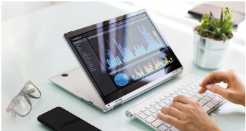
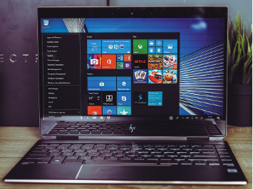
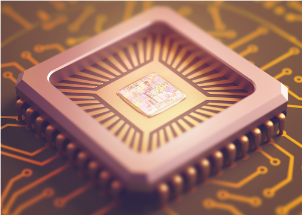
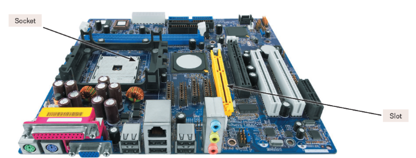
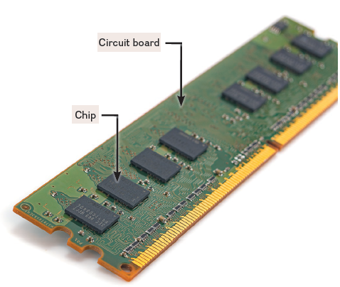

# Module 5 - The System Unit

# Dictionary

<strong>AC adapter</strong>

Notebook
computers use AC adapters that are typically outside the system unit.
They plug into a standard wall outlet, convert AC to DC, provide power
to drive the system components, and can recharge
batteries.

<strong>Activity tracker</strong>

A
wearable computer that typically monitors daily exercise and sleep
patterns.

<strong>All-in-one desktop</strong>

A
desktop computer that has the monitor and system unit housed together in
the same case (e.g., Apple’s iMac).

<strong>Analog</strong>

Continuous signals
that vary to represent different tones, pitches, and
volume.

<strong>Arithmetic-logic unit
(ALU)</strong>

The part of the CPU that performs arithmetic
and logical operations.

<strong>Arithmetic
operation</strong>

Fundamental math operations: addition,
subtraction, multiplication, and division.

<strong>ASCII (American Standard Code for Information
Interchange)</strong>

Binary coding scheme widely used on
all computers, including personal computers. Eight bits form each byte,
and each byte represents one character.

<strong>Binary system</strong>

Numbering
system in which all numbers consist of only two digits: 0 and
1.

<strong>BIOS (basic input/output
system)</strong>

Information including the specifics
concerning the amount of RAM and the type of keyboard, mouse, and
secondary storage devices connected to the system unit.

<strong>Bit (binary digit)</strong>

Each 1
or 0 is a bit; short for binary digit.

<strong>Bus</strong>

All communication
travels along a common connecting cable called a bus or a backbone. As
information passes along the bus, it is examined by each device on the
system board to see if the information is intended for that device. See
also Bus line and Ethernet.

<strong>Bus line</strong>

Electronic data
roadway along which bits travel; connects the parts of the CPU to each
other and links the CPU with other important hardware. The common
connecting cable in a bus network.

<strong>Bus width</strong>

The number of
bits traveling simultaneously down a bus is the bus width.

<strong>Byte</strong>

Unit consisting of
eight bits. There are 256 possible bit combinations in a byte, and each
byte represents one character.

<strong>Cable</strong>

Cords used to
connect input and output devices to the system unit.

<strong>Cache memory</strong>

Area of
random-access memory (RAM) set aside to store the most frequently
accessed information. Cache memory improves processing by acting as a
temporary high-speed holding area between memory and the CPU, allowing
the computer to detect which information in RAM is most frequently
used.

<strong>Cell phone</strong>

Mobile device
that uses cellular system to connect without a physical
connection.

<strong>Central processing unit
(CPU)</strong>

The part of the computer that holds data and
program instructions for processing the data. The CPU consists of the
control unit and the arithmetic-logic unit. In a personal computer, the
CPU is on a single electronic component called a microprocessor
chip.

<strong>Character encoding
standards</strong>

Assign unique sequence of bits to each
character.

<strong>Chip</strong>

A tiny circuit board
etched on a small square of sandlike material called silicon. A chip is
also called a silicon chip, semiconductor, or integrated
circuit.

<strong>Chip carrier</strong>

The device
onto which chips are mounted and plugged into the system
board.

<strong>Clock speed</strong>

Also called
clock rate. It is measured in gigahertz, or billions of beats per
second. The faster the clock speed, the faster the computer can process
information and execute instructions.

<strong>Computer
technician</strong>

Specialist who installs hardware and
software and troubleshoots problems for users.

<strong>Control unit</strong>

Section of
the CPU that tells the rest of the computer how to carry out program
instructions.

<strong>Coprocessor</strong>

Specialized
processing chip designed to improve specific computer operations, such
as the graphics coprocessor.

<strong>Desktop</strong>

(1) The screen
that is displayed on the monitor when the computer starts up. All items
and icons on the screen are considered to be on your desktop and are
used to interact with the computer. (2) A system unit that typically
contains the system’s electronic components and selected secondary
storage devices. Input and output devices, such as the mouse, keyboard,
and monitor, are located outside the system unit.

<strong>Digital</strong>

Computers are
digital machines because they can only understand 1s and 0s. For
example, a digital watch states the exact time on the face, whereas an
analog watch has the second hand moving in constant motion as it tells
the time.

<strong>DIMM (dual in-line memory
module)</strong>

An expansion module used to add memory to
the system board.

<strong>DisplayPort (DP)</strong>

A port
that an audiovisual device typically uses to connect to large
monitors.

<strong>DVI (Digital Video Interface)
port</strong>

A type of port that provides a connection to a
digital monitor.

<strong>EBCDIC (Extended Binary Coded Decimal
Interchange Code)</strong>

Binary coding scheme that is a
standard for minicomputers and mainframe computers.

<strong>Ethernet port</strong>

A high-
speed networking port that allows multiple computers to be connected for
sharing files or for high-speed Internet access.

<strong>Expansion bus</strong>

Connects
the CPU to slots on the system board. There are different types of
expansion buses such as industry standard architecture (ISA), peripheral
component interconnect (PCI), accelerated graphics port (AGP), universal
serial bus (USB), and FireWire buses. See also System bus.

<strong>Expansion card</strong>

Optional
device that plugs into a slot inside the system unit to expand the
computer’s abilities. Ports on the system board allow cables to be
connected from the expansion board to devices outside the system
unit.

<strong>Expansion slot</strong>

Openings
on a system board. Users can insert optional devices, known as expansion
cards, into these slots, allowing users to expand their systems. See
also Expansion card.

<strong>FireWire bus</strong>

Operates
much like USB buses on the system board but at higher
speeds.

<strong>FireWire port</strong>

Used to
connect high-speed printers, and even video cameras, to system
unit.

<strong>Flash memory</strong>

RAM chips
that retain data even when power is disrupted. Flash memory is an
example of solid-state storage and is typically used to store digitized
images and record MP3 files.

<strong>Gaming laptop</strong>

A laptop
with high-end graphics hardware and a very fast processor specifically
designed to play computer games.

<strong>GPU (graphics processing
unit)</strong>

See Graphics coprocessor.

<strong>Graphics card</strong>

Device that
provides high-quality 3D graphics and animation for games and
simulations.

<strong>Graphics
coprocessor</strong>

Designed to handle requirements related
to displaying and manipulating 2D and 3D graphic images.

<strong>Hexadecimal system
(hex)</strong>

Uses 16 digits to represent binary
numbers.

<strong>High Definition Multimedia Interface (HDMI)
port</strong>

Port that provides high-definition video and
audio, making it possible to use a computer as a video jukebox or an HD
video recorder.

<strong>Integrated circuit</strong>

See
Silicon chip.

<strong>Laptop</strong>

A small, portable
system unit that contains electronic components, selected secondary
storage devices, and input devices.

<strong>Logical
operation</strong>

Comparing two pieces of data to see
whether one is equal to (=), less than (<), or greater than (>) the
other.

<strong>Mainboard</strong>

See Motherboard
or System board.

<strong>Memory</strong>

Memory is
contained on chips connected to the system board and is a holding area
for data instructions and information (processed data waiting to be
output to secondary storage). RAM, ROM, and CMOS are three types of
memory chips.

<strong>Microprocessor</strong>

The
central processing unit (CPU) of a personal computer controls and
manipulates data to produce information. The microprocessor is contained
on a single integrated circuit chip and is the brains of the system.
Also known as a processor.

<strong>Mini notebook</strong>

A type of
very portable laptop. They are lighter and thinner and have a longer
battery life than other laptops. Also known as ultrabooks or
ultraportables.

<strong>Mini tablet</strong>

A type of
tablet with a smaller screen.

<strong>Motherboard</strong>

Also called a
system board; the communications medium for the entire
system.

<strong>Mini tablet</strong>

A type of
tablet with a smaller screen.

<strong>Network adapter
card</strong>

Connects the system unit to a cable that
connects to other devices on the network.

<strong>Network interface card
(NIC)</strong>

Also known as a network adapter card. Used to
connect a computer to one or more computers forming a communication
network whereby users can share data, programs, and
hardware.

<strong>Parallel processing</strong>

Used
by supercomputers to run large and complex programs.

<strong>PCI Express (PCIe)</strong>

New
type of bus that is 30 times faster than PCI bus.

<strong>Peripheral</strong>

External
device, such as a monitor and keyboard.

<strong>Personal computer</strong>

Small,
low-cost computer designed for individual users. These include desktop
computers, laptops, and mobile devices.

<strong>Port</strong>

Connecting socket on
the outside of the system unit. Used to connect input and output devices
to the system unit.

<strong>Power supply unit</strong>

Desktop
computers have a power supply unit located within the system unit that
plugs into a standard wall outlet, converting AC to DC, which becomes
the power to drive all of the system unit components.

<strong>Processor</strong>

See Central
processing unit.

<strong>Random-access memory
(RAM)</strong>

Volatile, temporary storage that holds the
program and data the CPU is presently processing. It is called temporary
storage because its contents will be lost if electrical power to the
computer is disrupted or the computer is turned off.

<strong>Read-only memory
(ROM)</strong>

Refers to chips that have programs built into
them at the factory. The user cannot change the contents of such chips.
The CPU can read or retrieve the programs on the chips but cannot write
or change information. ROM stores programs that boot the computer, for
example. Also called firmware.

<strong>SD card</strong>

Type of expansion
card designed for laptops, tablets, and smartphones.

<strong>Semiconductor</strong>

Silicon
chip through which electricity flows with some resistance.

<strong>Silicon chip</strong>

Tiny circuit
board etched on a small square of sandlike material called silicon.
Chips are mounted on carrier packages, which then plug into sockets on
the system board.

<strong>Slot</strong>

Area on a system
board that accepts expansion cards to expand a computer system’s
capabilities.

<strong>Smartphone</strong>

A type of cell
phone that offers a variety of advanced functionality, including
Internet and e-mail.

<strong>Smartwatch</strong>

A wearable
computer that acts as a watch, fitness monitor, and communication
device.

<strong>Socket</strong>

A socket provides
connection points on the system board for holding electronic
parts.

<strong>System board</strong>

Flat board
that usually contains the CPU and memory chips connecting all system
components to one another.

<strong>System bus</strong>

There are two
categories of buses. One is the system bus that connects the CPU to the
system board. The other is the expansion bus that connects the CPU to
slots on the system board.

<strong>System chassis</strong>

See System
unit.

<strong>System unit</strong>

Part of a
personal computer that contains the CPU. Also known as the system
cabinet or chassis, it is the container that houses most of the
electronic components that make up the computer system.

<strong>Tablet</strong>

A type of personal
computer that contains a thin system unit, most of which is the
monitor.

<strong>Tablet computer</strong>

See
Tablet.

<strong>Thunderbolt 3</strong>

A specialty
port for high-speed connections to up to seven separate devices
connected one to another.

<strong>Tower computer</strong>

A desktop
system unit placed vertically.

<strong>Tower unit</strong>

See Tower
computer.

<strong>Two-in-one laptop</strong>

Laptop
that includes a touch screen and the ability to fold flat like a tablet
computer. It offers the advantages of a laptop with the convenience of a
tablet.

<strong>Ultrabook</strong>

A very portable
laptop that is lighter and thinner with a longer battery life than other
laptops.

<strong>Ultraportable</strong>

See
Ultrabook.

<strong>Unicode</strong>

A 16-bit code
designed to support international languages, like Chinese and
Japanese.

<strong>Universal serial bus
(USB)</strong>

Combines with a PCI bus on the system board
to support several external devices without inserting cards for each
device. USB buses are used to support high-speed scanners, printers, and
video-capturing devices.

<strong>Universal serial bus (USB)
port</strong>

These ports have replaced serial and parallel
ports. They are faster, and one USB port can be used to connect several
devices to the system unit.

<strong>Universal serial bus—A
(USB-A)</strong>

The type of USB found on most laptops and
desktops.

<strong>Universal serial bus—A
(USB-A)</strong>

The type of USB found on most laptops and
desktops.

<strong>Universal serial bus—C
(USB-C)</strong>

The newest USB type, expected to replace
both USB types A and B.

<strong>Virtual memory</strong>

Feature of
an operating system that increases the amount of memory available to run
programs. With large programs, parts are stored on a secondary device
like your hard disk. Then each part is read in RAM only when
needed.

<strong>Wearable computer</strong>

See
Wearable device

<strong>Wearable device</strong>

A type of
mobile computer such as Apple’s Watch that contains an embedded computer
chip. Also known as a smartwatch.

<strong>Wireless charging
platform</strong>

Recharging device for laptops, tablets,
and wearable computers that does not require a connecting
cable.

<strong>Wireless network
card</strong>

Allows computers to be connected without
cables.

<strong>word</strong>

Glossary definition
for word goes here.

# General Notes

# System Unit

**System Unit**: The container that houses most of the electronic components
that make up a computer system.

- Also known as the **system chassis**
- Some are located in a separate case, whereas others share a case with other
  parts of the computer system.

<u>The five most common types of personal computers:</u>

- Cell phones
- Tablets
- Laptops
- Desktops
- Wearable computers

## Smartphones

- Smartphones are almost all monitor, with the system unit, secondary storage,
  and all electronic components located behind the monitor.

## Tablets

- Also known as **tablet computers**
- Cannot be connected to phone networks
- The smallest tablets _(mini tablets)_ are a little larger than the largest
  cell phones.

## Laptops

- Laptops have their system units housed with selected secondary storage and
  input devices.
- Their monitors are separate from the rest of the computer, attached to the
  system unit with a hinge.
- Specialized laptops:
    - **Two-in-on laptops**
        - 
        - Include a touchscreen and the ability to fold flat like a tablet
          computer.
    - **Gaming laptops**
        - Include high-end graphics hardware and very fast processors.
    - **Ultrabooks**
        - 
        - Also known as **ultra-portables** or **mini notebooks**
        - Lighter and thinner with longer battery life than most laptops.

## Desktops

- Most powerful type of personal computer.
- **all-in-one desktops** have their monitor and system unit housed together in
  the same case.
- Desktop system units that are in a separate case and are vertically places are
  referred to as a **tower unit** or **tower computer**.

## Wearable Computers

- Also known as a **wearable device**.
- One of the first evolutionary steps to the Internet of Things (IoT)
- Contain an embedded computer on a chip.
- The most common wearable computers are smartwatches and activity trackers.
    - **Smartwatches** like Apple's Watch act as a watch, fitness monitor, and
      communication device.
    - **Activity Trackers** like Garmin Vivoactive 4 monitors daily exercise and
      sleep patterns.
        - Also connects wirelessly to desktops, laptops, and smartphones to
          record
          and share their data.

## Components

Personal computers (cell phones, laptops, tablets, wearables, and desktops) all
share the same components:

- System boards
- Microprocessors
- Memory

# System Board

The **System board** controls communications for the entire computer system. All
devices and components connect to the system board, including external devices
and internal components.

- Also known as the **mainboard** or **motherboard**
- A flat circuit board covered with a variety of electric components:
    - sockets
    - slots
    - bus lines

The system board acts as a data path and traffic monitor, allowing the various
components to communicate efficiently with one another.

- Located behind the screen for cell phones, tablets, and wearable computers
- Located at the bottom of the system unit or along one side for laptops and
  desktops.

- _Chip mounted onto a chip carrier_

### Sockets

Provide a connection point for small electronic parts called chips.

- **Chips** consist of tiny circuit boards etched onto squares of sandlike
  material called silicon.
    - Also called a **silicon chip**, **semiconductor**, or 
      **integrated circuit**.
    - Typically mounted onto **chip carriers** that plug directly into sockets
      on the system board or onto cards that are then plugged into slots on the
      system board.
- Sockets are used to connect the system board to a variety of different types
  of chips.

### Slots

Slots provide a connection point for specialized cards or circuit boards.

- The cards, such as a wireless networking card, provide expansion capability
  for a computer system.

### Bus Lines

Bus lines provide pathways that support communication among the various
electronic components that are either located on the system board or attached to
the system board.

# Microprocessor

The **central processing unit (CPU)** or **processor** is contained on a single
chip called the **microprocessor**.

- _brains_ of the computer.

The CPU has two basic components:

- **Control Unit**
    - Tells the rest of the computer system how to carry out a program's
      instructions.
    - Directs the movement of electronic signals between memory, which
      temporarily
      holds data, instructions, and processed information, and the
      arithmetic-logic unit.
    - Also directs these control signals between th CPU and input / output
      devices.
- **Arithmetic-logic Unit**
    - Usually called the **ALU**.
    - Performs **arithmetic** and **logical** operations.
        - **Arithmetic operation:** Fundamental math operation such as addition,
          subtraction, multiplication, or division.
        - **Logical operation:** Consist of comparisons such as: **=**, **<**, *
          *>**.

## Microprocessor Chips

There are two major categories for microprocessors developed today:

- Mobile
    - Used in cell phones and tablets.
- Desktop
    - Used in computers and laptops.

Chip processing capabilities are expressed in **word*** sizes.

- A **word** is the number of bits (32 or 64) that can be accessed at one time
  by a CPU
- Eight bits group together to form a byte.
- A 32-bit computer can access 4 bytes at a time.
- A 64-bit computer can access 8 bytes at a time.

### Popular Mobile Microprocessors

| Processor      | Manufacturer |
|:---------------|:-------------|
| A14 Bionic     | Apple        |
| Snapdragon 888 | Qualcomm     |
| Exynos 2100    | Samsung      |

### Popular Desktop Microprocessors

| Processor  | Manufacturer |
|:-----------|:-------------|
| Ryzen 5000 | AMD          |
| M1         | Apple        |
| Alder Lake | Intel        |

---

The **clock speed** of a microprocessor is related to the number of times a CPU
can fetch and process data or instructions in a second.

- Older personal computers process data and instructions in millionths of a
  second, or microseconds
- Modern personal computers process data and instructions in billionths of a
  second, or nanoseconds.
- Supercomputers operate at speeds measured in picoseconds (1000 times faster
  than personal computers).
- In the future, we can expect speeds measuring in femtoseconds (1000 times
  faster than a supercomputer).

Some microprocessors can handle multiple instructions per cycle or tick of the
clock; This means that speed comparisons can only be made between processors
that work the same way.

|    Unit     | Speed                     |
|:-----------:|:--------------------------|
| Microsecond | Millionth of a second     |
| Nanosecond  | Billionth of a second     |
| Picosecond  | Trillionth of a second    |
| Femtosecond | Quadrillionth of a second |

**Multicore processors** provide two or more separate and independent CPUs.

- For multicore processors to be used effectively, computers divide tasks into
  parts that can be distributed across each core - an operation called
  **parallel processing**.

## Specialty Processors

**Coprocessors** (a popular specialty processor) are specialty chips designed to
improve specific computing operations.

- A standard feature in gaming computers is a **graphics coprocessor** _(also
  known as a **GPU [Graphics Processing Unit]**)_
    - Designed to handle specialized tasks such as displaying 3D images and
      encrypting data.
- Many cars have more than 100 separate specialty processors to control nearly
  everything from fuel efficiency to satellite entertainment and tracking
  systems.
- Most cell phones and tablets have specialty processors to efficiently show and
  store videos.

# Memory

Memory is a holding area for data, instructions, and information.

- Memory is contained on chips connected to the system board.

There are three types of memory chips:

- **Random-access memory (RAM)**
- **Read-only memory (ROM)**
- **Flash memory**

| Type  | Use                            |
|:------|:-------------------------------|
| RAM   | Programs and data              |
| ROM   | Fixed start-up instructions    |
| Flash | Flexible start-up instructions |

## RAM

RAM chips hold the program (sequence of instructions) and data that the CPU is
presently processing.

- Temporary or volatile storage because everything in most types of RAM is lost
  when the computer turns off (by any means).

- _RAM chips mounted on circuit board_

**Cache memory** improves processing by acting as a temporary high-speed holding
area between the memory and the CPU.

- The computer detects which information in RAM is most frequently used and then
  copies that information into the cache.
- When needed, the CPU can quickly access the information from the cache.

| Unit          | Capacity            |
|:--------------|:--------------------|
| Megabyte (MB) | 1 Million bytes     |
| Gigabyte (GB) | 1 Billion bytes     |
| Terabyte (TB) | 1 Trillion bytes    |
| Petabyte (PB) | 1 Quadrillion bytes |

If your computer does not have enough RAM to hold a program, it might be able to
run the program using **virtual memory**.

- With virtual memory, large programs are divided into parts, and the parts arc
  stored on a secondary device, usually a hard disk.
- Each part is then read into RAM only when needed. In this way, computer
  systems are able to run very large programs.

## ROM

ROM chips have information stored in them by the manufacturer.

- Not volatile.
- Cannot be changed by the user.
- Computer can read or retrieve data and programs write on the ROM chip, but
  not write - encode or change - the information or instructions in the ROM.

## Flash Memory

Offers a combination of features of RAM and ROM.

- Can be updated with new information that does not get lost when power is
  turned off.
- Used to store the start-up instructions for a computer.
    - Information is called the system's **BIOS (Basic input/output system)**.
    - Includes specifics concerning the amount of RAM, the type of keyboard,
      mouse,
      and secondary storage devices connected to the system unit.
    - Changes made to the computer system are reflected in flash memory.

# Expansion Cards and Slots

- **SD cards** are examples of expansion cards.
- Many personal computers allow users to expand their systems by providing
  expansion slots to the system board.

Some commonly used expansion cards:

- Graphics cards
- Network Interface Cards (NIC)
    - Network adapter cards
    - Used to connect a computer to a network
- Wireless network cards

# Bus Lines

A **Bus line** is known as a **bus**. A bus is a pathway for bits representing
data and instructions.

- The number of bits that can travel simultaneously down a bus is known as the
  **bus width**.
    - A 64-bit bus can move twice as much information at a time as a 32-bit bus.
- Many devices, such as expansion cards, will work with only one type of bus.
- Buses link the parts of the CPU to each other.
- Buses also link the CPU to various other components on the system board.

Every computer system has two basic categories of buses:

- **System buses**
    - Connects the CPU to memory on the system board.
- **Expansion buses**
    - Connects the CPU to other components on the system board, including
      expansion
      slots.

## Expansion Buses

Computer systems usually have a combination of different types of expansion
buses:

- **USB**
    - External USB devices are connected from one another to a common point or
      hub
      and then onto the USB bus.
    - USB bus then connects to the PCI bus on the system board.
    - Current USB standard is USB 3.4
- **FireWire**
    - Similar to USB buses, but more specialized. Primarily used to connect
      audio
      and video equipment to the system board.
- **PCI Express (PCIe)**
    - Does not share a single bus line or path with several devices like other
      buses, instead providing a single dedicated path for each connected
      device.

# Ports

A **port** is a socket for external devices to connect to the system unit.

- Cell phones use ports to recharge their batteries.
- Some ports connect directly to the system board, while others connect to cards
  that are inserted into slots on the system board.
- Some ports are standard, others are more specialized.

## Standard Ports

Most desktops and laptops come with a standard set of ports for connecting
**peripherals**, or external devices, such as a monitor and keyboard.

The most common ports are:

- **Universal Serial Bus (USB)** Ports
- **USB-A**
- **USB-B**
    - Found on peripheral devices, like digital cameras and cell phones.
- **USB-C**
    - Newest USB port
    - Some support **Thunderbolt 3**, a high-speed version of the USB-C port.
- **High Definition Multimedia Interface (HDMI) Ports**
    - Provide high-definition video and audio.
- **Ethernet Ports**
    - Allows connecting multiple computers, or to a DSL or cable modem

## Specialized Ports

The most common speciality ports:

- **DisplayPorts (DP)**
    - Audiovisual ports usually used to connect large monitors.
- **DVI (Digital Video Interface)**
    - Only send video signals and cannot send audio signals.
    - Connect digital monitors to your computer.
- **FireWire Ports**
    - Provide high-speed connections to specialized FireWire devices such as
      camcorders and storage devices.

## Cables

Standard cables:

- USB
- HDMI
- Thunderbolt
- Ethernet

# Power Supply

Computers require direct current (DC) to power their electronic components and
to represent data and instructions.

- DC power can be provided by converting alternating current (AC) from outlets
  or batteries.
- Most cell phones and tablets are powered directly from batteries that are
  recharged using an **AC adapter** that converts AC to DC.
- Desktop computers have a **power supply unit** located within the system unit
  that provides power to drive all the system unit components.

# Electronic Data and Instructions

Our voices create **analog** _(continuous)_ signals. Computers can only
recognize **digital** electronic signals. Before any processing can occur within
the system unit, the computer must convert what we understand to what the system
unit can electronically process.

## Numeric Representation

The binary system only consists of 0 and 1, with each one individually being
called a **bit** _(short for binary digit)_.

- **1** can be represented by a negative charge and **0** by no electric charge.
- Numbers, letters, and special characters are represented by bytes (bits
  combined into groups of eight).

## Character Encoding

**Character encoding standards** assign a unique sequence of bits to each
character.

- **ASCII (American Standard Code for Information Interchange)** was used in the
  past for personal computers, while mainframe computers used **EBCDIC (Extended
  Binary Coded Decimal Interchange Code)**. They were both limited.
    - ASCII only uses 7 bits, meaning that only 128 total characters can be
      represented.
        - Can not support languages like Chinese and Japanese
- **Unicode** eventually replaced ASCII.
    - The first 128 characters are assigned the same sequence of bits as ASCII
      to
      maintain compatibility with older ASCII-formatted information.
    - Unicode uses a variable number of bits to represent each character.
    - There's UTF-8 and UTF-16.
        - UTF-16 is the older standard. Each character would have a minimum of
          16
          bits. UTF-8 can have a minimum of 8 bits, making it more efficient.

# Careers in IT

**Computer technicians** repair and install computer components and systems.

- They work on personal computers, mainframe servers, printers, and many more.
- Responsible for setting up and maintaining computer networks.

## Brain - Computer Interfaces

> Can you imagine a future when we become half human and half machine? Today, we
> use computer implants to help
> people hear and to control their heartbeat. Computer chips are being implanted
> into people with Parkinson’s disease
> to help them control their movements and to reduce other impacts of the
> condition. But these devices are simple
> compared to the future of brain—computer interfaces imagined by the
> researchers and entrepreneurs of Silicon Valley.
> 
> The human brain stores information in neurons using electrical impulses. Using
> neural imaging, specialized equipment
> can read the intensity and location of these impulses or thought patterns.
> This technology currently allows amputees
> to control robotic limbs. This case and almost all other applications,
> however, require brain surgery and cumbersome
> equipment. Researchers are currently trying to reduce the size and
> invasiveness of these technologies. Scientists at
> Florida International University are investigating devices so small that they
> can travel through the bloodstream to the
> brain. In the future, a simple shot may allow your computer to tell what you
> are thinking.
>
> With improvements in the quality of neural imaging and neural hardware, we may
> soon be able to image all the brain’s
> electrical impulses. For example, when you think of turning on the house
> lights, a computer can take an image of your
> brain thinking about turning on the house lights. Later, when you have that
> thought again, the computer can compare
> your brain’s image to previous images and realize that when those areas of the
> brain are active, you want the house
> lights to turn on.
> 
> Not only may computers someday read your mind—they someday may write to it as
> well. Memories are stored in the
> electrical impulses of the brain, and by injecting tiny magnetic particles
> into the brain, scientists can stimulate neurons,
> essentially creating memories. Currently, our understanding of how the brain
> operates is too limited, and our ability to
> manipulate neurons is too coarse, to allow us to accurately transmit
> information. However, someday you may think, “I
> would like to be able to speak French,” and through neural stimulation, a
> computer would generate the memories
> necessary for you to speak French.
> 
> Many ethicists are concerned by the potential use of such technologies to
> improve human abilities instead of treating
> medical conditions. For example, with tiny chips being able to store so much,
> people could use brain implants to
> improve their memory. This can lead to a variety of scenarios where the
> individual with the implants would have an
> advantage over those who don’t have them. However, others disagree, arguing
> that the integration of technology and
> biology is to be expected and it is nothing more than the next step in human
> evolution. If such a technology became
> widespread and affordable, would you opt to receive a chip implant?

