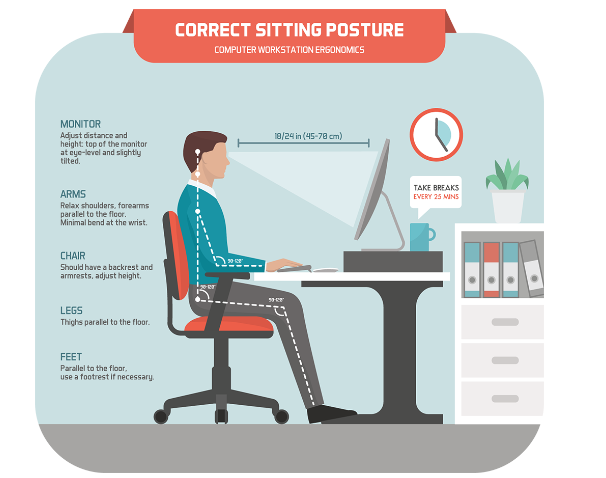

# Module 6 - Input and Output

# Dictionary

<strong>3D printer</strong>

A printer that
creates objects by adding layers of material onto one another. Also
known as additive manufacturing.

<strong>3D scanner</strong>

Scanner that
uses lasers, cameras, or robotic arms to record the shape of an
object.

<strong>Active display area</strong>

The
diagonal length of a monitor’s viewing area.

<strong>Additive
manufacturing</strong>

See 3D printer.

<strong>Aspect ratio</strong>

The width of
a monitor divided by its height. Common aspect ratios for monitors are
4:3 (standard) and 16:9 (wide screen).

<strong>Bar code</strong>

Code consisting
of vertical zebra-striped marks printed on product containers, read with
a bar code reader.

<strong>Bar code
reader</strong>

Photoelectric scanner that reads bar codes
for processing.

<strong>Bar code scanner</strong>

See Bar
code reader.

<strong>Bluetooth</strong>

A wireless
technology that allows nearby devices to communicate without the
connection of cables or telephone systems.

<strong>Card reader</strong>

A device that
interprets the encoded information contained on credit, debit, access,
and identification cards.

<strong>Carpal tunnel syndrome</strong>

A
repetitive strain injury consisting of damage to the nerves and tendons
in the hands.

<strong>Chip card</strong>

Type of credit
card that contains an embedded microchip to provide added
security.

<strong>Clarity</strong>

Indicated by the
resolution, or number of pixels, on a monitor. The greater the
resolution, the better the clarity.

<strong>Cloud printer</strong>

A printer
connected to the Internet that provides printing services to others on
the Internet.

<strong>Combination key</strong>

Keys such
as the Ctrl key that perform an action when held down in combination
with another key.

<strong>Connectivity</strong>

Capability
of the personal computer to use information from the world beyond one’s
desk. Data and information can be sent over telephone or cable lines and
through the air so that computers can talk to each other and share
information.

<strong>Contrast ratio</strong>

Indicates
a monitor’s ability to display colors. It compares the light intensity
of the brightest white to the darkest black.

<strong>Cordless mouse</strong>

A battery-
powered mouse that typically uses radio waves or infrared light waves to
communicate with the system unit. Also known as wireless
mouse.

<strong>Digital camera</strong>

Similar to
a traditional camera except that images are recorded digitally in the
camera’s memory rather than on film.

<strong>Digital projector</strong>

A type
of monitor that projects images from a traditional monitor onto a screen
or wall.

<strong>Digital whiteboard</strong>

A
specialized device with a large display connected to a computer or
projector.

<strong>Display screen</strong>

See
Display.

<strong>Document scanner</strong>

Similar
to a flatbed scanner except that it can quickly scan multipage
documents. It automatically feeds one page of a document at a time
through a scanning surface.

<strong>Dot pitch</strong>

Distance
between each pixel. The lower the dot pitch, the shorter the distance
between pixels and the higher the clarity of images
produced.

<strong>Dots per inch
(dpi)</strong>

Printer resolution is measured in dpi. The
higher the dpi, the better the quality of images produced.

<strong>Drone</strong>

Unmanned aerial
vehicles (UAV) that act as an output device, sending back video and
sound to the user.

<strong>Duplex printing</strong>

Allows
automatic printing on both sides of a sheet of paper.

<strong>E-book reader</strong>

Handheld,
book-sized device that displays text and graphics. Using content
downloaded from the web or special cartridges, these devices are used to
read newspapers, magazines, and books.

<strong>E-book</strong>

See E-book
reader.

<strong>E-ink</strong>

A black-and-white
output from some e-book readers producing images that reflect light like
ordinary paper.

<strong>Electronic
book</strong>

Traditional printed books in electronic
format.

<strong>E-reader</strong>

Dedicated mobile
devices for storing and displaying e-books and other electronic media
including electronic newspapers and magazines.

<strong>Ergonomics</strong>

The study of
human factors related to things people use.

<strong>Flatbed scanner</strong>

An input
device similar to a copying machine.

<strong>Flat-panel monitor</strong>

Or
liquid crystal display (LCD) monitor. These monitors are much thinner
than CRTs and can be used for desktop systems as well.

<strong>Flexible screen</strong>

Monitor
that allows digital devices to display images on nonflat
surfaces.

<strong>Game controller</strong>

A device
that provides input to computer games.

<strong>Gamepad</strong>

An input device
designed to be held by two hands and provide a wide array of inputs,
including motion, turning, stopping, and firing.

<strong>Gaming mice</strong>

A game
controller that provides greater precision, faster response, programming
buttons, and better ergonomics than a traditional mouse.

<strong>Google Cloud Print</strong>

A
Google service that supports cloud printing.

<strong>Grayscale</strong>

The most common
black ink selection in which images are displayed using many shades of
gray.

<strong>Handwriting recognition
software</strong>

Translates handwritten notes into a form
that the system unit can process.

<strong>Headphones</strong>

Typically worn
around the head providing audio output.

<strong>Headsets</strong>

Audio-output
devices connected to a sound card in the system unit. The sound card is
used to capture as well as play back recorded sound.

<strong>Immersive
experience</strong>

Allows the user to walk into a virtual
reality room or view simulations on a virtual reality
wall.

<strong>Inkjet printer</strong>

Printer
that sprays small droplets of ink at high speed onto the surface of the
paper, producing letter-quality images, and can print in
color.

<strong>Input</strong>

Any data or
instructions used by a computer.

<strong>Input device</strong>

Piece of
equipment that translates data into a form a computer can process. The
most common input devices are the keyboard and the mouse.

<strong>Interactive
whiteboard</strong>

See Digital whiteboard.

<strong>Joystick</strong>

Popular input
device for computer games. You control game actions by varying the
pressure, speed, and direction of the joystick.

<strong>Keyboard</strong>

Input device
that looks like a typewriter keyboard but has additional
keys.

<strong>Laptop keyboard</strong>

Almost
all laptops have attached keyboards and screens.

<strong>Laser printer</strong>

Printer
that creates dotlike images on a drum, using a laser beam light
source.

<strong>Light-emitting diode
(LED)</strong>

A technology for flat-panel monitors that
have a more advanced backlighting technology. They produce better-
quality images, are slimmer, and are more environmentally friendly as
they require less power and use fewer toxic chemicals to manufacture.
Most new monitors are LED.

<strong>Liquid crystal display
(LCD)</strong>

A technology used for flat-panel
monitors.

<strong>Magnetic card reader</strong>

A
card reader that reads encoded information from a magnetic strip on the
back of a card.

<strong>Magnetic-ink character recognition
(MICR)</strong>

Direct-entry scanning devices used in banks.
This technology is used to automatically read the numbers on the bottom
of checks.

<strong>MaxiCode</strong>

A code widely
used by the United Parcel Service (UPS) and others to automate the
process of routing packages, tracking in-transit packages, and locating
lost packages.

<strong>Monitor</strong>

See
Display.

<strong>Motion-sensing device</strong>

An
input device that controls games with user movements.

<strong>Mouse</strong>

Device that
typically is moved across the desktop and directs the cursor on the
display screen.

<strong>Mouse pointer</strong>

Typically
in the shape of an arrow.

<strong>Multifunctional devices
(MFD)</strong>

Devices that typically combine the
capabilities of a scanner, printer, fax, and copying
machine.

<strong>Multitouch screen</strong>

Can be
touched with more than one finger, which allows for interactions such as
rotating graphical objects on the screen with your hand or zooming in
and out by pinching and stretching your fingers.

<strong>Optical scanner</strong>

Device
that identifies images or text on a page and automatically converts it
to electronic signals that can be stored in a computer to copy or
reproduce.

<strong>Optical-character recognition
(OCR)</strong>

Scanning device that uses special preprinted
characters, such as those printed on utility bills, that can be read by
a light source and changed into machine-readable code.

<strong>Optical-mark recognition
(OMR)</strong>

Device that senses the presence or absence of
a mark, such as a pencil mark. As an example, an OMR device is used to
score multiple-choice tests.

<strong>Organic light-emitting diode
(OLED)</strong>

Replaces LED monitor’s backlighting
technology with a thin layer of organic compound that produces
light.

<strong>Output</strong>

Processed data or
information.

<strong>Output device</strong>

Equipment
that translates processed information from the central processing unit
into a form that can be understood by humans. The most common output
devices are monitors and printers.

<strong>Personal laser
printer</strong>

Inexpensive laser printer widely used by
single users to produce black-and-white documents.

<strong>Picture element</strong>

See
Pixel.

<strong>Pixel pitch</strong>

The distance
between each pixel on a monitor.

<strong>Pixel (picture
element)</strong>

Smallest unit on the screen that can be
turned on and off or made different shades. Pixels are individual dots
that form images on a monitor. The greater the resolution, the more
pixels and the better the clarity.

<strong>Platform scanner</strong>

Handheld
direct-entry device used to read special characters on price tags. Also
known as wand reader.

<strong>Plotter</strong>

Special-purpose
output device for producing bar charts, maps, architectural drawings,
and three-dimensional illustrations.

<strong>Pointing device</strong>

A device
that provides an intuitive interface with the system unit by accepting
pointing gestures and converting them into machine-readable
input.

<strong>Portable
language</strong>

Language that can be run on more than one
type of computer.

<strong>Printer</strong>

Device that
produces printed paper output.

<strong>Repetitive strain injury
(RSI)</strong>

Any injury that is caused by fast, repetitive
work that can generate neck, wrist, hand, and arm pain.

<strong>Resolution</strong>

A measurement
reflecting the quality of an image.

<strong>RFID (radio-frequency identification)
reader</strong>

A device used to read radio-frequency
identification information.

<strong>RFID tag</strong>

Microchip that
contains electronically stored information and can be embedded in items
such as consumer products, driver’s licenses, passports,
etc.

<strong>Robot</strong>

Typically use
cameras, microphones, and other sensors as inputs. Widely used in
factories and other applications involving repetitive
actions.

<strong>Scanner</strong>

See Optical
scanner.

<strong>Scanning devices</strong>

Convert
scanned text and images into a form that the system unit can
process.

<strong>Shared laser printer</strong>

More
expensive laser printer used by a group of users to produce black-and-
white documents. These printers can produce over 30 pages a
minute.

<strong>Speakers</strong>

Audio-output
devices connected to a sound card in the system unit. The sound card is
used to capture as well as play back recorded sound.

<strong>Stylus</strong>

Penlike device
used with tablets and PDAs that uses pressure to draw images on a
screen. A stylus interacts with the computer through handwriting
recognition software.

<strong>Technical writer</strong>

Prepares
instruction manuals, technical reports, and other scientific or
technical documents.

<strong>Thermal printer</strong>

Printer
that uses heat elements to produce images on heat-sensitive
paper.

<strong>Toggle key</strong>

These keys
turn a feature on or off, like the Caps Lock key.

<strong>Touch pad</strong>

Used to control
the pointer by moving and tapping your finger on the surface of a
pad.

<strong>Touch screen</strong>

Monitor
screen allowing actions or commands to be entered by the touch of a
finger.

<strong>Traditional
keyboard</strong>

Full-sized, rigid, rectangular keyboard
that includes function, navigational, and numeric keys.

<strong>Universal product code
(UPC)</strong>

A bar code system that identifies the product
to the computer, which has a description and the latest price for the
product.

<strong>Unmanned aerial vehicle
(UAV)</strong>

See Drone.

<strong>Virtual keyboard</strong>

Displays
an image of a keyboard on a touch-screen device. The screen functions as
the actual input device, which is why the keyboard is considered
virtual.

<strong>Touch pad</strong>

Used to control
the pointer by moving and tapping your finger on the surface of a
pad.

<strong>Voice recognition
system</strong>

Using a microphone, sound card, and
specialty software, the user can operate a computer and create documents
using voice commands.

<strong>VR controller</strong>

Device that
provides input to a virtual reality environment about a user’s hand
movements.

<strong>VR head-mounted
display</strong>

Interactive sensory equipment that collects
data from embedded earphones and three-dimensional stereoscopic screens
worn on the head.

<strong>Wand reader</strong>

Special-
purpose handheld device used to read OCR characters.

<strong>Webcam</strong>

Specialized
digital video camera for capturing images and broadcasting to the
Internet.

<strong>Wheel button</strong>

Some mice
have a wheel button that can be rotated to scroll through information
displayed on the monitor.

<strong>Wireless mouse</strong>

See
Cordless mouse.

# General Notes

# What Is Input

**Input** is any data or instructions entered into a computer.

- It can come directly from you or from other sources.
- You provide input whenever you use system or application programs.
    - Sending a text message from a cell phone: You enter data in the form of
      numbers and letters and issue commands such as _send message_ or _attach
      photo_.
    - You can also enter data and issue commands by pointing to items or using
      your voice.
    - Other sources of input:
        - Scanned or photographed images

**Input Devices** are hardware used to translate words, numbers, sounds, images,
and gestures that people understand into a form that the system unit can
process.

- Keyboards & Mice
- Pointing devices
- Scanning devices
- Image capturing devices
- Audio-input devices

# Keyboard Entry

Keyboards convert numbers, letters, and special characters that people
understand into electrical signals that are sent to, and processed by, the
system unit.

- Most keyboards use an arrangement of keys called QWERTY.

## Keyboards

There are three basic categories of keyboards:

- **Virtual**
    - Primarily used with cell phones and tablets.
- **Laptop**
- **Traditional**
    - The standard U.S. traditional keyboard has 101 keys.
        - Including function keys, navigation keys, and a numeric keypad.
        - Some keyboards include additional special keys _(such as the Windows
          key)_.
        - **Toggle keys** like Caps Lock turn a feature on or off.
        - **Combination Keys** like Ctrl perform an action when held down in
          combination with another key.

# Pointing Devices

**Pointing devices** provide an intuitive interface with the system unit by
accepting physical movements or gestures, such as a finger pointing or moving
across a screen, and converting these movements into machine-readable input.

There's a wide variety of pointing devices, such as:

- Touch screen
- Mouse
- Game controller

## Touch Screens

Touch screens allow users to select actions or commands by touching a screen
with a finger or stylus.

- **Stylus:** A pen-like device typically used with tablets and mobile devices.
    - A stylus often interacts with the computer through handwriting recognition
      software.
- **Multi-touch screens** can be touched with more than one finger.

## Mice

- A **mouse** controls a pointer that is displayed on the monitor.
- The **mouse pointer** usually appears in the shape of an arrow but frequently
  changes shape, depending on the application.
- Mice communicated detected movement through a cord or wirelessly through
  either radio waves or infrared light waves to communicate with the system
  unit.

## Game Controllers

- **Game controllers** are devices that provide input to computer games.

Keyboards and traditional mice can be used as game controllers, but the four
most popular and specialized game controllers are:

- **Joysticks**
    - Control game actions by users varying the pressure, speed, and direction
      of
      a control stick.
- **Gaming mice**
    - Similar to traditional mice with higher precision, faster responsiveness,
      and programmable buttons.
- Gamepads (like remote controllers for game consoles)
    - Designed to be held by two hands and provide a wide array of inputs,
      including motion, turning, stopping, and firing.
    - I.e. Console remote controllers
- Motion-sensing devices
    - Control games by user movement.
    - I.e. Nintendo's Joy-Con controllers

## Privacy

- Smart thermostats and smart refrigerators include microphones.
- Smart devices constantly listen to and record our conversations, sending
  them to researchers and scientists for analysis and study.

# Scanning Devices

Scanning devices convert scanned text and images into a form that the system
unit can process.

There are five types of scanning devices:

- Optical scanners
- Card readers
- Bar code readers
- RFID readers
- Character and mark recognition devices

## Optical Scanners

- Also known as just a **scanner**.
- Scanners accept documents consisting of text and/or images and converts them
  to machine-readable form.
    - They do not recognize individual letters or images.
    - They recognize light, dark, and colored areas that make up individual
      letters or images.
    - Scanned documents are saved in files that can be further processed,
      displayed, printed, or stored for later use.

There are four basic types of optical scanners:

- **Flatbed Scanner**
    - Like a copy machine.
    - Image to be scanned is placed on a glass surface, adn the scanner records
      the image.
- **Document Scanner**
    - Similar to flatbed scanner except that it can quickly scan multi-page
      documents.
    - Automatically feeds one page of a document at a time through a scanning
      surface.
- **Portable Scanner**
    - Handheld device that slides across the image, making direct contact.
- **3D Scanner**
    - Uses lasers, cameras, or robotic arms to record the shape of an object.
    - Unlike 2D scanners, most 3D scanners cannot recognize light, dark, and
      colored areas.
    - 3D scanners recognize the shape of the object they are scanning.

## Card Readers

- **Card readers** interpret encoded information that is stored on cards.
- The most common type of card reader is the **magnetic card reader**.
    - The encoded information is stored on a thin magnetic strip located on the
      back of the card.
    - The information is read when the card is swiped through the magnetic card
      reader.
- Many credit cards, known as **chip cards**, include additional security in
  the form of a microchip embedded in the credit card.
    - This chip contains encrypted data that makes it nearly impossible for
      criminals to forge a duplicate card.

## Bar Code Readers

- **Bar code readers** or **scanners** are often either handheld **wand
  readers** or **platform scanners**.
- Bar code readers contain photoelectric cells that scan or read **bar codes**,
  or the vertical zebra-striped marks printed on product containers.

There are a variety of codes, including:

- **UPCs (Universal Product Codes)**
    - Widely used by retail stores to automate the processes to check out
      customers, to change product prices, and to maintain inventory records.
- **MaxiCode**
    - Widely used by the United Parcel Service (UPS) and others to automate the
      process of routing packages, tracking in-transit packages, and locating
      lost
      packages.

## RFID Readers

**RFID (radio-frequency identification) tags** are tiny chips that can be
embedded in almost everything.

- These chips contain electronically stored information that can be read using
  an **RFID reader** located several yards away.
- Widely used to monitor and locate lost pets, track food from farm to table,
  and to record prices, product descriptions, and locations of retail items.

## Character and Mark Recognition Devices

Character and mark recognition devices are scanners that are able to recognize
special characters and marks.

- Specialty devices that are essential tools for certain applications.

The three types are:

- **Magnetic-ink Character Recognition (MICR)**
    - A special-purpose machine known as a reader/sorter reads these numbers and
      provides input that allows banks to efficiently maintain customer account
      balances.
    - Used by banks to automatically read those unusual numbers on the bottom of
      checks and deposit slips.
- **Optical-character Recognition (OCR)**
    - Uses special preprinted characters that can be read by a light source and
      changed into machine-readable code.
    - A common OCR device is the handheld wand reader, used in department stores
      to read retail price tags by reflecting light on the printed characters.
- **Optical-mark Recognition (OMR)**
    - Senses the presence or absence of a mark, such as a pencil mark.
    - OMR is often used to score standardized multiple-choice tests.

# Image-Capturing Devices

Optical scanners can make or copy from an original. Imager-capturing devices
create or capture original images.

These include:

- **Digital Cameras**
    - Capture images digitally and store the images on a memory card or in the
      camera's memory.
    - Provide a fast and easy way to create photos to share over social media
      and
      e-mail.
- **Webcams**
    - Specialized digital video cameras that capture images and send them to a
      computer for broadcast over the internet.
    - Popular videoconferencing apps, such as Zoom, Microsoft Teams, and Apple's
      FaceTime, use webcams to allow you to communicate in real time with
      friends
      and family using live video.

# Audio-Input Devices

_Audio-input devices_ convert sounds into a form that can be processed by the
system unit.

- By far the most widely used audio-input device is the microphone.
- Audio input can take many forms, including the human voice and music

## Voice Recognition Systems

**Voice recognition systems** use a microphone, a sound card, and special
software.

- Allow users to operate computers and other devices, as well as to create
  documents, using voice commands.
- Specialized portable voice recorders are widely used by doctors, lawyers,
  and others to record dictation.

# What Is Output

**Output** is processed data or information.

- Output typically takes the form of:
    - Text
    - Graphics
    - Photos
    - Audio
    - Video
- When you create a presentation using a presentation graphics program, you
  typically input text and graphics. You also could include photographs, voice
  narration, and even video. The output would be the completed presentation,

**Output devices** are any hardware used to provide or to create output.

- They translate information that has been processed by the system unit into a
  form that humans can understand.
- There are a wide range of output devices. The most widely used are:
    - **Monitors**
    - **Printers**
    - **Audio-output Devices**

# Monitors

- Monitors are the most frequently used output devices.
- Also known as **display screens**.
- Monitors present visual images of text and graphics.
- Monitors vary in size, shape, and cost.
- Almost all monitors have basic distinguishing features.

## Features

The most important characteristic of a monitor is its **clarity**.

- **Clarity:** Refers to the quality and sharpness of the displayed images. It
  is a function of several monitor features, including:
    - **Resolution**
    - **Dot pitch**
    - **Contrast ratio**
    - **Active display area**
    - **Aspect ratio**
- Another important feature is the ability to accept touch or gesture input.
    - Not present in older monitors, although it is becoming standard in newer
      monitors.

### Resolution

- One of the most important features.
- Resolution is expressed as a grid of the series of dots or pixels that form
  images on a monitor.

| Standard |    Pixels     |
|:--------:|:-------------:|
|  HD 720  |  1280 x 720   |
| HD 1080  | 1,920 x 1,080 |
|  WQXGA   | 2,560 x 1,600 |
|  UHD 4K  | 3,840 x 2,160 |
|  UHD 8K  | 8,192 x 4,608 |

### Dot (Pixel) Pitch

- The distance between each pixel.
- The lower the dot pitch, the clearer the images.
- Most newer desktop monitors have a dot pitch below 0.30mm.
- Cell phones have dot pitches below 0.05mm since they are designed to be viewed
  more closely.

### Contrast Ratios

- Indicate a monitor's ability to display images.
- It compares the light intensity of the brightest white to the darkest black.
- The higher the ratio, the better the monitor.
- Good monitors have a contrast ratio above 1,000:1

### Active Display Area

- Size
- Measured by the diagonal length of a monitor's viewing area.
- Common sizes are:
    - 15 inches
    - 17 inches
    - 19 inches
    - 21 inches
    - 24 inches

### Aspect Ratio

- Indicates the proportional relationship between a display's width and height.
- Older, square-shaped monitors have a 4:3 aspect ratio.
- Newer monitors have a 16:9 aspect ratio, designed to display widescreen
  content.

## Calibrating a Monitor

1. Warm up the TV or monitor for half an hour before calibration
2. Set the display resolution to its default (or native) resolution
3. Calibrate in a room with ambient light.
    - Direct light on the screen can make it difficult to accurately asses your
      display's picture quality.
4. Select your picture mode
    - For true color representation, look for **THX** or **ISF** modes. If those
      are not present, use **cinema** or **theater** mode.
5. Use software tools
    - Windows and macOS come with free monitor calibration tools.
    - THX Tune-up app is a premium tool you can use.

## Flat-Panel Monitors

- Most widely used monitor today.
- Compared to other types, they are thinner, more portable, and require less
  power to operate.
- Almost all are backlit, meaning that a common source of light is dispersed
  over all the pixels on the screen.

There are three types of flat-panel monitors:

- **LCD (Liquid Crystal Display)**
    - Widely used for older monitors.
    - Less expensive
- **LED (Light-Emitting Diode)**
    - Use similar technology with a more advanced backlighting technology.
    - Produce better-quality images, are slimmer, and more environmentally
      friendly as they require less power and use fewer toxic chemicals to
      manufacture.
    - Most new monitors are LED.
- **OLED (Organic Light-Emitting Diode)**
  - Replace the LED monitor's backlighting technology with a thin layer of
    organic compound that produces light.
  - OLED monitors are even thinner, with better power efficiency and contrast
    ratios, because they eliminate the backlight.

## E-book Readers

**E-book readers (e-readers)** are dedicated mobile devices for storing and
displaying e-books and other electronic media, including electronic newspapers 
and magazines.

- Typically use **e-ink**, a technology that produces images that reflect light
  like ordinary paper, making the display easy to read.
- Two well-known e-readers:
  - Amazon's Kindle
  - Walmart's Kobo eReaders

## Other Monitors

- Some other types of monitors are used for more specialized applications, such
  as making presentations or watching television.

Some other types of monitors:

- **Digital** or **Interactive Whiteboards**
  - Specialized devices with a large display connected to a computer or 
    projector.
  - Computer's desktop is displayed on the digital whiteboard and controlled 
    using a special pen, a finger, or some other device.
  - Widely used in classrooms and corporate boardrooms.
- **Flexible Screens**
  - Allow digital devices to display images on nonflat services.
  - I.e. Cell phones with screens that wrap around the edges of the phone and 
    curved monitors whose edges wrap toward the viewer.
    - Samsung Galaxy Fold
- **Digital Projectors**
  - Project images from a traditional monitor onto a screen or wall.

# Printers

- Printers are one of the most used output devices.
- Printers translate information that has been processed by the system unit and
  present the information on paper.

## Features

Almost all printers have the following basic distinguishing features:

- **Resolution**
  - Similar to monitor resolution, it is a measure of the clarity of images
    produced.
  - Measured in **dpi (dots per inch)**.
  - Personal printers average 1,200 by 4,800 dpi.
- **Color Capability**
  - The most common black ink selection is **grayscale**, in which images are 
    displayed using many shades of gray.
- **Speed**
  - Measured in the number of pages printed per minute.
  - Personal printers average 15 to 19 pages per minute for single color (black)
    output, and 5 to 12 pages per minute for color output.
- **Memory**
  - Used to store printing instructions and documents waiting to be printed.
  - The more memory, the faster it will be able to print large documents.
- **Duplex Printing**
  - Allows automatic printing on both sides of a sheet of paper.
  - Not currently a standard feature for all printers, but will likely become
    one in the future to reduce paper waste.
- **Connectivity**
  - The ability to connect to a network, eliminating the need for a computer to
    be attached by a cable to the printer and making it easier for multiple 
    computers to share one printer.

## Inkjet Printers

- Spray ink at a high speed onto the surface of paper.
- Produces high-quality images in a variety of colors, making it ideal for
  printing photos.
- Most widely used printers.

## Laser Printers

- Use technology similar to photocopying machines.
- Use a laser light beam to produce images with excellent letter and graphics
  quality.
- More expensive than Inkjet printers.
- Used in applications requiring high-quality output.

There are two categories of laser printers:

- **Personal Laser Printers**
  - Less Expensive
  - Used by a single user
  - Can print 15 to 17 pages a minute
- **Shared Laser Printers**
  - More expensive
  - Shared by a group of users
  - Can print over 50 pages a minute
  - Support color

## 3D Printers

- Create three-dimensional shapes by adding very thin layer after layer of 
  material until the final hsape is fully formed.
  - Known as **additive manufacturing**
- Variety of different processes and materials can be used to create each layer.
  - One of the most common extrudes a liquid plastic or other substance through 
    a nozzle similar to an inject printer.
- Controlled by data describing the shape of the object to be created.
  - Typically a file created by a 3D modeling program or from scanning a 
    physical model using a 3D scanner.
- Volkswagen uses 3D printers in its production lines to produce gear knobs and
  custom tailgate lettering.

## Other Printers

- **Cloud Printers**
  - Connected to the Internet and provide printing services to others on the
    internet.
  - **Google Cloud Print** is an example that allows a user to print from 
    anywhere on any device to a printer that is activated using the Google 
    Chrome OS.
- **Thermal Printers**
  - Use heat elements to produce images on heat-sensitive paper.
  - Widely used with ATMs and gasoline pumps to print receipts.
- **Plotters**
  - Special-purpose printers for producing a wide range of specialized output.
  - Using output from graphics tablets and other graphical devices, plotters
    create maps, images, and architectural and engineering drawings.
  - Typically used by graphic artists, engineers, and architects to print out
    designs, sketches, and drawings.

# Audio-Output Devices

- Audio-output devices translate audio information from the computer into
  sounds that people can understand.
- The most widely used audio-output devices are **speakers** and **headphones**.
  - They connect to a sound card within the system unit by either cable or 
    wirelessly using **bluetooth**.
- It is much easier to create voice output than to recognize and interpret voice
  input.

# Combination Input and Output Devices

Common combination devices:

- **Headsets**
  - Combine the functionality of microphones and headphones.
  - The microphone accepts audible input and the headphones provide audio
    output.
- **Multifunctional Devices (MFD)**
  - Combine the capabilities of a scanner, printer, fax, and copy machine.
  - Less expensive than purchasing the individual components, but more likely
    to break down.
  - A device with a single purpose in mind (such as a scanner) is more likely
    to have professional-level features and perform faster than a MFD.
  - Not as reliable, because problems with one of the functional parts can make
    the entire device inoperable.
- **Virtual Reality (VR) Head-mounted Displays and Controllers**
  - Artificial, or simulated, reality created in 3D by computers.
  - **VR head-mounted displays**
    - Use earphones, stereoscopic screens to present 3D images, and gyroscopic
      sensors to interpret head orientation.
  - **VR controllers**
    - Use sensors that collect data about your hand movements coupled with 
      software.
- **Drones** or **Unmanned Aerial Vehicles (UAVs)**
  - Take input from a radio joystick or Wii-Fi-connected tablet or laptop.
  - The drones act as an output device, sending back video and sound to the user.
  - Used in civil engineering, amateur cinematography, agriculture to apply 
    pesticides and monitor livestock, disaster relief to look for people in 
    distress, and by the post office to deliver mail.
- **Robots**
  - Use cameras, microphones, and other sensors as inputs.
  - Found everywhere, including vacuuming floors in homes, assembling cars in
    factories, and aiding surgeons in hospitals.

# Ergonomics

- **Ergonomics _(er-guh-nom-ix)_:** The study of human factors related to
  things people use.
  - Concerned with fitting the task to the user rather than forcing the user 
    to contort to do the task.

Other recommendations to avoid physical discomfort:

- **Eyestrain and Headache**
  - Take a 15-minute break every hour or two
  - Keep everything you're focusing on at about the same distance
  - Clean the screen of dust from time to time
- **Back and Neck Pain**
  - Make sure equipment is adjustable
  - The monitor should be at eye level or slightly below eye level
  - Use a footrest to reduce leg fatigue
- **Repetitive Strain Injury (RSI)**
  - RSI is any injury caused by fast, repetitive work that can generate neck,
    wrist, hand, and arm pain.
  - **Carpal tunnel syndrome** is an example and can be avoided by getting an
    ergonomically correct keyboard.
    - Also take frequent short rest breaks and gently massage your hands

## Portable Computers

Recommendations for ergonomics with the following portable computers:

- **Cell Phones**
  - Pain occurs at the base or in the muscles of the thumb or wrist. Minimize 
    this by:
    - Keeping wrists straight (not bent)
    - Head up
    - Shoulders straight
    - Frequently resting thumbs by using other fingers
- **Tablets**
  - Pain occurs in the neck and back due to _tablet hunch_, where the user 
    improperly aligns his or her head to the viewing surface. Minimize this by:
    - Taking frequent breaks
    - Moving around while working
    - Using a tablet cover or stand that allows the screen to be tipped at 
      various angles
    - Using an external keyboard
- **Laptops**
  - It's impossible to position the keyboard or screen for safe ergonomic use.
  - To minimize the negative impact:
    - Raise the level of the screen by using books or reams of paper under the
      laptop and attach an external keyboard to be used at waist level.

# Careers In IT

**Technical writers** prepare instruction manuals, technical reports, and other
scientific or technical documents. 

- Most technical writers work for computer software firms, government agencies,
  or research institutions. 
- They translate technical information into easily understandable instructions
  or summaries. 
- As new technology continues to develop and expand, the need for technical
  writers who can communicate technical expertise to others is expected to
  increase.
- Typically require an Associates or Bachelor's degree in communications, 
  journalism, or English and a specialization in, or familiarity with, a 
  technical field.

