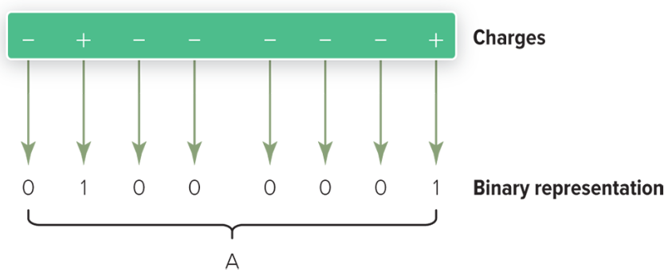
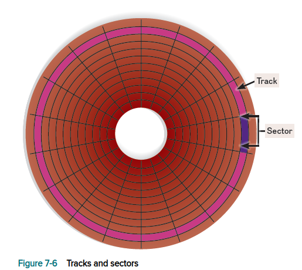
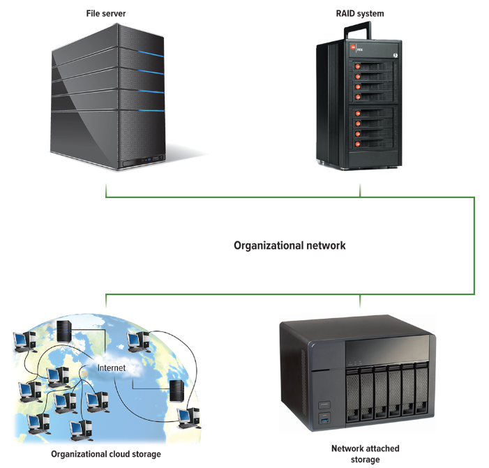

# Module 7 - Secondary Storage

# Storage

- Before a program can be processed or a program can be run, it must be in
  **RAM** _(sometimes referred to as **primary storage**)_.
- RAM is relatively small and unable to hold all the videos, photos, and
  applications that we regularly use.
- **Secondary storage** provides permanent or nonvolative storage with a far
  larger capacity than RAM.

The most important characteristics of secondary storage are:

- **Media**
    - Physical material that holds the data and programs.
- **Capacity**
    - Measures how much a particular storage medium can hold.
- **Storage Devices**
    - Hardware that reads data and programs from storage media.
    - Referred to as **drives**.
    - Most also write to storage media.
- **Access Speed**
    - Measures the amount of time required by the storage device to retrieve
      data and programs.

# Solid-State Storage

Solid-state storage devices provide access to **flash memory**.

- Commonly known as **solid-state storage**.
- Flash memory offers a combination of features of RAM and ROM. Like RAM, it can
  be updated, and like ROM it does not lose information when a computer is
  turned off.
- Flash memory is a little slower than traditional memory but much faster than
  other secondary storage drives.

## Solid-State Drives

- Store and retrieve information similar to RAM.
- Characters are represented by positive (+) and negative (-) charges using the
  ASCII, EBCDIC, or Unicode binary codes.
    - 
    - The letter **A** requires eight charges.
- SSDs are fast, durable, and require little power, making them popular for
  cell phones, tablets, and laptops
- Recovery / Undelete programs:
    - Disk Drill
    - Recuva

## Flash Memory Cards

**Flash memory cards** are small solid-state storage devices widely used in
portable devices.

- Provide external or removable storage.
- Commonly used with digital cameras and cell phones to expand their internal
  storage.

## USB Flash Drives

- Small solid-state drives

# Hard Disks

- **Hard-disk drives** rotate and have read/write heads that move in and out.
    - These moving parts allow hard-disk drives to use inexpensive technology to
      provide large-capacity storage; however, they also make hard disks less
      durable and slower than solid-state drives.
- Hard disks save files by altering the magnetic charges of the disk’s surface
  to represent 1s and 0s.
    - Hard disks retrieve data and programs by reading these charges from the
      magnetic disk
- **Density** refers to how tightly these charges can be packed next to one
  another on the disk.
- Hard disks use rigid metallic **platters** that are stacked one on top of
  another.
- Hard disks store and organize files using tracks, sectors, and cylinders.
    - **Tracks** are rings of concentric circles on the platter. Each track is
      divided into invisible wedge-shaped sections called **sectors**.
    - A **cylinder** runs through each track of a stack of platters. Cylinders
      are necessary to differentiate files stored on the same track and sector
      of different platters.
    - When a hard disk is formatted, tracks, sectors, and cylinders are
      assigned.

There are three types of hard disks:

- **Internal**
- **External**
- **Network**

## Internal Hard Disks

- An **internal hard disk** is located inside the system unit.
- These hard disks are able to store and retrieve large quantities of
  information quickly.
- They are used to store programs and data files.

## External Hard Disks

- **External hard drives** use the same basic technology as internal hard drives
  and are used primarily to complement an internal hard disk.
- External hard disks provide slower access and are typically connected to a USB
  or Thunderbolt port on the system unit and are easily removed.
- Because each removable hard disk can be easily replaced by another removable
  hard disk, a single port on the system unit can provide access to an unlimited
  amount of storage.

## Network Drives

- **Network drives** place the drive or drives on a network and can be located
  across the world from the system unit.

## Performance Enhancements

Four ways to improve the performance of hard disks are:

- **Disk Caching**
    - Similar to cache memory.
    - Cache memory improves the processing by acting as a temporary high-speed
      holding area between memory and the CPU, but disk caching improves
      processing by acting as a temporary high-speed holding area between a
      secondary storage device and memory.
    - Disk caching requires a combination of hardware and software.
        - During idle processing time, frequently used data is automatically
          identified and read from the hard disk into the disk cache.
    - When needed, the data is then accessed directly from memory. The transfer
      rate from memory is much faster than from the hard disk. As a result,
      overall system performance is often increased by as much as 30 percent.
- **Hybrid Drives**
    - Contain both solid-state storage and hard disks in an attempt to gain the
      speed and power benefits of SSDs while still having the low cost and large
      capacity of hard drives.
    - Use SSDs to store the operating system and applications, and hard disks to
      store videos, music, and documents.
- **Redundant Arrays of Inexpensive Disks**
    - Improve performance by:
        - Expanding external storage
        - Improving access speed
        - Providing reliable storage
    - Several inexpensive hard-disk drives are connected to one another.
    - These connections can be by a network or within specialized RAID devices.
    - The connected hard-disk drives are related or grouped together, and the
      computer system interacts with the RAID system as though it were a single
      large-capacity hard-disk drive. The result is expanded storage capability,
      fast access speed, and high reliability.
    - RAID is often used by Internet servers and large organizations.
- **File Compression / Decompression**
    - Increase storage capacity by reducing the amount of space required to
      store
      data and programs.
    - File compression also helps to speed up transmission of files from one
      computer system to another.
    - File compression programs scan files for ways to reduce the amount of
      required storage.
        - One way is to search for repeating patterns. The repeating patterns
          are replaced with a token, leaving enough tokens so that the original
          can be rebuilt or decompressed. These programs often shrink files to a
          quarter of their original size.

|     Technique      | Description                           |
|:------------------:|:--------------------------------------|
|    Disk caching    | Uses cache and anticipates data needs |
|    Hybrid drive    | Uses both SSD and hard disks          |
|        RAID        | Linked, inexpensive hard-disk drives  |
|  File compression  | Reduces file size                     |
| File decompression | Expands compressed files              |

# Optical Discs

In optical disc technology, a laser beam alters the surface of a plastic or
metallic disc to represent data.

- Unlike hard disks, which use magnetic charges to represent 1s and 0s, optical
  discs use reflected light.

- The 1s and 0s are represented by flat areas called **lands** and bumpy areas
  called **pits** on the disc surface.

The disc is read by an optical disc drive using a laser that projects a tiny
beam of light on these areas. The amount of reflected light determines whether
the area represents a 1 or a 0.

- Like hard disks, optical discs use tracks and sectors to organize and store
  files.
- Unlike the concentric tracks and wedge-shaped sectors used for hard disks,
  however, optical discs typically use a single track that spirals outward from
  the center of the disc. This single track is divided into equal-sized sectors.

The most widely used optical discs are:

- **Compact Discs (CDs)**
    - were the first widely available optical format for PC users, but have
      largely been replaced by DVDs and Blu-rays.
    - CD drives store 700 MB (megabytes) of storage.
    - Optical discs that store music are often CDs
- **Digital Versatile Discs (DVDs)**
    - DVD discs can store 4.7 GB (gigabytes)
    - Optical discs that store movies or software are often DVDs.
- **Blu-ray Discs (BDs)**
    - Designed to store **hi-def (high-definition)** video.
    - The name Blu-ray comes from a special blue-colored laser used to read the
      discs that gives them a typical capacity of 50 GB
    - Optical discs that store hi-def video and the newest video games are
      often Blu-ray discs.
    - The newest Blu-ray discs, **Ultra HD Blu-rays (UHD BD)**, are able to
      play back 4K video content and store up to 100 GB of data.

Each optical disc has three basic formats:

Each of these optical discs has three basic formats: read only, write once, and
rewritable.

- **Read-only (ROM for read-only memory) discs**
    - Discs that cannot be written on or erased by the user.
    - Optical discs that you buy in a store, such as music CDs, DVD movies, and
      Blu-ray video games, are often read only.
- **Write-once (R for recordable) discs**
    - Can be written on once. After that, the disc can be read many times but
      cannot be written on or erased.
    - These discs are ideal for creating permanent archives, such as CD-R,
      often used for storing family photos, and DVD-R, often used to store home
      movies.
- **Rewritable (RW for rewritable or RAM for random-access memory) discs**
    - The disc surface is not permanently altered when data is recorded.
    - These changeable, portable storage options are popular for storing and
      sharing audio, video, and large multimedia presentations.

Some optical discs, referred to as double-sided discs, contain information on
both sides of the disc and need to be flipped over to read the other side,
effectively doubling the storage capacity of the disk.

- Another way to add capacity to an optical disc is by adding multiple
  recording layers.
    - These discs store information on several layers sandwiched together on one
      side of the disc.
    - For example, some Blu-ray discs have multiple layers that increase storage
      capacity from 25 GB to 128 GB.

## Summary of Different Optical Disks

| Format | Typical Capacity | Description                    |
|:------:|:----------------:|:-------------------------------|
|   CD   |      700 MB      | Once the standard optical disc |
|  DVD   |      4.7 GB      | Current standard               |
|   BD   |      25 GB       | Hi-def format, large capacity  |
| UHD BD |      100 GB      | 4K video                       |

# Cloud Storage

## Advantages of Cloud Storage

* **Maintenance**
    * The cloud service will take care of backups, encryption, and security.
* **Hardware upgrades**
    * The cloud service will never run out of disk space and can replace failed
      hard disks without interruption to the user.
* **File syncing and collaboration**
    * Users can share documents, spreadsheets, and files with others from
      anywhere with an Internet connection. One user can sync files across
      multiple devices, and all users will have the most recent version of their
      documents.

## Disadvantages of Cloud Storage

- **Access speed**
    - The data transfer rate is dependent upon the speed of your Internet
      connection, which most likely is not as fast as a user’s internal network.
- **File security**
    - Users are dependent upon the cloud service’s security procedures, which
      may not be as effective as your own.

## Cloud Storage Service Providers

Some cloud storage services:

| Company   | Location                                               |
|-----------|--------------------------------------------------------|
| Dropbox   | [dropbox.com](https://www.dropbox.com)                 |
| Google    | [drive.google.com](https://www.drive.google.com)       |
| Microsoft | [onedrive.live.com](https://www.onedrive.live.com)     |
| Amazon    | [amazon.com/gp/drive](https://www.amazon.com/gp/drive) |
| Apple     | [icloud.com](https://www.icloud.com)                   |

# Mass Storage Devices

- **Mass storage** refers to the tremendous amount of secondary storage required
  by large organizations.

## Enterprise Storage System

- **Mass storage devices** are specialized high-capacity secondary storage
  devices designed to meet organizational demands for data storage.

Some enterprise storage systems:

- **File Servers**
    - Dedicated computers with very large storage capacities that provide users
      access to fast storage and retrieval of data.
- **Network Attached Storage (NAS)**
    - Type of file server designed for homes and small businesses.
    - NAS is less expensive, easier to set up, and easier to manage than most
      file servers. However, it does not include powerful management tools and
      features found in many large-scale file servers.
- **RAID Systems**—larger versions of the specialized devices discussed earlier
  in this chapter that protect data by constantly making backup copies of files
  moving across the organization’s networks.
- **Organizational Cloud Storage**
    - High-speed Internet connection to a dedicated remote storage facility.
    - These facilities contain banks of file servers to offer enormous amounts
      of
      storage.

## Storage Area Network

**Storage Area Network (SAN)** is an architecture to link remote computer
storage devices, such as enterprise storage systems, to computers such that the
devices are as available as locally attached drives.

- Innovating and growing mass storage technology.
- In a SAN system, the user’s computer provides the file system for storing
  data, but the SAN provides the disk space for data.
- The key to a SAN is a high-speed network, connecting individual computers to
  mass storage devices.
- Special file systems prevent simultaneous users from interfering with each
  other. SANs provide the ability to house data in remote locations and still
  allow efficient and secure access.

# Careers in IT

**Disaster Recovery Specialists**  are responsible for recovering systems and
data after a disaster strikes an organization.

- In addition, they often create plans to prevent and prepare for such
  disasters.
- A crucial part of that plan is to use storage devices and media in order to
  ensure that all company data is backed up and, in some cases, stored off-site.

# Next-Generation Storage

> Every year, cell phones improve. One of their greatest features is the
> incredible cameras we can now carry in our pockets. As we record longer videos
> at greater quality, we need more secondary storage to hold them. Scientists
> are
> looking to a future where you may carry years, worth of videos or walk around
> with an entire copy of the Internet in your pocket and where every moment of
> your day will be recorded in vastly larger secondary storage devices than the
> ones we have today.
>
> Such future storage will require new ways of thinking and
> astounding technological advancements that are currently being studied. In the
> future, your cell phone may record data using heat rays, lasers, or even DNA.
> Our cell phones, tablets, and laptops have secondary storage that uses magnets
> to store information. A magnetic field writes data on the surface of a
> magnetized material by flipping a magnetic charge on the surface of the
> material. The retained magnetic charge on the surface represents one bit of
> information.
>
> The magnetic charge on the surface must be kept far apart from the
> other bits of information stored elsewhere on the surface. If the two bits are
> stored too closely together, the magnetic field of one bit could overwrite the
> data in the other bit. This is one of the major limitations to how much space
> is
> required to store information digitally.
>
> 
>
> To overcome this limitation, scientists are exploring the use of Samsung’s
> **Heat-Assisted Magnetic Recording (HAMR)** technologies.
>
> A HAMR writes data on a special heat-sensitive magnetic surface. The surface
> can be written on with a magnetic field—but only when the surface is heated. 
> When not heated, the surface will not change. 
> 
> Thus, closely packed bits of information will not overwrite each other as 
> long as the material is not heated. Writing to the surface is accomplished by 
> preheating an area using a precision laser. If this technology
> can be brought to market, a hard disk could store 50 times more information.
>
> While HAMR technology may allow us to store more information in every square
> inch of a magnetic surface, Intel’s Optane flash memory is exploring the
> possibility of storing data not on the surface but in 3D multilevel cells 
> (MLCs). Optane uses flash memory technologies to create nonvolatile memory
> stacks that store information both horizontally and vertically. These dense 
> stacks of bits can be accessed much faster than traditional flash memory—at
> speeds rivaling RAM access speeds.
>
> The greatest innovations in secondary storage will likely require a major
> change in the way we store data. Many of the most promising and futuristic 
> secondary storage devices do not use magnets to store information. In nature, 
> living creatures store genetic information on strands of sequenced cells, 
> called DNA. In 2017, Columbia University used encoding techniques developed 
> at Netflix to store 215 petabytes in one gram of DNA. In 2019, researchers 
> at the University of Washington automated the read and write processes used 
> to record data on DNA—bringing the possibility of DNA secondary storage even 
> closer.
>
> Obviously, the technology to read and write DNA data is neither cheap nor
> common, but when it comes to storing data, nature has been doing it longer and
> better than we have. Perhaps in the future your family photos won’t be stored
> on DVDs, but instead on genetic material. Do you think that the expenses 
> associated with DNA processing will ever reduce enough to make DNA data 
> storage useful, or will we continue with hard drives and flash memory?