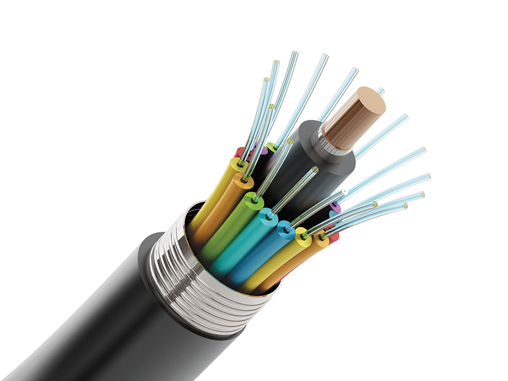

# Module 8 - Communications and Network

# General Notes

# Communications

Computer communications is the process of sharing data, programs, and
information between two or more computers. Some examples:

- Texting
- E-mail
- Videoconferencing
- Electronic Commerce

Key concepts and technologies for the 21st century:

- **Connectivity**
- **The Wireless Revolution**
- **Communication Systems**

## Connectivity

**Connectivity** is a concept related to using computer networks to link people
and
resources.

- For example, connectivity means that you can connect your cell phone to other
  devices and information sources from almost anywhere. With this connection,
  you are linked to the world of larger computers and the Internet.

This includes hundreds of thousands of web servers and their extensive
information resources. Thus, being able to efficiently and effectively use
computers becomes a matter of knowing not only about connectivity through
networks to cell phones, but also about larger computer systems and their
information resources.

## The Wireless Revolution

- The single most dramatic change in connectivity and communications since the
  development of the Internet has been the widespread use of mobile devices like
  cell phones and tablets with fast wireless Internet connectivity.
- Modern cell phones support e-mail, web access, social networking, and a
  variety of Internet applications.
- Wireless technology allows a wide variety of nearby devices to communicate
  with one another without any physical connection.
- High-speed internet wireless technology allows individuals to connect to
  the internet and share information from almost anywhere in the world.

## Communication Systems

**Communication systems** are electronic systems that transmit data from one
location to another.

Every communication system (wired or wireless) has four basic elements:

- **Sending and receiving devices**
    - Often a computer or specialized communication device.
    - They originate (send) and accept (receive) messages in the form of data,
      information, and/or instructions.
- **Connection devices**
    - Devices that act as an interface between the sending and receiving
      devices and the communication channel.
    - They convert outgoing messages into packets that can travel across the
      communication channel. They also reverse the process for incoming
      messages.
- **Data transmission specifications**
    - Rules and procedures that coordinate the sending and receiving devices by
      precisely defining how the message will be sent across the communication
      channel.
- **Communication channel**
    - The actual connecting or transmission medium that carries the message.
    - This medium can be physical wire or cable, or it can be wireless.

### Example

1. You send a message to your friend using your cell phone
   _**(Sending device)**_
2. The modem is on a microchip located inside the cell phone _**(Connection
   device)**_
3. The connection device would modify and format the message so that it could
   travel efficiently across _**communication channels**_, such as cell phone
   towers.
4. The specifics describing how the message is modified, reformatted, and sent
   would be described in the _**data transmission specifications**_.
5. After the message travels across the channel, a connection device _(such
   as a model)_ would reformat it so that it could be displayed to your friend's
   computer _**(receiving device)**_.

# Communication Channels

These channels actually carry the data from one computer to another.

There are two categories of communciation channels:

- **Wireless**
    - Send information through the air
- **Wired**
    - Require a physical connection

## Wireless Connections

Most wireless connections use radio waves to communicate.

- Cell phones and many other Internet-enabled devices use radio waves to place
  telephone calls and to connect to the Internet.

Primary technologies used for wireless connections are:

- **Cellular**
- **Bluetooth**
- **Wi-Fi**
- **Microwave**
- **WiMax**
- **Satellite connections**

### Cellular

Uses multiple antennae _(**cell towers**)_ to send and receive data within
relatively small geographic regions _(**cells**)_.

### Bluetooth

Short-range radio communication standard that transmits data over short
distances of up to approximately 33 feet.

### Wi-Fi (wireless fidelity)

Uses high-frequency radio signals to transmit data.

A number of standards for Wi-Fi exist, each with different send/receive speeds:

|   Standard   | Maximum speed |
|:------------:|:-------------:|
| **802.11g**  |  **54 Mbps**  |
| **802.11n**  | **600 Mbps**  |
| **802.11ac** | **2.6 Gbps**  |
| **802.11ax** | **10.5 Gbps** |

### Microwave

Uses high-frequency radio waves.

- Referred to as line-of-sight communication because microwaves can only travel
  in a straight line.
    - Because they cannot bend with the curvature of the earth, they can be
      transmitted only over relatively short distances.
- Ideal for sending data between buildings in a city or on a large
  college campus.
- For longer distances, the waves must be relayed by means of microwave
  stations with microwave dishes or antennas.

- _Microwave Dish_

### WiMax (Worldwide Interoperability for Microwave Access)

- Wireless standard that extends the range of Wi-Fi networks using microwave
  connections.
- Commonly used by universities and others to extend the capability of existing
  Wi-Fi networks.

### Satellite

Satellite communication uses satellites orbiting about 22,000 miles above the
earth as microwave relay stations

- Many of these are offered by Intelsat, the International Telecommunications
  Satellite Consortium, which is owned by 114 governments and forms a worldwide
  communication system.
- Satellites orbit at a precise point and speed above the earth.
- Satellites amplify and relay microwave signals from one transmitter on the
  ground to another.
- **Uplink** refers to sending data to a satellite.
- **Downlink** refers to receiving data from a satellite.
- Bad weather can interrupt the flow of data.

Satellites are also used for global positioning. A network of satellites owned
and managed by the Department of Defense continuously sends location information
to earth. **Global positioning system (GPS)** devices use that information to
uniquely determine the geographic location of the device.

#### Infrared

Unlike radio waves, **infrared** uses infrared light waves to communicate over
short distances.

- Like microwave transmissions, infrared is a line-of-sight communication.
- Because light waves can only travel in a straight line, sending and receiving
  devices must be in clear view of one another without any obstructions blocking
  that view.

## Physical (Wired) Connections

There are three types of physical connection cables:

- **Fiber-optic**
- **Coaxial**
- **Twisted-pair**

### Fiber-optic

- Transmits data as pulses of light through tiny tubes of glass.
- The data transmission speeds of fiber-optic cables are incredible.
- Recently, speeds of 1 petabit per second were measured (a petabit is 1 million
  gigabits)
- Compared to coaxial cable, it is lighter, faster, and more reliable at
  transmitting data.
- Fiber-optic cable is rapidly replacing twisted-pair cable telephone lines.

### Coaxial

- High-frequency transmission cable, replaces the multiple wires of telephone
  lines with a single solid-copper core.
- In terms of the number of telephone connections, a coaxial cable has over 80
  times the transmission capacity of twisted pair.
- Coaxial cable is used to deliver television signals as well as to connect
  computers in a network.

### Twisted-pair

- Consists of pairs of copper wire that are twisted together.
- Both landline **telephone lines** and **Ethernet cables** use twisted pair.
- Ethernet cables are often used in networks and to connect a variety of
  components to the system unit.

# Connection Devices

At one time nearly all computer communication used telephone lines.

However, because the telephone was originally designed for voice transmission,
telephone lines were designed to carry **analog signals**, which are continuous
electronic waves. Computers, in contrast, send and receive **digital signals**.

- Digital signals represent the presence or absence of an electronic pulse—the
  binary signals of 1s and 0s.
- To convert the digital signals to analog signals and vice versa, you need a
  modem.

## Wave Shapes

## Modems

- The word **modem** is short for _modulator-demodulator_.
- **Modulation** is the name of the process of converting from digital to
  analog.
- **Demodulation** is the process of converting from analog to digital.
- The modem enables digital personal computers to communicate across different
  media, including:
    - Telephone wires
    - Cable lines
    - Radio waves.
- The **transfer rate** is the speed with which modems transmit data.

|   Unit   | Speed                    |
|:--------:|:-------------------------|
| **Mbps** | Million bits per second  |
| **Gbps** | Billion bits per second  |
| **Tbps** | Trillion bits per second |

There are three commonly used types of modems:

- **DSL (Digital Subscriber Line)**
    - Uses the standard phone lines to create a high-speed connection directly
      to your phone company's offices.
    - Connecting using USB or Ethernet and are usually external.
- **Cable**
    - Uses a coaxial cable.
- **Wireless modem** aka **WWAN (Wireless Wide Area Network) modem**

## Connection Service

For years, large corporations have been leasing special high-speed lines from
telephone companies.

- Originally, these were copper lines, known as **T1** lines, that could be
  combined to form higher-capacity options known as **T3** or **DS3** lines.
- These lines have largely been replaced by faster **optical carrier (OC)**
  lines.

**Dial-up services** have been replaced by higher-speed connection services
like:

- Cellular
- DSL
- Cable
- Satellite services

### Generations of Mobile Telecommunication

* **First generation (1G)** could only transmit analog signals used for voice
  communications.
    * Started in the 1980's.
* **Second generation (2G)** used radio signals for cellular calls and
  introduced texting.
* **Third generation (3G)** improved data speeds and introduced widespread use
  of the Internet on cell phones.
* **Fourth generation (4G)** uses Long Term Evolution (LTE) connections for
  increased Internet speeds, making streaming videos and music popular on cell
  phones.
* **Fifth generation (5G)** is the newest and fastest network, with speeds
  rivaling home Internet connections. The 5G network is a new technology and may
  not be available yet in your area as service providers update old antennae and
  add new antennae to the network.
    * **Digital subscriber line (DSL)** service is provided by telephone
      companies using existing telephone lines to provide high-speed
      connections.
        * **ADSL (asymmetric digital subscriber line)** is one of the most
          widely used types of DSL.
        * DSL is much faster than dial-up.
    * **Cable service** is provided by cable television companies using their
      existing television cables. These connections are usually faster than DSL.
    * **Fiber-optic service (FiOS)** is showing up in some areas, but it is a
      new technology and not widely available. Current providers of FiOS include
      Google and Verizon with speeds faster than cable or DSL connections.
    * **Satellite connection** services use satellites to provide wireless
      connections. Although slower than DSL and cable modem, satellite
      connections are available almost anywhere using a satellite-receiving
      disk.

# Data Transmission

There are several factors affecting how data is transmitted, and two of them
are:

- **Bandwidth**
- **Protocols**

## Bandwidth

**Bandwidth** is a measurement of the width or capacity of the communication
channel.

- Effectively, it means how much information can move across the communication
  channel in a given amount of time.

- For example, to transmit text documents, a slow bandwidth would be acceptable.
  However, to effectively transmit video and audio, a wider bandwidth is
  required.

There are four categories of bandwidth:

* **Voiceband**, also known as **low bandwidth**, is used for landline telephone
  communication.
    * At one time, personal computers with telephone modems and dial-up service
      used this bandwidth.
    * Although effective for transmitting text documents, it is too slow for
      many types of transmission, including high-quality audio and video.
* **Medium band** is used in special leased lines to connect midrange computers
  and mainframes, as well as to transmit data over long distances.
    * This bandwidth is capable of very-high-speed data transfer.
* **Broadband** is widely used for DSL, cable, and satellite connections to the
  Internet.
    * Several users can simultaneously use a single broadband connection for
      high-speed data transfer.
* **Baseband** is widely used to connect individual computers that are located
  close to one another, such as the computers in an office building.
    * Like broadband, it is able to support high-speed transmission.
    * Unlike broadband, however, baseband can only carry a single signal at a
      time.

## Protocols

The rules for exchanging data between computers are known as protocols.

- **Https**, or **hypertext transfer protocol secure**, is widely used to
  protect the transfer of sensitive information.
- Another widely used Internet protocol is **TCP/IP (transmission control
  protocol/Internet protocol)**

The essential features of the TCP/IP protocol involve:

1. Identifying sending and receiving devices
2. Breaking information into small parts, or packets, for transmission
   across the Internet.

### Identification

- Every computer on the Internet has a unique numeric address called an
  **IP address (Internet protocol address)**
- The internet uses IP addresses to locate websites and deliver e-mails.
- Because IP addresses are difficult to remember, a system was developed to
  automatically convert text-based addresses to numeric IP addresses, using a
  **domain name server (DNS)**

### Packetization

Information sent or transmitted across the Internet usually travels through
numerous interconnected networks.

Before the message is sent, it is reformatted or broken down into small parts
called **packets**.

Each packet is then sent separately over the Internet, possibly traveling
different routes to one common destination. At the receiving end, the packets
are reassembled into the correct order.

# Networks

- A **computer network** is a communication system that connects two or more
  computing devices so that they can exchange information and share resources.
- Networks can be set up in different arrangements to suit users’ needs.

## Terms

There are a number of specialized terms that describe computer networks. These
terms include:

* **Node**
    * Any device that is connected to a network.
    * It could be a computer, printer, or data storage device.
* **Client**
    * A node that requests and uses resources available from other nodes.
    * Typically, a client is a user’s personal computing device.
* **Server**
    * A node that shares resources with other nodes.
    * Dedicated servers specialize in performing specific tasks.
        * Depending on the specific task, they may be called an application
          server, communication server, database server, file server, printer
          server, or web server.
* **Directory server**
    * A specialized server that manages resources, such as user accounts, for an
      entire network.
* **Host**
    * Any computer system connected to a network that provides access to its
      resources.
* **Router**
    * A node that forwards or routes data packets from one network to their
      destination in another network.
* **Switch**
    * Central node that coordinates the flow of data by sending messages
      directly between sender and receiver nodes.
    * A hub previously filled this purpose by sending a received message to all
      connected nodes, rather than just the intended node.
* **Network interface cards (NICs)**
    * These are expansion cards located within the system unit that connect the
      computer to a network. Sometimes referred to as a LAN adapter.
* **Network operating systems (NOSs)**
    * Control and coordinate the activities of all computers and other devices
      on a network.
        * These activities include electronic communication and the sharing of
          information and resources.
* **Network administrator**
    * A computer specialist responsible for efficient network operations and
      implementation of new networks.

# Network Types

- Local area, metropolitan area, and wide area networks are distinguished by the
  size of the geographic area they serve.

The primary difference between a PAN, LAN, MAN, and WAN is the geographic range.

|   Type   | Description                                                                     |
|:--------:|:--------------------------------------------------------------------------------|
| **LAN**  | Local area network; located within close proximity                              |
| **Home** | Local area network for home and apartment use; typically wireless               |
| **WLAN** | Wireless local area network; all communication passes through access point      |
| **PAN**  | Personal area network; connects digital devices, such as Bluetooth headphones   |
| **MAN**  | Metropolitan area network; typically spans cities with coverage up to 100 miles |
| **WAN**  | Wide area network for countrywide or worldwide coverage                         |

## Local Area Networks

Networks with nodes that are in close physical proximity—within the same
building, for instance—are called **local area networks (LANs)**.

- LANs span distances less than a mile and are owned and operated by individual
  organizations.
- LANs are widely used by colleges, universities, and other types of
  organizations to link personal computers and to share printers and other
  resources.

- This arrangement offers two benefits:
    - **Economy**
    - **Flexibility**
- The four personal computers share the high-speed laser printer and the file
  server.
- Other equipment or nodes can be added to the LAN.
- The **network gateway** is a device that allows one LAN to be linked to other
  LANs or to larger networks (such as the LAN of another office group).

There are a variety of different standards or ways in which nodes can be
connected to one another and ways in which their communications are controlled
in a LAN. The most common standard is known as **Ethernet**.

- LANs using this standard are sometimes referred to as Ethernet LANs.

## Home Networks

Home networks (LANS in the homes or apartments) allow different computers to
share resources, including a common internet connection.

## Wireless LAN

- A wireless local area network is typically referred to as a **wireless LAN
  (WLAN)**.
- It uses radio frequencies to connect computers and other devices.
- All communications pass through the network’s centrally located **wireless
  access point** or **base station**.
    - This access point interprets incoming radio frequencies and routes
      communications to the appropriate devices.

## Personal Area Networks

A **personal area network (PAN)** is a type of wireless network that works
within a very small area—your immediate surroundings.

- PANs connect cell phones to headsets, keyboards to cell phones, etc.
- The most popular PAN technology is Bluetooth, with a maximum range of around
  33 feet.

## Metropolitan Area Networks

**Metropolitan area networks (MANs)** span distances up to 100 miles.

- These networks are frequently used as links between office buildings that are
  located throughout a city.
- Unlike a LAN, a MAN is typically not owned by a single organization. Rather,
  it is owned either by a group of organizations or by a single network service
  provider that provides network services for a fee.

## Wide Area Networks

**Wide area networks (WANs)** are countrywide and worldwide networks.

- These networks provide access to regional service (MAN) providers and
  typically span distances greater than 100 miles.
- They use microwave relays and satellites to reach users over long
  distances
    - for example, from Los Angeles to Paris.

Of course, the widest of all WANs is the Internet, which spans the entire globe.

# Network Architecture

- Network architecture describes how a network is arranged and how resources are
  coordinated and shared.
- It includes network topologies and strategies.
- Network topology refers to the physical arrangement of the network while
  network strategies define how information and resources are shared.

## Topologies

- A network can be arranged or configured in different ways known as **network
  topologies**.
- The most common network topologies include:
    - **Bus Network**
    - **Ring Network**
    - **Start Network**
    - **Tree Network**
    - **Mesh Network**

### Bus Network Topology

- Each device is connected to a common cable called a **bus** or **backbone**,
  and all communications travel along this bus.

### Ring Network Topology

- Each device is connected to two other devices, forming a ring.
- When a message is sent, it is passed around the ring until it reaches the
  intended destination.

### Star Network Topology

- Each device is connected directly to a central network switch.
- Whenever a node sends a message, it is routed to the switch, which then passes
  the message along to the intended recipient.
- The star network is the most widely used network topology today.

### Tree Network Topology

- Each device is connected to a central node, either directly or through one or
  more other devices.
- The central node is connected to two or more subordinate nodes that in turn
  are connected to other subordinate nodes, forming a treelike structure.
- This network, also known as a **hierarchical network**, is often used to share
  corporate-wide data.

### Mesh Network Topology

- This topology is the newest type and does not use a specific physical layout (
  such as a star or a tree).
- Rather, the mesh network requires that each node has more than one connection
  to the other nodes.
- The resulting pattern forms the appearance of a mesh.
- If a path between two nodes is disrupted, data can be automatically rerouted
  around the failure using another path.
- Wireless technologies are frequently used to build mesh networks.

## Strategies

- Every network has a **strategy**, or way of coordinating the sharing of
  information and resources.
- The two most common network strategies are:
    - **client/server**
    - **peer-to-peer**.

### Client/Server Strategy

- Client/server networks use central servers to coordinate and supply services
  to other nodes on the network.
- The server provides access to resources such as web pages, databases,
  application software, and hardware.
- This strategy is based on specialization, where server nodes coordinate and
  supply specialized services, and client nodes request the services.
- Commonly used server operating systems are Windows Server, macOS X Server,
  Linux, and Solaris.
- One advantage of the client/server network strategy is the ability to handle
  very large networks efficiently.
- Another advantage is the availability of powerful network management software
  to monitor and control network activities.
- The major disadvantages are the cost of installation and maintenance.

### Peer-to-Peer Strategy

- In a peer-to-peer (P2P) network, nodes have equal authority and can act as
  both clients and servers.
- The most common way to share games, movies, and music over the Internet is to
  use a P2P network.
- P2P networks are rapidly growing in popularity as people continue to share
  information with others around the world.
- One advantage of P2P networks is that they are easy and inexpensive (often
  free) to set up and use.
- One disadvantage of P2P networks is the lack of security controls or other
  common management functions.
- For this reason, few businesses use this type of network to communicate
  sensitive information.

## Conclusion

- Network architecture describes the arrangement and coordination of resources
  in a network.
- It includes topologies and strategies, which are important for effective
  network management and performance.
- Network topologies include bus, ring, star

# Organizational Networks

## Evolution of Computer Networks

- Large organizations have a wide range of different network configurations,
  operating systems, and strategies.
- Organizations face the challenge of making these networks work together
  effectively and securely.

## Internet Technologies

- **Intranet**: a private network within an organization that resembles the
  Internet.
    - Uses browsers, websites, and web pages.
    - Applications include electronic telephone directories, e-mail addresses,
      employee benefit information, internal job openings, and more.
- **Extranet**: a private network that connects more than one organization.
    - Many organizations use Internet technologies to allow suppliers and others
      limited access to their networks.
    - Increases efficiency and reduces costs.
    - Example: an automobile manufacturer has hundreds of suppliers for the
      parts that go into making a car.

## Network Security

### Challenges for Large Organizations

- Ensuring that only authorized users have access to network resources,
  sometimes from multiple geographic locations or across the Internet.
- Securing large computer networks requires specialized technology.

### Three Common Technologies for Network Security

- **Firewalls:** hardware and software that control access to a company’s
  intranet and other internal networks.
    - Consists of software or a special computer called a proxy server.
    - Evaluates the source and the content of each communication.
    - Decides whether it is safe to let a particular message or file pass into
      or out of the organization’s network.
- **Intrusion detection systems (IDSs):** work with firewalls to protect an
  organization’s network.
    - Use sophisticated statistical techniques to analyze all incoming and
      outgoing network traffic.
    - Recognize signs of a network attack and disable access before an intruder
      can do damage.
- **Virtual private networks (VPNs):** create a secure private connection
  between a remote user and an organization’s internal network.
    - Special VPN protocols create the equivalent of a dedicated line between a
      user’s home or laptop computer and a company server.
    - Connection is heavily encrypted.

### Additional Information

#### Privacy and Security for End Users

- End users have security challenges and concerns.
- Need to be concerned about the privacy of personal information.

#### Concept Check

- Internet technologies are used to support effective communication within and
  between organizations using intranets and extranets.
- Intranets are private networks within organizations that resemble the
  Internet, while extranets are private networks that connect more than one
  organization.
- A firewall consists of hardware and software that control access to a
  company’s intranet and other internal networks. A proxy server is a special
  computer used by firewalls to evaluate the source and content of each
  communication.
- Intrusion detection systems (IDSs) use sophisticated statistical techniques to
  analyze all incoming and outgoing network traffic and recognize signs of a
  network attack.
- Virtual private networks (VPNs) create a secure private connection between a
  remote user and an organization’s internal network.

---

## Conclusion

In conclusion, computer networks have evolved over time, and large organizations
face the challenge of making these networks work together effectively and
securely. Internet technologies, such as intranets and extranets, are commonly
used to support effective communication within and between organizations. To
ensure network security, organizations commonly use firewalls, intrusion
detection systems, and virtual private networks. End users also have security
challenges and concerns, such as the privacy of personal information.

# Careers in IT

## Network Administrator

- Network administrators manage a company's LAN and WAN networks, and are
  responsible for design, implementation, and maintenance of networks.
- They diagnose and repair problems with the networks, and plan and implement
  network security measures.
- Employers usually require a bachelor's or an associate's degree in computer
  science, computer technology, or information systems, as well as practical
  networking experience.
- Technical certification may be helpful in obtaining this position.
- Good communication skills are essential because network administrators
  interact with people in many departments.
- Annual salary ranges from $43,000 to $84,000.
- This position is expected to be among the fastest-growing jobs in the near
  future.

## A Look to the Future

### Telepresence

- Telepresence is the use of technology to create the illusion of being
  somewhere else.
- It attempts to replicate a foreign location entirely and includes improved
  video and audio with immersive screens and multiple directional speakers.
- Telepresence technologies could someday allow the user to touch things and
  interact with the world through robotics and even feel the other location.
- Future technologies include specialized cameras that monitor temperature,
  heart rate, and respiration, and haptic robotics that can assist in diagnostic
  testing.
- Telepresence robots could play a role in the home and be used by skilled
  technicians, such as a plumber or electrician, to maneuver around the home,
  review pipes or wiring, and perform simple tests, make recommendations, and
  offer quotes on work to be done.
- Cisco TelePresence is an example of an early implementation that uses
  very-high-definition video, acoustically tuned audio systems, and high-speed
  networks to create a convincing videoconferencing experience.
- Ava Robotics has developed the RP-VITA, a telepresence robot that has multiple
  cameras, high-resolution screens, and complex robotics to allow a doctor to
  care for and consult with patients and doctors from around the world.
- Scientists at the National Institutes of Health are investigating the use of
  augmented reality videoconferencing to assist in the triage and care of
  patients entering a hospital.

# Conclusion

- A career in IT as a network administrator requires a bachelor's or associate's
  degree in computer science, computer technology, or information systems,
  practical networking experience, and technical certification may be helpful.
- Telepresence is the use of technology to create the illusion of being
  somewhere else, and future technologies could allow users to touch things,
  interact with the world through robotics, and feel the other location.
- Telepresence robots could play a significant role in various industries,
  including healthcare and home services.
