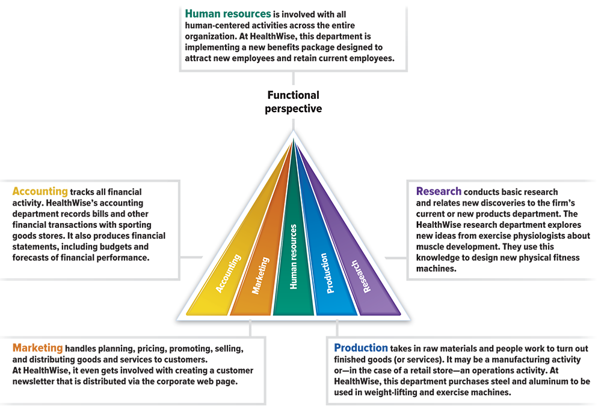
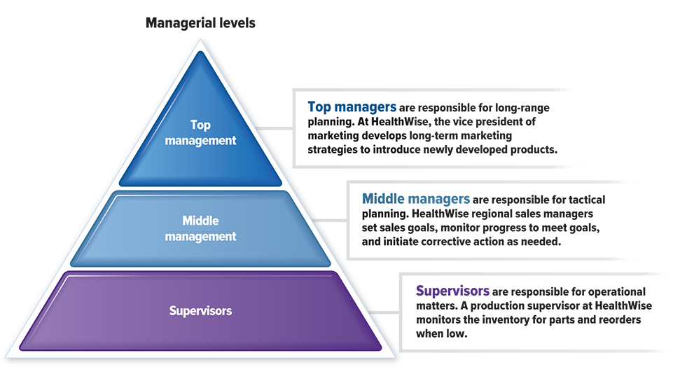
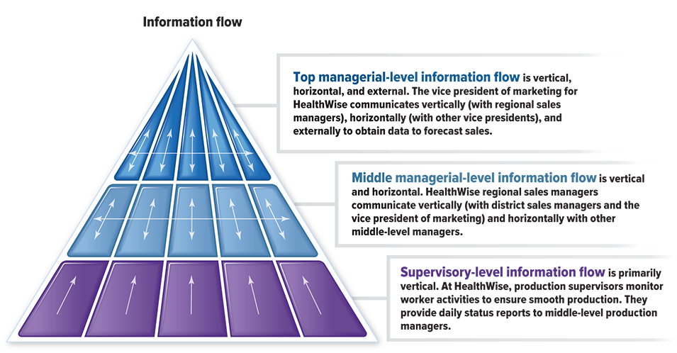
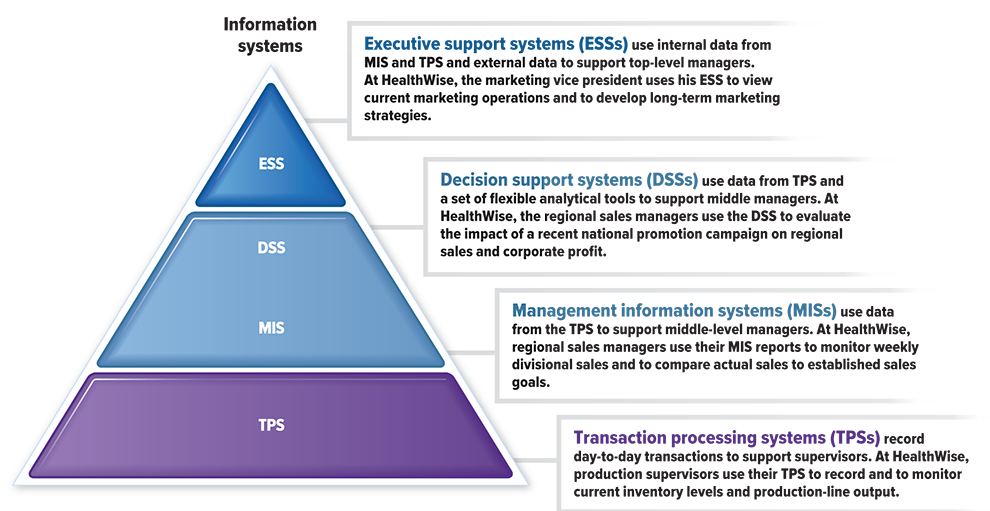
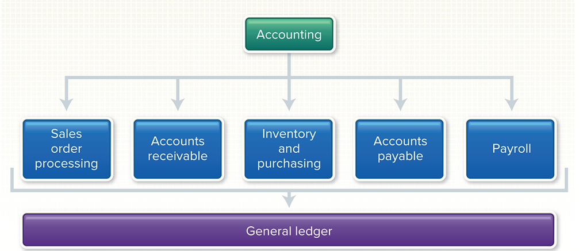
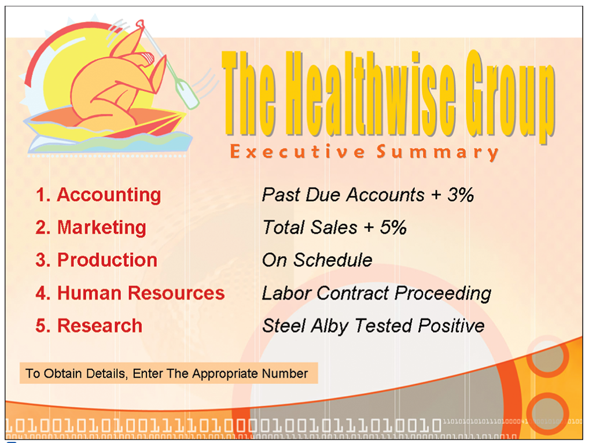
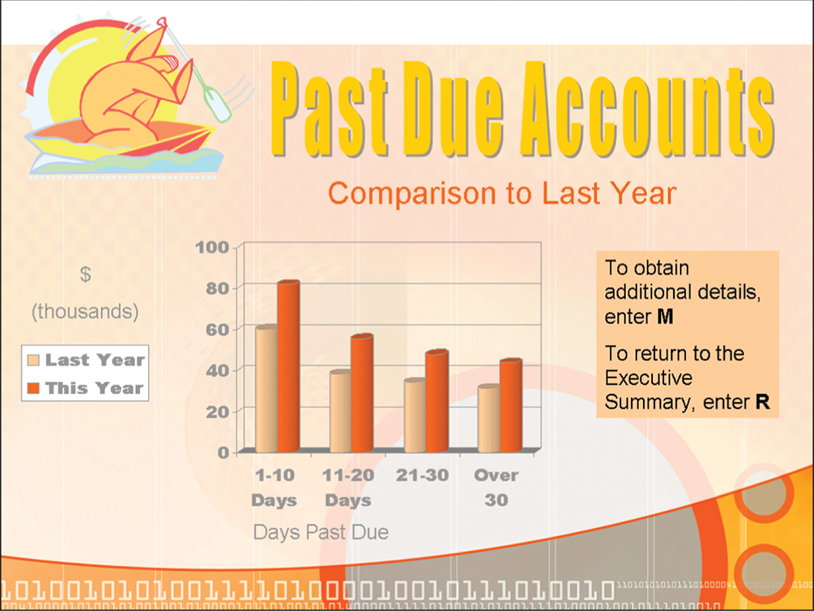

# Module 10 - Information Systems

<!-- TOC -->
* [Module 10 - Information Systems](#module-10---information-systems)
* [General Notes](#general-notes)
* [Information Systems Manager and Computer Information Systems](#information-systems-manager-and-computer-information-systems)
  * [What is an Information System?](#what-is-an-information-system)
  * [Why are Computers Used in Organizations?](#why-are-computers-used-in-organizations)
  * [Understanding Information Flows in Organizations](#understanding-information-flows-in-organizations)
  * [Conclusion](#conclusion)
* [Organizational Information Flow](#organizational-information-flow)
  * [Introduction](#introduction)
  * [Organization Structure](#organization-structure)
  * [Basic Functional Areas in Organizations](#basic-functional-areas-in-organizations)
    * [Examples](#examples)
    * [Organization Chart](#organization-chart)
    * [Conclusion](#conclusion-1)
  * [Management Levels and Information Flow](#management-levels-and-information-flow)
    * [Introduction](#introduction-1)
    * [Management Levels](#management-levels)
      * [Examples](#examples-1)
      * [Organization Chart](#organization-chart-1)
    * [Information Flow](#information-flow)
      * [Information Flow within an Organization](#information-flow-within-an-organization)
      * [Information Flow Chart](#information-flow-chart)
    * [Conclusion](#conclusion-2)
* [Computer-Based Information Systems](#computer-based-information-systems)
  * [Types of Information Systems](#types-of-information-systems)
    * [Information Systems Chart](#information-systems-chart)
  * [Transaction Processing System (TPS)](#transaction-processing-system--tps-)
  * [Management Information System (MIS)](#management-information-system--mis-)
  * [Decision Support System (DSS)](#decision-support-system--dss-)
  * [Executive Support System (ESS) or Executive Information System (EIS)](#executive-support-system--ess--or-executive-information-system--eis-)
  * [Conclusion](#conclusion-3)
* [Transaction Processing System (TPS)](#transaction-processing-system--tps--1)
  * [Accounting TPS](#accounting-tps)
  * [Other TPSs](#other-tpss)
    * [Conclusion](#conclusion-4)
* [Management Information System (MIS)](#management-information-system--mis--1)
  * [Example Report](#example-report)
  * [Key Points](#key-points)
    * [Categories of MIS Reports](#categories-of-mis-reports)
    * [Conclusion](#conclusion-5)
* [Decision Support System (DSS)](#decision-support-system--dss--1)
  * [Parts of a DSS](#parts-of-a-dss)
  * [Group Decision Support Systems (GDSS)](#group-decision-support-systems--gdss-)
  * [Concept Check](#concept-check)
* [Executive Support Systems (ESSs)](#executive-support-systems--esss-)
  * [Example of an ESS](#example-of-an-ess)
    * [ESS Main Menu](#ess-main-menu)
    * [ESS Past Due Accounts](#ess-past-due-accounts)
  * [Advantages of ESSs](#advantages-of-esss)
  * [Summary of Information Systems](#summary-of-information-systems)
  * [Comparison of ESSs to MISs and DSSs](#comparison-of-esss-to-miss-and-dsss)
  * [Conclusion](#conclusion-6)
* [Other Information Systems](#other-information-systems)
  * [Introduction](#introduction-2)
  * [Information Workers](#information-workers)
  * [Office Automation Systems (OAS)](#office-automation-systems--oas-)
  * [Knowledge Work Systems (KWS)](#knowledge-work-systems--kws-)
  * [Expert Systems](#expert-systems)
  * [Conclusion](#conclusion-7)
* [Information Systems Manager](#information-systems-manager)
  * [Job Description](#job-description)
  * [Requirements](#requirements)
  * [Salary and Advancement](#salary-and-advancement)
* [Careers in IT](#careers-in-it)
  * [What is an Information Systems Manager?](#what-is-an-information-systems-manager)
  * [Salary and Advancement Opportunities](#salary-and-advancement-opportunities)
  * [IBM’s Watson](#ibms-watson)
  * [Conclusion](#conclusion-8)
<!-- TOC -->

# General Notes

# Information Systems Manager and Computer Information Systems

## What is an Information System?

- An information system is a collection of people, procedures, software,
  hardware, data, and connectivity
- It provides information essential to running an organization
- The information is critical for producing a product or service and for
  deriving profit for profit-oriented enterprises

## Why are Computers Used in Organizations?

- At a basic level, computers are used to record events
- At a deeper level, computers are used to make decisions
- Data from sales in stores and inventory items are used to decide employee
  bonuses and identify market trends, respectively

## Understanding Information Flows in Organizations

- To effectively use computers in an organization, one must understand how
  information flows through different functional areas and management levels
- Different types of computer-based information systems include transaction
  processing systems, management information systems, decision support systems,
  and executive support systems
- Databases play an important role in supporting each level or type of
  information system

## Conclusion

- Computers are used to record events and make decisions
- Different types of computer-based information systems and databases support
  different levels and types of information systems in an organization.

# Organizational Information Flow

## Introduction

- Computerized information systems support the vertical and horizontal flow of
  information within the organization, in addition to keeping track of
  transactions and day-to-day business operations.
- To understand the flow of information within an organization, we need to
  examine its structure from a functional perspective.

## Organization Structure

- HealthWise Group, a hypothetical manufacturer of sporting goods, can be viewed
  from a functional perspective with various management levels.
- Effective operations require an efficient and coordinated flow of information
  throughout the organization.

## Basic Functional Areas in Organizations

Most organizations have departments that specialize in one of five basic
functions:

- **Accounting:** Records all financial activity from billing customers to
  paying employees.
- **Marketing:** Plans, prices, promotes, sells, and distributes the
  organization's goods and services.
- **Human resources:** Focuses on people—hiring, training, promoting, and any
  number of other human-centered activities within the organization.
- **Production:** Actually creates finished goods and services using raw
  materials and personnel.
- **Research:** Identifies, investigates, and develops new products and
  services.

### Examples

- HealthWise's accounting department tracks all sales, payments, and transfers
  of funds. It also produces reports detailing the financial condition of the
  company.
- HealthWise's goods include a wide range of products related to sports and
  other types of physical activity.
- Human resources at HealthWise is responsible for implementing a new benefits
  package, for hiring new skilled workers, and much more.
- HealthWise manufacturers a variety of sports equipment, including yoga mats.
- Scientists at HealthWise are investigating a light, inexpensive alloy for a
  new line of weight-training equipment.

### Organization Chart

### Conclusion

- Understanding the basic functions in an organization is important for
  effective communication and information flow within the organization.
- Departments specializing in these functions ensure that the organization runs
  efficiently and smoothly.

## Management Levels and Information Flow

### Introduction

- The foundation of any organization is its employees who produce goods and
  services.
- Different levels of managers plan, lead, organize, and control the
  organization to ensure that work gets done.
- Each level of management has different information needs, and information
  flows in different directions to support those needs.

### Management Levels

- Management in many organizations is divided into three levels:
    - **Supervisors:** Manage and monitor employees or workers, with
      responsibility relating to _operational matters_.
    - **Middle-level managers:** Deal with control, planning _(also called
      tactical planning)_, and decision-making, implementing the long-term
      goals of the organization.
    - **Top-level managers:** Concerned with long-range planning _(also called
      strategic planning)_ and need information that will help them plan the
      future growth and direction of the organization.

#### Examples

- The northwest district sales manager for HealthWise directs and coordinates
  all the salespeople in her area.
- Vice president of marketing, director of human resources, and production
  manager are other job titles in larger organizations.

#### Organization Chart

### Information Flow

- Top-level managers need summary information describing the overall operations
  of the business and information from outside the organization to forecast and
  plan for long-range events.
- Middle-level managers need summarized information, develop budget projections,
  and evaluate the performance of supervisors.
- Supervisors need detailed, current, day-to-day information on their units to
  keep operations running smoothly.

#### Information Flow within an Organization

- For **top-level managers**, information flows vertically and horizontally from
  within and outside the organization.
- For **middle-level managers**, information flow is both vertical and
  horizontal across functional lines.
- For **supervisory managers**, information flow is primarily vertical,
  communicating mainly with their middle managers and the workers beneath them.

#### Information Flow Chart

### Conclusion

- Understanding the different management levels and their information needs is
  essential for effective communication and information flow within the
  organization.
- Each level of management requires different types of information, and
  information flows in different directions to support those needs.

# Computer-Based Information Systems

## Types of Information Systems

- **Transaction processing system (TPS)**
- **Management information system (MIS)**
- **Decision support system (DSS)**
- **Executive support system (ESS)** or **executive information system (EIS)**

### Information Systems Chart

## Transaction Processing System (TPS)

- Records day-to-day transactions, such as customer orders, bills, inventory
  levels, and production output.
- Generates databases that act as the foundation for other information systems.
- Helps supervisors by providing detailed data for decision-making.

## Management Information System (MIS)

- Summarizes the detailed data of the TPS in standard reports for middle-level
  managers.
- Provides standard reports like weekly sales and production schedules.
- Helps managers make operational decisions.

## Decision Support System (DSS)

- Provides a flexible tool for analysis.
- Helps middle-level managers and others in the organization analyze a wide
  range of problems, such as the effect of events and trends outside the
  organization.
- Draws on the detailed data of the TPS.

## Executive Support System (ESS) or Executive Information System (EIS)

- Presents information in a highly summarized form.
- Helps top-level managers oversee the company’s operations and develop
  strategic plans.
- Combines the databases generated from the TPS and the reports generated from
  the MIS with external data.

## Conclusion

- Almost all organizations have computer-based information systems, which are
  categorized into four types: TPS, MIS, DSS, and ESS.
- TPS records day-to-day transactions and generates databases that serve as the
  foundation for other information systems.
- MIS summarizes the detailed data of the TPS and provides standard reports for
  middle-level managers to make operational decisions.
- DSS provides a flexible tool for analysis to help middle-level managers
  analyze a wide range of problems.
- ESS presents information in a highly summarized form to help top-level
  managers oversee the company’s operations and develop strategic plans.
- All four systems play a critical role in supporting an organization’s
  decision-making and improving operational efficiency.

# Transaction Processing System (TPS)

A transaction processing system helps an organization keep track of routine
operations and records these events in a database. Some firms call this the data
processing system (DPS). The data from operations is stored in a database that
records the transactions of the company. This database of transactions is used
to support the MIS, DSS, and ESS.

## Accounting TPS

One of the most essential transaction processing systems for any organization is
in the accounting area. Every accounting department handles six basic
activities. These are:

1. **Sales Order Processing:** records the customer requests for the company’s
   products or services.
2. **Accounts Receivable:** records money received from or owed by customers.
3. **Inventory and Purchasing:** the parts and finished goods that the company
   has in stock are called inventory. An inventory control system keeps records
   of the number of each kind of part or finished good in the warehouse.
   Purchasing is the buying of materials and services.
4. **Accounts Payable:** refers to money the company owes its suppliers for
   materials and services it has received.
5. **Payroll:** concerned with calculating employee paychecks.
6. **General Ledger:** keeps track of all summaries of all the foregoing
   transactions. A typical general ledger system can produce income statements
   and balance sheets. Income statements show a company’s financial performance,
   and balance sheets list the overall financial condition of an organization.

## Other TPSs

- **Automatic Teller Machines (ATMs):** record cash withdrawals.
- **Online registration systems:** track student enrollments.
- **Supermarket discount cards:** track customer purchases.

### Conclusion

A transaction processing system (TPS) is a system that helps organizations keep
track of routine operations and records these events in a database. The most
important TPS is the accounting TPS, which consists of six basic activities.
There are other TPSs, such as ATMs, online registration systems, and supermarket
discount cards.

# Management Information System (MIS)

A **Management Information System (MIS)** is a computer-based information system
that produces standardized reports in summarized structured form. An MIS uses
databases of various departments to provide summary data that supports middle
managers.

## Example Report

<u>Regional Sales Report</u>

| Region   | Actual Sales | Target   | Difference |
|:---------|:-------------|:---------|:-----------|
| Central  | $166,430     | $175,000 | ($8,570)   |
| Northern | 137,228      | 130,000  | 7,228      |
| Southern | 137,772      | 135,000  | 2,772      |
| Eastern  | 152,289      | 155,000  | (2,711)    |
| Western  | 167,017      | 160,000  | 7,017      |

## Key Points

- Whereas a transaction processing system _creates_ databases, an MIS _uses_
  databases.
- MIS produces predetermined reports, following a standard format and providing
  the same content.
- MIS requires a database management system to integrate databases from
  different departments.
- MIS supports middle managers by providing summary data drawn from across
  different functional areas.
- MIS reports are **periodic**, **exception**, and **demand** reports.

### Categories of MIS Reports

1. **Periodic Reports**: These are produced at regular intervals such as weekly,
   monthly, or quarterly.
    - The sales reports from district sales managers are
      combined into a monthly report for the regional sales managers.
    - For comparison purposes, a regional manager is also able to see the sales
      reports of other regional managers.
2. **Exception Reports**: These reports call attention to unusual events.
    - For instance, if fewer exercise bicycles are selling than were predicted
      for the northwest sales region, the regional manager will receive an
      exception report. That report may be used to alert the district managers
      and salespeople to
      give this product more attention.
3. **Demand Reports**: These reports are produced on request. An example is a
   report on the numbers and types of jobs held by women and minorities. At
   HealthWise, many government contracts require this information. It is used to
   certify that HealthWise is within certain government equal-opportunity
   guidelines.

### Conclusion

MIS is an important tool for middle managers as it provides them with a summary
of data from different departments. It produces predetermined reports in a
standardized format, which include periodic, exception, and demand reports. MIS
requires a database management system that integrates databases from different
departments to provide summary data.

# Decision Support System (DSS)

A decision support system (DSS) is a tool used by managers to get answers to
unanticipated, non-recurring problems. DSS is different from transaction
processing systems and management information systems, as it analyzes data and
produces flexible reports.

## Parts of a DSS

A DSS consists of four parts: the **user**, **system software**, **data**, and
**decision models**.

1. **User**: The user is typically a middle-level manager who has to make
   decisions.
2. **System software**: The software is designed to work behind the scenes and
   is typically menu or icon driven to provide an intuitive interface for the
   user.
3. **Data**: Data in a DSS is stored in a database and can be **internal** or
   **external**.
    - **Internal** data consists of transactions from the transaction processing
      system
    - **External** data is gathered from outside the organization.
4. **Decision models**: Decision models provide the analytical capabilities of a
   DSS. There are three types of decision models:
    - **Strategic:** Assist top-level managers in long-range planning.
        - _Ex. Stating company objectives or planning plant locations._
    - **Tactical:** Help middle-level managers control the work of the
      organization.
        - _Ex. Financial planning and sales promotion planning._
    - **Operational:** Help lower-level managers accomplish the organization’s
      day-to-day activities.
        - _Ex. Evaluating and maintaining quality control._

## Group Decision Support Systems (GDSS)

Some DSSs are designed to support a team of decision makers, known as **Group
Decision Support Systems (GDSS)**.

- These systems include tools to support group meetings and collective work.

## Concept Check

- The purpose of a decision support system is to provide managers with answers
  to unanticipated, non-recurring problems.
- The four parts of a DSS are the user, system software, data, and decision
  models.
- The three basic types of decision models are strategic, tactical, and
  operational.

# Executive Support Systems (ESSs)

- Sophisticated software designed to present, summarize, and analyze data from
  an organization’s databases in an easy-to-use format for top-level executives.
- ESSs are specifically designed to be easy to use so that top executives with
  little spare time can obtain essential information without extensive training.
- The information is often displayed in a very condensed form with informative
  graphics.

## Example of an ESS

- The President of HealthWise uses an executive support system available on his
  personal computer.
- The ESS displays a condensed account of activities in five different areas of
  the company: Accounting, Marketing, Production, Human Resources, and Research.

On one particular morning, the ESS shows business in four areas proceeding
smoothly, but the percentage of late-paying customers (past due accounts) has
increased by 3% in Accounting.

1. To find out the details, the President selects Accounting and sees a graph of
   past due accounts comparing today’s late payers in red to last year’s late
   payers in yellow.
2. The differences between today and a year ago are significant and clearly
   presented, and the President decides to take action to speed up customer
   payments.

### ESS Main Menu

### ESS Past Due Accounts

## Advantages of ESSs

- ESSs permit a firm’s top executives to gain direct access to information about
  the company’s performance.
- They provide direct electronic communication links to other executives.
- Some ESSs have the ability to retrieve information from databases outside the
  company, such as business-news services.
- This enables a firm to watch for stories on competitors and stay current on
  relevant news events that could affect its business.

## Summary of Information Systems

|  Type   | Description                                                                                                                                         |
|:-------:|:----------------------------------------------------------------------------------------------------------------------------------------------------|
| **TPS** | Tracks routine operations and records events in databases; also known as data processing systems                                                    |
| **MIS** | Produces standardized reports (**periodic**, **exception**, and **demand**) using databases created by TPS                                          |
| **DSS** | Analyzes unanticipated situations using data (**internal** and **external**) and decision models (**strategic**, **tactical**, and **operational**) |
| **ESS** | Presents summary information in a flexible, easy-to-use, graphical format designed for top executives                                               |

- **TPS** tracks routine operations and records events in databases, also known
  as data processing systems.
- **MIS** produces standardized reports using databases created by TPS.
- **DSS** analyzes unanticipated situations using data and decision models.
- **ESS** presents summary information in a flexible, easy-to-use, graphical
  format designed for top executives.

## Comparison of ESSs to MISs and DSSs

- ESSs and MISs can present, summarize, and analyze data from an organization’s
  databases, but ESSs are specifically designed to be easy to use for top
  executives with little spare time.
- DSSs analyze unanticipated situations using data and decision models, whereas
  ESSs focus on presenting summary information in a flexible, easy-to-use,
  graphical format designed for top executives.

## Conclusion

- An executive support system is a sophisticated software designed to present,
  summarize, and analyze data from an organization’s databases in an easy-to-use
  format for top-level executives.
- ESSs are specifically designed to be easy to use and often display information
  in a condensed form with informative graphics. They permit a firm’s top
  executives to gain direct access to information about the company’s
  performance and provide direct electronic communication links to other
  executives.
- ESSs are similar to MISs in that they can present, summarize, and analyze data
  from an organization’s databases, but ESSs are specifically designed to be
  easy to use for top executives with little spare time.
- DSSs, on the other hand, focus on analyzing unanticipated situations
  using data and decision models.

# Other Information Systems

## Introduction

- Information workers distribute, communicate, and create information.
- There are two types of information workers:
    - **Data workers**
    - **Knowledge workers**
- There are two types of systems to support information workers:
    - **Office automation systems (OASs)**
    - **Knowledge Work Systems (KWS)**

## Information Workers

- Information workers distribute, communicate, and create information
- Administrative assistants, clerks, engineers, and scientists are examples of
  information workers
- **Data workers** are involved with distribution and communication of
  information
    - _Ex. Administrative assistants and clerks_
- **Knowledge workers** are involved with the creation of information
    - _Ex. Engineers and scientists_

## Office Automation Systems (OAS)

- Designed primarily to support data workers
- Focus on managing documents, communicating, and scheduling
- Word processing, web authoring, desktop publishing, and other image
  technologies are used for managing documents.
- **Project managers** are programs designed to schedule, plan, and control
  project resources.
- **Videoconferencing systems** are computer systems that allow people located
  at various geographic locations to communicate and have in-person meetings.

## Knowledge Work Systems (KWS)

- Knowledge workers use OAS systems and specialized information systems called
  Knowledge Work Systems (KWSs) to create information in their areas of
  expertise
- KWSs consist of powerful personal computers running special programs that
  integrate the design and manufacturing activities
- CAD/CAM systems are widely used in the manufacture of automobiles, product
  design, and by engineers.
    - **Computer-aided design/computer-aided manufacturing (CAD/CAM) systems**
- Expert systems are another widely used KWS

## Expert Systems

- Expert systems are a type of artificial intelligence that uses a database to
  provide assistance to users
- They are also known as knowledge-based systems
- Expert systems capture the knowledge of a human expert and make it accessible
  to everyone through a computer program
- The knowledge base contains facts and rules distilled from a human expert
- Users interact with an expert system by describing a particular situation or
  problem
- Industries where expert systems are popular include medicine, geology,
  architecture, and nature.

## Conclusion

- Information systems supporting information workers include OAS and KWS
- OAS is designed for managing documents, communicating, and scheduling while
  KWS is designed to create information in the areas of expertise of knowledge
  workers
- Expert systems are specialized software that use a knowledge base to provide
  assistance to users in specific industries.

# Information Systems Manager

## Job Description

- Information systems managers oversee computer professionals, create and
  implement corporate computer policy and systems.
- They manage the work of programmers, computer specialists, systems analysts,
  and other computer professionals.

## Requirements

- Individuals with strong technical backgrounds and a master’s degree in
  business are often preferred by employers.
- Strong leadership and excellent communication skills are also essential.
- Communication skills should be in both technical and non-technical terms.
- Consultants or managers in previous positions are often preferred.
- Experience in computer and network security is in demand.

## Salary and Advancement

- Information systems managers can expect an annual salary of $90,430 to
  $208,000.
- Advancement opportunities typically include leadership in the field.

# Careers in IT

## What is an Information Systems Manager?

- Information Systems Managers oversee the work of programmers, computer
  specialists, systems analysts, and other computer professionals.
- They create and implement corporate computer policy and systems.
- Employers look for individuals with strong technical backgrounds, sometimes as
  consultants, with a master’s degree in business.
- Information Systems Managers must have strong leadership and excellent
  communication skills and must be able to communicate with people in technical
  and non-technical terms.
- Information Systems Management positions are often filled by individuals who
  have been consultants or managers in previous positions.
- Those with experience in computer and network security will be in demand as
  businesses and society continue to struggle with important security issues.

## Salary and Advancement Opportunities

- Information Systems Managers can expect an annual salary of $90,430 to
  $208,000.
- Advancement opportunities typically include leadership in the field.

## IBM’s Watson

- IBM’s Watson is an information-finding supercomputer.
- In 2011, Watson defeated the two best contestants in the game show Jeopardy.
- Watson can read the question, understand what was being asked, search through
  200 million pages of text, figure out what the best answer would be, and then
  hit a buzzer before the other contestants to deliver the answer.
- Watson is being used by several organizations.
- One healthcare company uses Watson to help suggest options based on a
  patient’s unique circumstances. It assists physicians and nurses by looking
  through millions of pages of medical research and then quickly identifying the
  most likely diagnosis and treatment options for the patient.
- To help Watson learn more about the medical field, IBM has partnered with a
  cancer center in order to “teach” Watson how to process the massive amount of
  cancer-related research and case studies.
- In the finance field, Watson has recently been learning about the complexities
  of Wall Street, with the hopes that it can help financial firms identify risks
  and rewards to improve the advice given to their customers.
- IBM envisions Watson’s technology being an integral part of healthcare and
  finance industries.
- Other companies such as Uber and the UK’s National Health Service have also
  developed similar systems.
- The future of information technology could transform the way all of us do
  research and seek answers for our toughest problems.

## Conclusion

- Information Systems Managers play an important role in creating and
  implementing corporate computer policy and systems.
- With the development of powerful systems like IBM’s Watson, professionals in
  various industries could benefit from quick access to vast amounts of
  information.
- While the technology has the potential to transform the way we do research, it
  is important to consider the impact on employment in various industries.