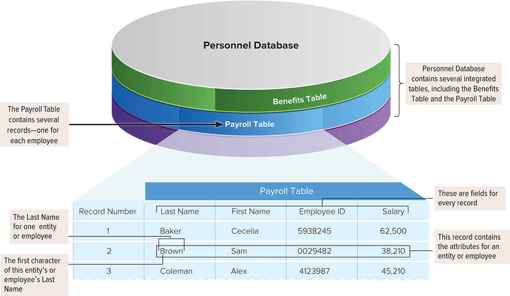
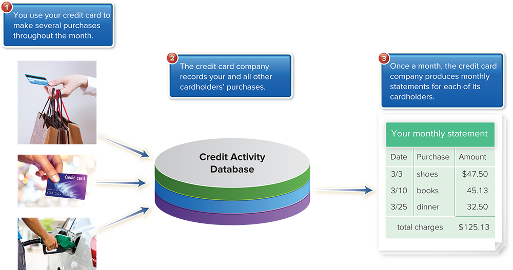
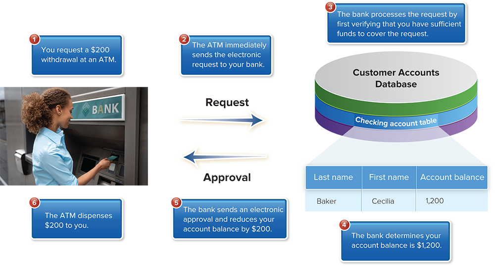
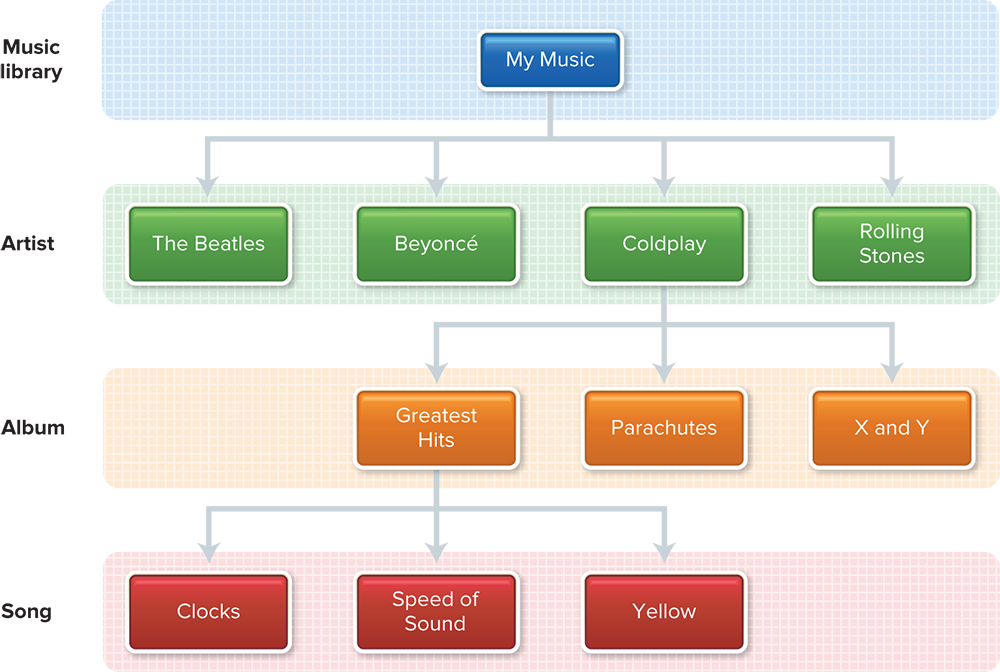
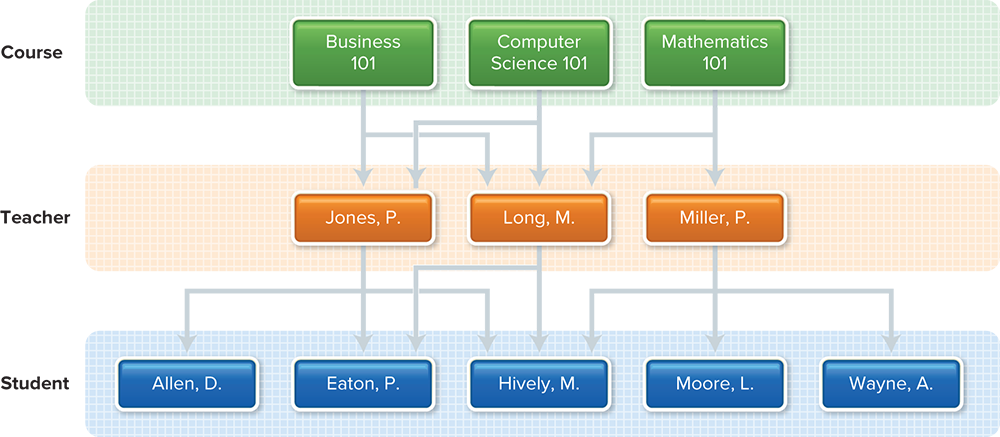
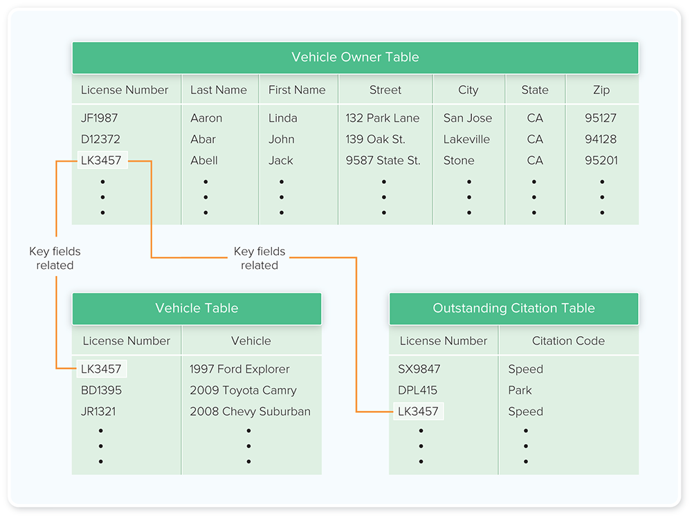
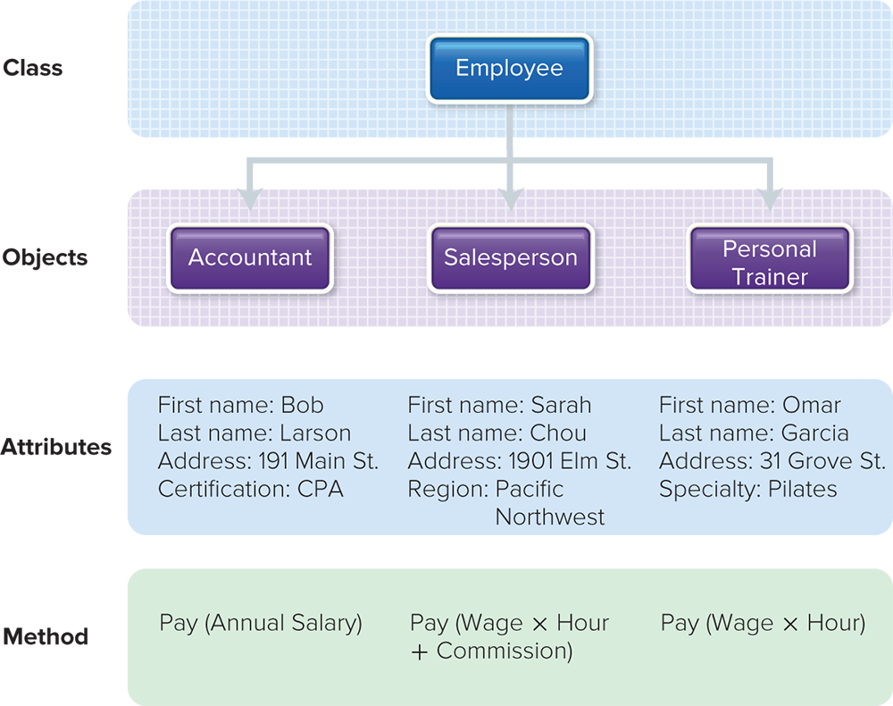

# Module 11 - Databases

<!-- TOC -->
* [Module 11 - Databases](#module-11---databases)
* [General Notes](#general-notes)
* [Data](#data)
  * [Data in Information Systems](#data-in-information-systems)
  * [Types of Data](#types-of-data)
  * [Perspectives on Data](#perspectives-on-data)
  * [Concept Check](#concept-check)
  * [Conclusion](#conclusion)
* [Data Organization](#data-organization)
  * [Logical Data Organization](#logical-data-organization)
  * [Key Field](#key-field)
  * [Batch vs Real-Time Processing](#batch-vs-real-time-processing)
    * [Batch Processing](#batch-processing)
    * [Real-time Processing](#real-time-processing)
  * [Conclusion](#conclusion-1)
* [Databases](#databases)
  * [Data Redundancy and Data Integrity](#data-redundancy-and-data-integrity)
  * [Advantages of Databases](#advantages-of-databases)
  * [Database Management System (DBMS)](#database-management-system--dbms-)
    * [DBMS Subsystems](#dbms-subsystems)
  * [Database Administration](#database-administration)
  * [Conclusion](#conclusion-2)
* [DBMS Structure](#dbms-structure)
  * [Database Models](#database-models)
  * [Hierarchical Database](#hierarchical-database)
  * [Network Database](#network-database)
  * [Relational Database](#relational-database)
  * [Multidimensional Database](#multidimensional-database)
    * [Advantages of Multidimensional Databases](#advantages-of-multidimensional-databases)
  * [Object-Oriented Database](#object-oriented-database)
    * [Classes, Objects, Attributes, and Methods](#classes-objects-attributes-and-methods)
  * [Table of Databases](#table-of-databases)
  * [Conclusion](#conclusion-3)
* [Types of Databases](#types-of-databases)
  * [1. Individual](#1-individual)
  * [2. Company](#2-company)
  * [3. Distributed](#3-distributed)
  * [4. Commercial](#4-commercial)
  * [Table of Different Database Types](#table-of-different-database-types)
  * [Conclusion](#conclusion-4)
* [Database Uses and Issues](#database-uses-and-issues)
  * [Strategic Uses](#strategic-uses)
  * [Security](#security)
  * [Conclusion](#conclusion-5)
* [Careers in IT](#careers-in-it)
  * [Database Administrators](#database-administrators)
  * [Crime Databases and Predictive Policing](#crime-databases-and-predictive-policing)
  * [Conclusion](#conclusion-6)
<!-- TOC -->

# General Notes

# Data

## Data in Information Systems

- **Data:** Facts or observations about people, places, things, and events
- **Databases:** Store, organize, and use data

## Types of Data

- **Audio** (captured, interpreted, and saved using microphones and voice
  recognition systems)
- **Music** (downloaded from the Internet and saved on various devices)
- **Photographs** (captured by digital cameras, edited by image editing
  software,
  and shared over the Internet)
- **Video** (captured by digital video cameras, TV tuner cards, and webcams)

## Perspectives on Data

1. **Physical view**:
    - Focuses on actual format and location of the data
    - Data recorded as digital bits grouped into bytes representing characters
      using a coding scheme like Unicode
    - Mostly concerns specialized computer professionals
2. **Logical view**:
    - Focuses on meaning, content, and context of the data
    - Relevant to end users and most computer professionals
    - Involves using data with application programs
    - This chapter discusses the logical view of data and its storage in
      databases

## Concept Check

- **Different types of data:** audio, music, photographs, video
- **Physical view of data:** focuses on the actual format and location of the
  data
- **Logical view of data:** focuses on the meaning, content, and context of the
  data

## Conclusion

Data is a crucial component of information systems and can be stored, organized,
and used through databases. Data comes in various forms, such as audio, music,
photographs, and video. **It can be viewed from two perspectives:** physical
view (
format and location) and logical view (meaning, content, and context). This
chapter mainly discusses the logical view of data and how it is stored in
databases.

# Data Organization

## Logical Data Organization

- **Character:** Single letter, number, or special character.
- **Field:** Group of related characters, represents an attribute of an entity.
- **Record:** Collection of related fields, describes an entity.
- **Table:** Collection of related records.
- **Database:** Integrated collection of logically related tables.

## Key Field

- Distinctive field in a record, called **primary key**.
- Uniquely identifies the record.
- Used to relate tables by common key fields.
- Key fields in different tables can be used to integrate the data in a
  database.
    - For example, in the Personnel Database, both the Payroll and the Benefits
      tables include the field Employee ID. Data from the two tables could be
      related by combining all records with the same key field (Employee ID).

## Batch vs Real-Time Processing

### Batch Processing

- Data collected over a period and processed all at once.
- **_Example:** Monthly credit card statements._

### Real-time Processing

- Data processed at the same time the transaction occurs.
- Also known as **online processing**.
- **_Example:** ATM withdrawal._

## Conclusion

- Data in databases is organized logically into characters, fields, records,
  tables, and databases.
- Key fields uniquely identify records and are used to relate tables.
- Batch processing processes data in large groups, while real-time-processing
  processes data immediately as transactions occur.

# Databases

## Data Redundancy and Data Integrity

- **Data redundancy:** Multiple files containing the same information, leading
  to storage inefficiency and data maintenance problems.
- **Data integrity:** Ensuring accuracy and consistency of data across different
  sources.

## Advantages of Databases

1. **Sharing:** Easy exchange of information across departments.
2. **Security:** Access control with passwords and selective permissions.
3. **Less data redundancy:** Reduced storage space and data maintenance issues.
4. **Data integrity:** Consistent and accurate data across different sources.
    - _Example: A customer’s address may be listed as “Main Street” in one
      system and “Main St.” in another. With discrepancies like these, it is
      probable that the customer would be treated as two separate people._

## Database Management System (DBMS)

- Software to create, modify, and access databases.
- _Example: Microsoft Access for personal computers, specialized database
  servers._

### DBMS Subsystems

1. **DBMS engine:** Bridge between logical and physical view of data.
    - Handles the details of actually locating the data (physical perspective).
2. **Data definition subsystem:** Defines database's logical structure using
   **data dictionary** or **schema**.
    - This dictionary contains a description of the structure of data in the
      database.
3. **Data manipulation subsystem:** Tools for data maintenance (adding,
   deleting, editing) and analysis (viewing, querying, reporting).
    - Maintaining data is known as **data maintenance**.
    - Specific tools include **query-by-example** and a specialized programming
      language called **structured query language (SQL)**.
4. **Application generation subsystem:** Tools to create data entry forms and
   interface with programming languages.
5. **Data administration subsystem:** Manages overall database, including
   security, disaster recovery, and performance monitoring.

## Database Administration

- Database administrators (DBAs): Specialists managing databases and determining
  processing rights (who has access to what data).

## Conclusion

Databases provide significant advantages to organizations, such as sharing,
security, less data redundancy, and data integrity. Database management
systems (DBMS) facilitate creating, modifying, and accessing databases through
various subsystems. Database administrators (DBAs) play a crucial role in
managing and securing access to the database.

# DBMS Structure

## Database Models

- DBMS programs work with logically structured data, known as a
  **database model**.
- Database models define rules and standards for all the data in a database.
- Microsoft Access is designed to work with databases using the relational data
  model.
- There are five common database models:
    - **Hierarchical**
    - **Network**
    - **Relational**
    - **Multidimensional**
    - **Object-oriented**

## Hierarchical Database

- Hierarchical data model used in mainframe DBMS
- Fields or records structured in nodes
- Parent nodes have one-to-many relationships with child nodes
- Rigid structure; deleting a parent node removes all child nodes
    - A child node cannot be added unless a parent node is added first.
    - One parent only per child, and no relationships or connections between the
      child nodes themselves.

## Network Database

- Developed in response to hierarchical model limitations
- Each child node can have multiple parent nodes
    - **Many-to-many relationships**
- Increased flexibility and efficiency
- There are additional connections—called **pointers**—between parent nodes and
  child nodes.

## Relational Database

- Most common database model
- Data elements stored in tables with rows and columns
- Tables and data called **relations**
- Requires **common data item** or shared key field in related tables
- Simplicity; easy addition, deletion, and modification of entries
- Used in personal computer DBMSs and mainframe/midrange systems

## Multidimensional Database

- Variation and extension of relational model
- Uses **data cubes** with multiple dimensions
- Represents complex relationships between data

### Advantages of Multidimensional Databases

- **Conceptualization:** Users can analyze complex data and relationships
  without specialized database programming knowledge.
- **Processing Speed:** Analyzing and querying a large multidimensional database
  can be much faster than a relational database.

A query requiring just a few seconds on a multidimensional database could take
minutes or hours to perform on a relational database.

## Object-Oriented Database

Object-oriented databases are designed to store data as well as instructions to
manipulate the data. They are more flexible than other data structures and
ideally designed to provide input for object-oriented software development.

### Classes, Objects, Attributes, and Methods

- **Classes**: General definitions.
- **Objects**: Specific instances of a class that can contain both data and
  instructions to manipulate the data.
- **Attributes**: Data fields an object possesses.
- **Methods**: Instructions for retrieving or manipulating attribute values.

## Table of Databases

| Organization     | Description                                                                                                                                       |
|:-----------------|:--------------------------------------------------------------------------------------------------------------------------------------------------|
| Hierarchical     | Data structured in nodes organized like an upside-down tree; each parent node can have several children; each child node can have only one parent |
| Network          | Like hierarchical except that each child can have several parents                                                                                 |
| Relational       | Data stored in tables consisting of rows and columns                                                                                              |
| Multidimensional | Data stored in data cubes with three or more dimensions                                                                                           |
| Object-oriented  | Organizes data using classes, objects, attributes, and methods                                                                                    |

## Conclusion

Database models dictate the structure and organization of data in a database.
There are various models available, each with their own advantages and
limitations. Hierarchical and network databases are more rigid in structure,
while relational databases are more common and offer simplicity.
Multidimensional databases provide a more intuitive model and faster processing,
and object-oriented databases offer flexibility and compatibility with
object-oriented software development.

Although hierarchical and network databases are still widely used, relational
and multidimensional databases are the most popular today. Object-oriented
databases are becoming more widely used and are part of a new category of
databases known as **NoSQL**.

# Types of Databases

| Types of Databases | Description                                                                                                                                                 |
|:------------------:|:------------------------------------------------------------------------------------------------------------------------------------------------------------|
|     Individual     | Databases that are created and maintained by individuals for personal use or for small projects.                                                            |
|      Company       | Databases that are created and maintained by organizations for their own use, such as managing customer information or inventory.                           |
|    Distributed     | Databases that are spread across multiple computers or locations and can be accessed by multiple users simultaneously.                                      |
|     Commercial     | Databases that are created and maintained by companies specifically for commercial purposes, such as selling to other companies or providing data services. |

## 1. Individual

- Also known as a **personal computer database**
- Used primarily by one person
- Data and DBMS under direct control of the user
- Stored on user's hard-disk drive or LAN file server
- _Example: A salesperson keeping track of their customers_

## 2. Company

- Created for internal use within a company
- Stored on a central database server and managed by a database administrator
- Accessible to users within the company via personal computers and networks
- Foundation for management information systems
- _Example: A department store recording all sales transactions_

## 3. Distributed

- Data stored in multiple locations, accessible through various communication
  networks
- Not all data physically located in one place
- Database servers on client/server networks link the data
- _Example: Sales figures for a chain of department stores located at various_
  stores, accessible by executives at district offices or headquarters

## 4. Commercial

- Large databases covering specific subjects
- Accessible to the public or selected individuals for a fee
- Also called **information utilities** or **data banks**
- _Example: Factiva, offering information-gathering and reporting services_
- **Widely used commercial databases:** ProQuest Dialog, Dow Jones Factiva, and
  LexisNexis

## Table of Different Database Types

**Table Summary:** A table divided into 2 columns summarizes four types of
databases. Column 1 shows the Type and column 2 shows the Description.

| Type        | Description                                                                      |
|:------------|:---------------------------------------------------------------------------------|
| Individual  | Integrated files used by just one person                                         |
| Company     | Common operational or commonly used files shared in an organization              |
| Distributed | Database spread geographically and accessed using database server                |
| Commercial  | Information utilities or data banks available to users on a wide range of topics |

## Conclusion

**Databases can be categorized into four types:** individual, company,
distributed,
and commercial. Individual databases are used by one person, while company
databases are used internally within an organization. Distributed databases
store data in multiple locations, and commercial databases offer access to
specific subjects for a fee. Each type of database serves different purposes and
has varying levels of accessibility.

- Databases can be classified according to their size and accessibility.

# Database Uses and Issues

## Strategic Uses

1. Databases are essential for productivity and planning, often more valuable
   than books and journals in corporate libraries.
2. Data warehouses store data from internal and external sources for managers
   and business professionals.
3. Data mining techniques search databases for related information and patterns.
4. Types of databases include:
    - Business directories
        - Providing addresses, financial and marketing information, products,
          and trade and brand names.
    - Demographic data
        - Such as county and city statistics, current estimates on population
          and income, employment statistics, census data, and so on.
    - Business statistical information
        - Such as financial information on publicly traded companies, market
          potential of certain retail stores, and other business data and
          information.
    - Text databases
        - Providing articles from business publications, press releases, reviews
          on companies and products, and so on.
    - Web databases
        - Covering a wide range of topics, including all of those previously
          mentioned. As mentioned earlier, web search sites like Google maintain
          extensive databases of available Internet content.

## Security

1. Database security is critical due to the value of information stored.
2. **Security concerns:**
    - Misuse of personal and private information
    - Unauthorized users accessing databases
    - Computer viruses launched into databases or networks
3. **Security measures:**
    - Guards in computer rooms
    - Identification checks
    - Electronic fingerprint scanners
    - Firewalls for controlling access to internal networks

## Conclusion

Databases play a crucial role in businesses for maintaining productivity and
strategic planning. Data warehouses and data mining techniques enable
organizations to analyze data and find patterns. As databases hold valuable
information, security measures such as identification checks, fingerprint
scanners, and firewalls are necessary to protect against unauthorized access and
potential misuse of information.

# Careers in IT

## Database Administrators

- **Role**: Determine efficient organization and access of company data,
  maintain security, and perform backups.
- **Industry**: Fast-growing, substantial job growth expected.
- **Requirements**:
    - Bachelor's degree in computer science or information systems.
    - Technical experience.
    - Internships and prior experience with the latest technology are
      advantageous.
- **Salary**: $47,000 to $111,000 annually.
- **Advancement**: Chief technology officer or managerial positions.

## Crime Databases and Predictive Policing

- **Current databases**: Focus on individuals who have committed crimes.
    - Contain basic information, fingerprints, photos, and DNA samples.
- **Predicting criminal behavior**:
    - Research on patterns and factors leading to violent crime.
    - Studies on human DNA for connections to antisocial or violent behavior.
- **Expanding criminal databases**:
    - Collection of DNA samples from every person in a country.
    - Access to databases from schools, businesses, insurance companies, and
      medical practices.
    - Potentially monitor or intervene with psychological or medical assistance
      for identified individuals.
- **Challenges**:
    - Legal challenges to data collection.
    - Balancing privacy and crime reduction.
    - Trust in the government.

## Conclusion

Database administrators play a crucial role in managing and securing company
data, with the potential for career advancement. In the context of crime
databases, the focus is shifting towards predicting criminal behavior by
analyzing patterns and expanding data collection. However, challenges arise in
balancing privacy, crime reduction, and trust in the government.