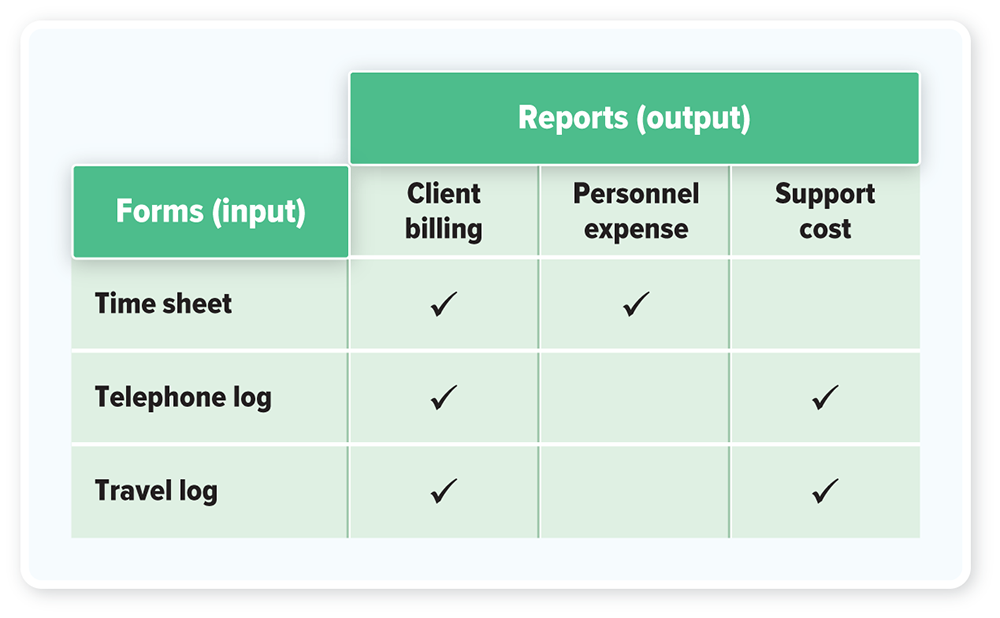
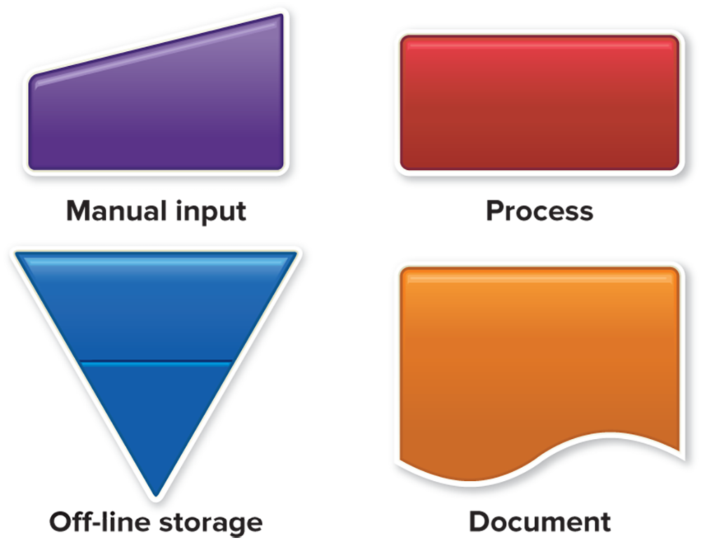
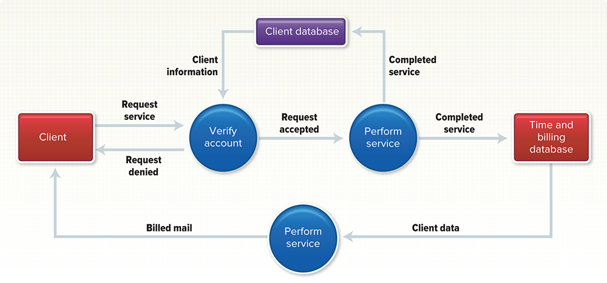

# Module 12 - Systems Analysis and Design

<!-- TOC -->
* [Module 12 - Systems Analysis and Design](#module-12---systems-analysis-and-design)
* [General Notes](#general-notes)
* [Systems Analysis and Design](#systems-analysis-and-design)
  * [Definition of System](#definition-of-system)
  * [Information Flow in an Organization](#information-flow-in-an-organization)
  * [Six-Phase Systems Life Cycle](#six-phase-systems-life-cycle)
  * [Importance of Understanding Systems Analysis and Design](#importance-of-understanding-systems-analysis-and-design)
  * [Conclusion](#conclusion)
* [Phase 1: Preliminary Investigation](#phase-1--preliminary-investigation)
  * [Purpose of Preliminary Investigation](#purpose-of-preliminary-investigation)
  * [Tasks of the Systems Analyst in Phase 1](#tasks-of-the-systems-analyst-in-phase-1)
  * [Defining the Problem](#defining-the-problem)
  * [Suggesting Alternative Systems](#suggesting-alternative-systems)
  * [Preparing a Short Report](#preparing-a-short-report)
  * [Additional Information](#additional-information)
  * [Conclusion](#conclusion-1)
* [Phase 2: Systems Analysis](#phase-2--systems-analysis)
  * [Gathering Data](#gathering-data)
  * [Analyzing the Data](#analyzing-the-data)
    * [Top-down analysis method](#top-down-analysis-method)
    * [Grid charts](#grid-charts)
    * [System flowcharts](#system-flowcharts)
    * [Data flow diagrams](#data-flow-diagrams)
    * [Automated design tools](#automated-design-tools)
  * [Documenting Systems Analysis](#documenting-systems-analysis)
    * [Contents of Systems Analysis Report](#contents-of-systems-analysis-report)
  * [Conclusion](#conclusion-2)
* [Phase 3: Systems Design](#phase-3--systems-design)
  * [Designing Alternative Systems](#designing-alternative-systems)
  * [Selecting the Best System](#selecting-the-best-system)
  * [Writing the Systems Design Report](#writing-the-systems-design-report)
  * [Concept Check](#concept-check)
  * [Conclusion](#conclusion-3)
* [Phase 4: Systems Development](#phase-4--systems-development)
  * [Overview](#overview)
  * [Acquiring Software](#acquiring-software)
  * [Acquiring Hardware](#acquiring-hardware)
  * [Testing the New System](#testing-the-new-system)
  * [Conclusion](#conclusion-4)
* [Phase 5: Systems Implementation](#phase-5--systems-implementation)
  * [Introduction](#introduction)
  * [Types of Conversion](#types-of-conversion)
    * [Direct Approach](#direct-approach)
    * [Parallel Approach](#parallel-approach)
    * [Pilot Approach](#pilot-approach)
    * [Phased Approach](#phased-approach)
  * [Which Conversion Approach is Best?](#which-conversion-approach-is-best)
  * [Training](#training)
  * [Conclusion](#conclusion-5)
* [Phase 6: Systems Maintenance](#phase-6--systems-maintenance)
  * [Purpose of Systems Maintenance](#purpose-of-systems-maintenance)
  * [Two Parts of Systems Maintenance](#two-parts-of-systems-maintenance)
  * [Summary of the Systems Life Cycle](#summary-of-the-systems-life-cycle)
  * [Conclusion](#conclusion-6)
* [Prototyping and Rapid Applications Development](#prototyping-and-rapid-applications-development)
  * [Prototyping](#prototyping)
  * [Rapid Applications Development (RAD)](#rapid-applications-development--rad-)
  * [Advantages of Prototyping and RAD](#advantages-of-prototyping-and-rad)
  * [Conclusion](#conclusion-7)
* [Careers in IT](#careers-in-it)
  * [Systems Analyst](#systems-analyst)
  * [Look to the Future](#look-to-the-future)
    * [Pace of Business](#pace-of-business)
    * [Moving to the Cloud](#moving-to-the-cloud)
  * [Conclusion](#conclusion-8)
<!-- TOC -->

# General Notes

# Systems Analysis and Design

## Definition of System

-

A [system](https://epub-factory-cdn.mheducation.com/publish/sn_7bac8/12/1080mp4/OPS/s9ml/glossary.xhtml#key-System)
is a collection of activities and elements organized to accomplish a goal.

- An information system is a collection of hardware, software, people,
  procedures, data, and the Internet that work together to provide information
  essential to running an organization.

## Information Flow in an Organization

- Information flows into an organization **from the outside** about orders
  received, products shipped, money owed, etc.
- Information flows **within** the organization about what supplies have been
  received, which customers have paid their bills, etc.
- To avoid confusion, the flow of information must follow a route that is
  defined by a set of rules and procedures.
- Organizations need to change their information systems from time to time for
  various reasons such as:
    - Organizational growth
    - Mergers and acquisitions
    - New marketing opportunities
    - Revisions in governmental regulations
    - Availability of new technology

## Six-Phase Systems Life Cycle

- [Systems analysis and design](https://epub-factory-cdn.mheducation.com/publish/sn_7bac8/12/1080mp4/OPS/s9ml/glossary.xhtml#key-Systems-analysis-and-design)
  is a six-phase problem-solving procedure for examining and improving an
  information system.
- The six phases make up the systems life cycle:
    1. **Preliminary investigation**
        - The organization’s problems or needs are identified and summarized in
          a short report.
    2. **Systems analysis**
        - The present system is studied in depth. New requirements are specified
          and documented.
    3. **Systems design**
        - A new or alternative information system is designed and a design
          report created.
    4. **Systems development**
        - New hardware and software are acquired, developed, and tested.
    5. **Systems implementation**
        - The new information system is installed, and people are trained to use
          it.
    6. **Systems maintenance**
        - In this ongoing phase, the system is periodically evaluated and
          updated as needed.
- The life cycle is used by computer professionals known
  as [systems analysts](https://epub-factory-cdn.mheducation.com/publish/sn_7bac8/12/1080mp4/OPS/s9ml/glossary.xhtml#key-Systems-analyst)
  to determine what actions to take and how to use computer technology to assist
  organizations.
- Information systems fail because of a lack of investigation and analysis, and
  many go over budget or become obsolete too quickly because of a failure to
  recognize the importance of system maintenance.
- The value and necessity of each of the phases are crucial for the long-term
  success of an information system.

## Importance of Understanding Systems Analysis and Design

- Learning the six steps of the systems life cycle will raise computer
  efficiency and effectiveness.
- Understanding systems analysis and design will give you skills to solve a wide
  range of problems, making you more valuable to an organization.

## Conclusion

In summary, systems analysis and design is a six-phase procedure for examining
and improving an information system. The six phases are preliminary
investigation, systems analysis, systems design, systems development, systems
implementation, and systems maintenance. Understanding the systems life cycle
and the value of each phase is important for the long-term success of an
information system. As an end user, understanding systems analysis and design
will make you more efficient and effective and increase your value to an
organization.

# Phase 1: Preliminary Investigation

## Purpose of Preliminary Investigation

- The first phase of the systems life cycle is a preliminary investigation of a
  proposed project to determine the need for a new information system.
- The purpose is to determine whether a new information system is needed.

## Tasks of the Systems Analyst in Phase 1

1. Briefly defining the problem
2. Suggesting alternative solutions
3. Preparing a short report
    - _If you are an end user, you may not produce a written report. Rather, you
      might report your findings directly to your supervisor_

## Defining the Problem

- Defining the problem involves examining the current information system in use.
- Determining what information is needed, by whom, when, and why is accomplished
  by interviewing and making observations.
- The survey is done by either a systems analyst or the end-user depending on
  the size of the system.
- _I.e._ Advantage Advertising account executives, copywriters, and graphic
  artists
  currently record the time spent on different jobs on their desk calendars.
    - This manual time-and-billing system is slow, disorganized, and difficult
      to use.
    - A large job often has many people working on it, making it difficult to
      pull together all their notations to make up a bill for the client.
    - This system is not professional enough to show to clients, and
      freelancers' time slips are not readily available.

## Suggesting Alternative Systems

- The next step is to suggest some possible plans as alternatives to the present
  arrangement.
- Advantage Advertising could hire more administrative assistants to collect the
  information from everyone's calendars, including telephoning those working at
  home.
- Advantage Advertising could use the existing system of network-linked personal
  computers that staffers and freelancers presently use.
- Perhaps off-the-shelf packaged software is available that could be used for a
  time-and-billing system.

## Preparing a Short Report

- For large projects, the systems analyst writes a report summarizing the
  results of the preliminary investigation and suggesting alternative systems.
- The report also may include schedules for further development of the project.
- This document is presented to higher management, along with a recommendation
  to continue or discontinue the project.
- Management then decides whether to finance the second phase, the systems
  analysis.

## Additional Information

- The preliminary investigation phase is important to determine if a new
  information system is needed and to suggest alternative systems.
- Defining the problem involves examining the current information system in use,
  determining what information is needed, by whom, when, and why, and suggesting
  improvements.
- The systems analyst prepares a report summarizing the results and suggesting
  alternative systems, and management decides whether to continue or discontinue
  the project.

## Conclusion

The preliminary investigation phase is an important phase of the systems life
cycle. The purpose is to determine whether a new information system is needed,
and the tasks of the systems analyst are to define the problem, suggest
alternative systems, and prepare a short report. Defining the problem involves
examining the current information system, determining what information is
needed, and suggesting improvements. The systems analyst prepares a report
summarizing the results and suggesting alternative systems, and management
decides whether to finance the second phase, the systems analysis.

# Phase 2: Systems Analysis

In Phase 2 of developing a new system, called systems analysis, data is
collected about the current system, analyzed, and new requirements for the new
system are determined. This process is essential to identify the specific needs
of the organization to achieve their objectives.

## Gathering Data

- Data collection in this phase involves expanding on the data gathered during
  the previous phase, Phase 1.
- The systems analyst or the end-user conducting the analysis adds more details
  about the workings of the present system, such as how information flows
  through the system.
- Data is obtained from observation, interviews, and questionnaires given to the
  system users.
- Formal documents such as **organization charts**, standard operating
  procedures, and other official documents are also studied to obtain relevant
  data.

## Analyzing the Data

- The goal of data analysis is to learn how information currently flows and why
  it isn't flowing as expected.
- The current system is analyzed, and the systems analyst applies logic to see
  how workable the existing arrangement is.
- Many times, the system does not need to be redesigned, but rather people in it
  need to be shown how to follow the correct procedures.
- Tools available to the systems analyst and end-users to assist in this phase
  include:
    - **The top-down analysis method**
    - **Grid charts**
    - **System flowcharts**
    - **Data flow diagrams**
    - **Automated design tools**

### Top-down analysis method

- The top-down analysis method is used to identify the top-level components of a
  complex system. Each component is then broken down into smaller and smaller
  components to make it easier to analyze and deal with.
- For instance, the systems analyst might look at the present kind of bill
  submitted to a client for a complex advertising campaign. The analyst might
  note the categories of costs—employee salaries, telephone and mailing charges,
  travel, supplies, and so on.

### Grid charts

- Grid charts show the relationship between input and output documents.
- Rows represent inputs, such as time sheet forms, while columns represent
  output documents, such as different client bills.
- A checkmark at the intersection of a row and column means that the input
  document is used to create the output document.

### System flowcharts

<u>Systems flowchart example:</u>

<u>Systems flowchart symbols:</u>

- System flowcharts show the flow of input data to processing and finally to
  output, or distribution of information.
- This type of chart keeps track of time for advertising "creative people."
- A system flowchart is not the same as a program flowchart, which is very
  detailed.
- _Note_ that this describes the present manual, or non-computerized, system.
    - A **system flowchart** is not the same as a **program flowchart**, which
      is very detailed.

### Data flow diagrams

<u>Data flow diagram example:</u>

<u>Data flow diagram symbols:</u>

- Data flow diagrams show the data or information flow within an information
  system, tracing data from its origin through processing, storage, and output.

### Automated design tools

- Automated design tools evaluate hardware and software alternatives according
  to requirements given by the systems analyst.
- These tools are also called **computer-aided software engineering (CASE)**
  tools, and they relieve the systems analysts of many repetitive tasks and
  develop clear documentation.
    - For larger projects they also coordinate team member activities.

## Documenting Systems Analysis

- In larger organizations, systems analysis is documented in a report for higher
  management.
- The report describes the current information system, requirements for a new
  system, and a possible development schedule.
- Advantage Advertising's systems flowchart shows the current flow of
  information in a manual time-and-billing system.
    - Some boxes in the flowchart can be replaced with symbols showing where a
      computerized information system could work better.

### Contents of Systems Analysis Report

- Description of current information system
- Requirements for new system
- Possible development schedule

## Conclusion

Phase 2 of systems development, known as systems analysis, focuses on gathering
and analyzing data about the current system to determine new requirements for
the new system. The systems analyst or end-user conducting the analysis adds
more details about the workings of the current system, including how information
flows through the system. Various tools are available for analyzing the data,
including the top-down analysis method, grid charts, system flowcharts, data
flow diagrams, and automated design tools. It is crucial to conduct thorough
analysis and collect relevant data to develop a new system that meets the
organization's specific needs.

# Phase 3: Systems Design

Phase 3 is Systems Design, which consists of three tasks:

1. **Designing alternative systems**
2. **Selecting the best system**
3. **Writing a systems design report**

## Designing Alternative Systems

- More than one design can be developed to meet the information needs.
- Systems designers evaluate each alternative system for feasibility.
- Feasibility refers to economic, technical, and operational aspects:
    - **Economic feasibility:**
        - Will the costs of the new system be justified by the benefits it
          promises?
        - How long will it take for the new system to pay for itself?
    - **Technical feasibility:**
        - Are reliable hardware, software, and training available to make the
          system work?
            - If not, can they be obtained?
    - **Operational feasibility:**
        - Can the system actually be made to operate in the organization, or
          will people&ndash;_employees, managers, clients_&ndash;resist it?

## Selecting the Best System

- When choosing the best design, managers must consider the following questions:
    1. Will the system work with the organization's overall information system?
    2. Will the system be flexible enough so it can be modified in the future?
    3. Can it be made secure against unauthorized use?
    4. Are the benefits worth the costs?
- Managers also need to consider factors such as security when choosing the best
  system design, such as whether to allow freelancers and outside vendors to
  input data directly into a computerized system or not.
    - In allowing these outside people to input information directly, are you
      also allowing them access to files they should not see?
    - Do these files contain confidential information, perhaps information of
      value to rival advertising agencies?

## Writing the Systems Design Report

- The systems design report is prepared for higher management and describes the
  alternative designs, their costs versus benefits, and the effect of
  alternative designs on the organization.
- The report usually concludes by recommending one of the alternatives.

## Concept Check

- The purpose of the design phase is to design alternative systems, select the
  best system, and write a systems design report.
- Economic feasibility refers to whether the costs of the new system will be
  justified by the benefits it promises, technical feasibility refers to the
  availability of reliable hardware, software, and training to make the system
  work, and operational feasibility refers to whether the system can actually be
  made to operate in the organization.
- Factors that need to be considered when choosing the best systems design
  include whether the system works with the organization's overall information
  system, whether it can be modified in the future, whether it can be made
  secure against unauthorized use, and whether the benefits are worth the costs.
  Additionally, managers need to consider factors such as security when choosing
  the best system design, such as whether to allow freelancers and outside
  vendors to input data directly into a computerized system or not.

## Conclusion

Overall, Phase 3 is crucial in the development of systems as it involves
designing alternative systems, selecting the best system, and writing a systems
design report. To design alternative systems, systems designers must evaluate
the feasibility of each alternative system in terms of economic, technical, and
operational aspects. When selecting the best system, managers need to consider
factors such as the system's flexibility, security, and compatibility with the
organization's overall information system. Finally, the systems design report is
prepared for higher management, outlining the alternative designs, their costs
versus benefits, and their effect on the organization, before recommending one
of the alternatives.

# Phase 4: Systems Development

## Overview

Phase 4 is Systems Development, which involves three steps:

1. **Acquiring software**
2. **Acquiring hardware**
3. **Testing the new system**

- Acquiring software can be done through purchasing off-the-shelf packaged
  software or custom-designing software.
- Acquiring hardware involves determining the equipment needed and the places
  where they are to be installed.
- Testing the new system involves feeding sample data into the system and
  evaluating the processed information.

## Acquiring Software

- Application software for the new information system can be obtained in two
  ways:
    - Off-the-shelf packaged software
    - Custom-designed software
- In an example provided, the time-and-billing packaged software designed for
  service organizations did not meet the requirements, and custom-designed
  software was needed.

## Acquiring Hardware

- Determining the equipment needed and the places where they are to be installed
  is critical.
- Upgrading or switching equipment can be expensive.
- In an example provided, existing hardware was sufficient, and an electronic
  mailbox was suggested for freelancers and others outside the company.

## Testing the New System

- After the software and equipment have been installed, the system should be
  tested with sample data.
- Testing may take several months if the new system is complex.
- User feedback during testing can lead to modifications and improvements to the
  software.

## Conclusion

The Systems Development phase is an important step in developing a new
information system. The acquisition of software and hardware, as well as
thorough testing, are crucial for the success of the system. Custom-designed
software may be necessary if off-the-shelf packaged software does not meet the
requirements. Upgrading or switching equipment can be expensive, so it is
critical to determine the equipment needed and the places where they are to be
installed. Testing the system with sample data is crucial and user feedback can
lead to modifications and improvements to the software.

# Phase 5: Systems Implementation

## Introduction

- **Systems implementation** _(also known as **conversion**)_ is the process of
  changing _(converting)_ from the old
  system to the new system and training people to use the new system.

## Types of Conversion

There are four approaches to conversion:

| Conversion Approach | Description                                                                                                                                                                                                                                                                                                                                                                                          |
|:-------------------:|:-----------------------------------------------------------------------------------------------------------------------------------------------------------------------------------------------------------------------------------------------------------------------------------------------------------------------------------------------------------------------------------------------------|
|     **Direct**      | Abandons the old system and starts up the new system. This approach is risky because if anything is wrong with the new system, the old system is no longer available as a fallback. <ul><li>The direct approach is not recommended precisely because it is so risky. Problems, big or small, invariably crop up in a new system. In a large system, a problem might just mean catastrophe.</li></ul> |
|    **Parallel**     | Operates old and new systems side by side until the new one proves to be reliable. This approach is low-risk but expensive as it requires enough equipment and people to manage two systems simultaneously. It is used only in cases where the cost of failure or interrupted operation is significant.                                                                                              |
|      **Pilot**      | Tries out the new system in only one part of the organization, and once it works smoothly in that area, it is implemented throughout the rest of the organization. This approach is less expensive than the parallel approach but is somewhat riskier. The risks can be controlled because problems will be confined to only certain areas of the organization.                                      |
|     **Phased**      | Implements the new system gradually over a period of time, broken down into parts or phases. Implementation begins with the first phase, and once it is successfully implemented, the second phase begins. This process continues until all phases are operating smoothly. This approach is least risky, but it is typically expensive because the implementation is done slowly.                    |

### Direct Approach

- The conversion is done simply by abandoning the old and starting up the new.
- Not recommended because it is risky.
- Problems, big or small, invariably crop up in a new system, and if anything is
  still wrong with the new system, the old system is no longer available to fall
  back on.

### Parallel Approach

- Old and new systems are operated side by side until the new one proves to be
  reliable.
- Low risk approach because if the new system fails, the organization can switch
  to the old system to keep going.
- However, keeping enough equipment and people active to manage two systems at
  the same time can be very expensive.

### Pilot Approach

- The new system is tried out in only one part of the organization, and once the
  system is working smoothly in that part, it is implemented throughout the rest
  of the organization.
- Less expensive than the parallel approach but riskier.
- Problems will be confined to only certain areas of the organization, and
  difficulties will not affect the entire organization.

### Phased Approach

- The new system is implemented gradually over a period of time.
- The entire implementation process is broken down into parts or phases.
- Implementation begins with the first phase, and once it is successfully
  implemented, the second phase begins.
- This process continues until all phases are operating smoothly.
- One of the least risky approaches but typically an expensive proposition
  because the implementation is done slowly.

## Which Conversion Approach is Best?

- In general, the pilot and phased approaches are the favored methods.
- The pilot approach is preferred when there are many people in an organization
  performing similar operations, and phased is more appropriate for
  organizations in which people are performing different operations.
- At Advantage Advertising, a pilot implementation was chosen due to cost and
  the availability of a representative group of users.

## Training

- Training people is important, but it is commonly overlooked.
- Some people may begin training early so that they can adjust more easily.
- A professional software trainer may be brought in to show people how to
  operate the system.
- The systems analyst can act as the trainer at Advantage Advertising because
  the time-and-billing software is simple enough.

## Conclusion

- Systems implementation or conversion is the process of changing from the old
  system to the new system and training people to use the new system.
- There are four approaches to conversion: direct, parallel, pilot, and phased.
- In general, the pilot and phased approaches are the favored methods, and a
  pilot implementation was chosen at Advantage Advertising.
- Training people is important but commonly overlooked, and the systems analyst
  can act as the trainer at Advantage Advertising.

# Phase 6: Systems Maintenance

## Purpose of Systems Maintenance

- Systems maintenance is the final phase of the systems life cycle, which
  involves ongoing activities to maintain the newly implemented system.
- It is crucial to ensure the system remains functional and effective in meeting
  the organization's goals.

## Two Parts of Systems Maintenance

1. **Systems Audit**
    - This involves comparing the system's performance to the original design
      specifications to determine whether the new procedures are actually
      enhancing productivity.
    - If not, redesign may be necessary.
2. **Periodic Evaluation**
    - This involves evaluating the system from time to time to ensure that it is
      meeting its intended goals and providing the expected service.

## Summary of the Systems Life Cycle

| Phase                        | Activity                                                   |
|:-----------------------------|:-----------------------------------------------------------|
| 1. Preliminary Investigation | Define problem, suggest alternatives, prepare short report |
| 2. Systems Analysis          | Gather data, analyze data, document                        |
| 3. Systems Design            | Design alternatives, select best alternative, write report |
| 4. Systems Development       | Develop software, acquire hardware, test system            |
| 5. Systems Implementation    | Convert, train                                             |
| 6. Systems Maintenance       | Perform systems audit, evaluate periodically               |

## Conclusion

- Organizations tend to spend more time and money on systems maintenance than on
  any other phase of the systems life cycle.
- The purpose of the systems audit is to ensure that the system is functioning
  according to the original design specifications.
- Periodic evaluation ensures that the system is still providing the expected
  service.

# Prototyping and Rapid Applications Development

**Prototyping** and **Rapid Applications Development (RAD)** are alternative
approaches to the traditional systems life cycle that allow for faster
development by reducing the time spent on evaluation, design, and testing.

## Prototyping

- [Prototyping](https://epub-factory-cdn.mheducation.com/publish/sn_7bac8/12/1080mp4/OPS/s9ml/glossary.xhtml#key-Prototyping)
  means building a _model_ or _prototype_ that can be modified before the actual
  system is installed.
- The development time for prototyping is typically shorter, but it may be more
  difficult to manage the project and control costs.
- _Example:_ Advantage Advertising's systems analyst might develop a proposed or
  prototype menu for the time-and-billing system. Users would try it out and
  provide feedback to the systems analyst. The systems analyst would revise the
  prototype until the users felt it was ready to put into place.

## Rapid Applications Development (RAD)

- [Rapid applications development (RAD)](https://epub-factory-cdn.mheducation.com/publish/sn_7bac8/12/1080mp4/OPS/s9ml/glossary.xhtml#key-Rapid-applications-development-RAD)
  involves using powerful development software, small specialized teams, and
  highly trained personnel.
- RAD can result in shorter development times and better quality completed
  systems, although they may cost more.
- _Example:_ Advantage Advertising's systems analyst would use specialized
  development software like CASE, form small teams consisting of select users
  and managers, and obtain assistance from other highly qualified analysts.

## Advantages of Prototyping and RAD

- Prototyping and RAD are alternative approaches that require less time than
  following every phase of the systems life cycle.
- Hardware changes rapidly, and there may not be time for evaluation, design,
  and testing as described in the systems life cycle.
- Prototyping and RAD allow for more flexibility and adaptability in the
  development process.
- Prototyping and RAD involve end-users in the development process, leading to
  greater user satisfaction with the final system.

## Conclusion

Prototyping and Rapid Applications Development are two alternative approaches to
traditional systems development life cycle that allow for more flexibility,
adaptability, and end-user involvement in the development process. While they
may cost more, they can result in shorter development times and better quality
completed systems.

# Careers in IT

## Systems Analyst

- A systems analyst follows the steps of the systems life cycle and designs new
  systems or reorganizes a company's computer resources to best utilize them.
- Systems analyst positions require either an advanced associate's degree or a
  bachelor's degree in computer science or information systems and technical
  experience.
- Systems analysts can expect to earn an annual salary of $48,000 to $95,000,
  with opportunities for advancement as a chief technology officer or other
  managerial roles.

## Look to the Future

### Pace of Business

- The pace of business is accelerating, and many new products and services are
  being released quickly.
- Internet technologies provide tools to support the rapid introduction of new
  products and services.
- To stay competitive, corporations must integrate new technologies into their
  existing ways of doing business.
- Many organizations are responding by aggressively implementing prototyping and
  RAD and enlisting the services of outside consulting groups that specialize in
  systems development.
- The future of life cycle management lies in relying on the cloud, where
  businesses will turn to companies that offer processing and software as a
  service, rather than hosting these systems on their own.

### Moving to the Cloud

- In the future, many companies will no longer have large servers and database
  systems under their own roof but instead pay a monthly fee to a company, such
  as Amazon, that has large data centers that are accessible via the Internet.
- The systems analyst of the future will not have to worry about the hardware
  requirements of a new piece of software or database management system.
- All hardware upgrades will be managed by the company offering the cloud
  service, and the software will be hosted there.
- Cloud computing enables a business to release reliable products more quickly
  and at a lower cost.
- However, there is a danger in trusting another company with a business's data,
  and good communications infrastructure is necessary.

## Conclusion

- A systems analyst is responsible for designing and reorganizing computer
  resources to best utilize them, and it requires technical expertise and an
  advanced degree.
- The pace of business is accelerating, and companies must integrate new
  technologies into their existing ways of doing business, which is facilitated
  by cloud computing.
- Cloud computing offers many benefits, but there is a risk of trusting another
  company with a business's data, and good communications infrastructure is
  necessary.