# Module 13 - Programming and Languages

<!-- TOC -->
* [Module 13 - Programming and Languages](#module-13---programming-and-languages)
* [General Notes](#general-notes)
* [Programs and Programming](#programs-and-programming)
  * [What is Programming?](#what-is-programming)
  * [What is a Program?](#what-is-a-program)
  * [Programming Process](#programming-process)
  * [Software Development Lifecycle Steps](#software-development-lifecycle-steps)
  * [Professionals in Programming](#professionals-in-programming)
  * [Conclusion](#conclusion)
* [Step 1: Program Specification](#step-1--program-specification)
  * [Program Specification](#program-specification)
  * [Program Objectives](#program-objectives)
  * [Desired Output](#desired-output)
  * [Input Data](#input-data)
  * [Processing Requirements](#processing-requirements)
  * [Program Specifications Document](#program-specifications-document)
  * [Concept Check](#concept-check)
* [Step 2: Program Design](#step-2--program-design)
  * [Program Design](#program-design)
  * [Top-Down Program Design](#top-down-program-design)
    * [Example Top-Down Program Design](#example-top-down-program-design)
  * [Pseudocode](#pseudocode)
    * [Example Pseudocode](#example-pseudocode)
  * [Flowcharts](#flowcharts)
    * [Flowchart Symbols](#flowchart-symbols)
    * [Example Flowchart](#example-flowchart)
  * [Logic Structures](#logic-structures)
  * [Conclusion](#conclusion-1)
* [Step 3: Program Code](#step-3--program-code)
  * [What is coding?](#what-is-coding)
  * [The Good Program](#the-good-program)
  * [Programming Languages](#programming-languages)
    * [Example `C++` Code](#example-c-code)
    * [Table Summary:](#table-summary-)
  * [Testing and Debugging](#testing-and-debugging)
  * [Conclusion](#conclusion-2)
* [Step 4: Program Test](#step-4--program-test)
  * [Debugging](#debugging)
  * [Syntax Errors](#syntax-errors)
  * [Logic Errors](#logic-errors)
  * [Testing Process](#testing-process)
    * [Testing Process Summary](#testing-process-summary)
  * [Conclusion](#conclusion-3)
* [Step 5: Program Documentation](#step-5--program-documentation)
  * [Definition and Purpose of Documentation](#definition-and-purpose-of-documentation)
  * [Users and User Documentation](#users-and-user-documentation)
  * [Operators and Operator Documentation](#operators-and-operator-documentation)
  * [Programmers and Programmer Documentation](#programmers-and-programmer-documentation)
    * [Additional Information:](#additional-information-)
  * [Conclusion](#conclusion-4)
* [Step 6: Program Maintenance](#step-6--program-maintenance)
  * [Purpose of Program Maintenance](#purpose-of-program-maintenance)
  * [Operations Activities](#operations-activities)
  * [Changing Needs](#changing-needs)
    * [Programming Process](#programming-process-1)
      * [Summarizing The Six Steps of The Programming Process](#summarizing-the-six-steps-of-the-programming-process)
  * [Conclusion](#conclusion-5)
* [CASE and OOP](#case-and-oop)
  * [CASE Tools](#case-tools)
  * [Object-Oriented Software Development](#object-oriented-software-development)
    * [Object-Oriented Programming Example](#object-oriented-programming-example)
  * [Concept Check](#concept-check-1)
  * [Conclusion](#conclusion-6)
* [Generations of Programming Languages](#generations-of-programming-languages)
  * [Overview](#overview)
  * [Machine Languages: The First Generation](#machine-languages--the-first-generation)
  * [Assembly Languages: The Second Generation](#assembly-languages--the-second-generation)
  * [High-Level Procedural Languages: The Third Generation](#high-level-procedural-languages--the-third-generation)
    * [Difference between Compiler and Interpreter](#difference-between-compiler-and-interpreter)
      * [Steps](#steps)
  * [Task-Oriented Languages: The Fourth Generation](#task-oriented-languages--the-fourth-generation)
    * [Overview](#overview-1)
    * [Comparison with 3GLs](#comparison-with-3gls)
    * [Query Languages](#query-languages)
    * [Application Generators](#application-generators)
    * [Conclusion](#conclusion-7)
  * [Problem and Constraint Languages: The Fifth Generation](#problem-and-constraint-languages--the-fifth-generation)
  * [Summary of Generations of Programming Languages](#summary-of-generations-of-programming-languages)
  * [Concept Check](#concept-check-2)
  * [Conclusion](#conclusion-8)
* [Careers in IT](#careers-in-it)
  * [Overview](#overview-2)
  * [A Look to the Future: Your Own Programmable Robot](#a-look-to-the-future--your-own-programmable-robot)
    * [Overview](#overview-3)
    * [Examples](#examples)
    * [Useful tips and tricks](#useful-tips-and-tricks)
    * [Conclusion](#conclusion-9)
<!-- TOC -->

# General Notes

# Programs and Programming

## What is Programming?

- Programming is a problem-solving procedure.
- It involves creating a list of instructions for the computer to follow,
  processing data into information.

## What is a Program?

- A program is a list of instructions for the computer to follow to accomplish a
  task.
- Programs can be pre-written (e.g., application programs) or custom-made.
    - This is one of the first things that needs to be decided in programming.
- Examples of programs include word processors and spreadsheets.
    - We use word processors to create documents and spreadsheets to analyze
      data.

## Programming Process

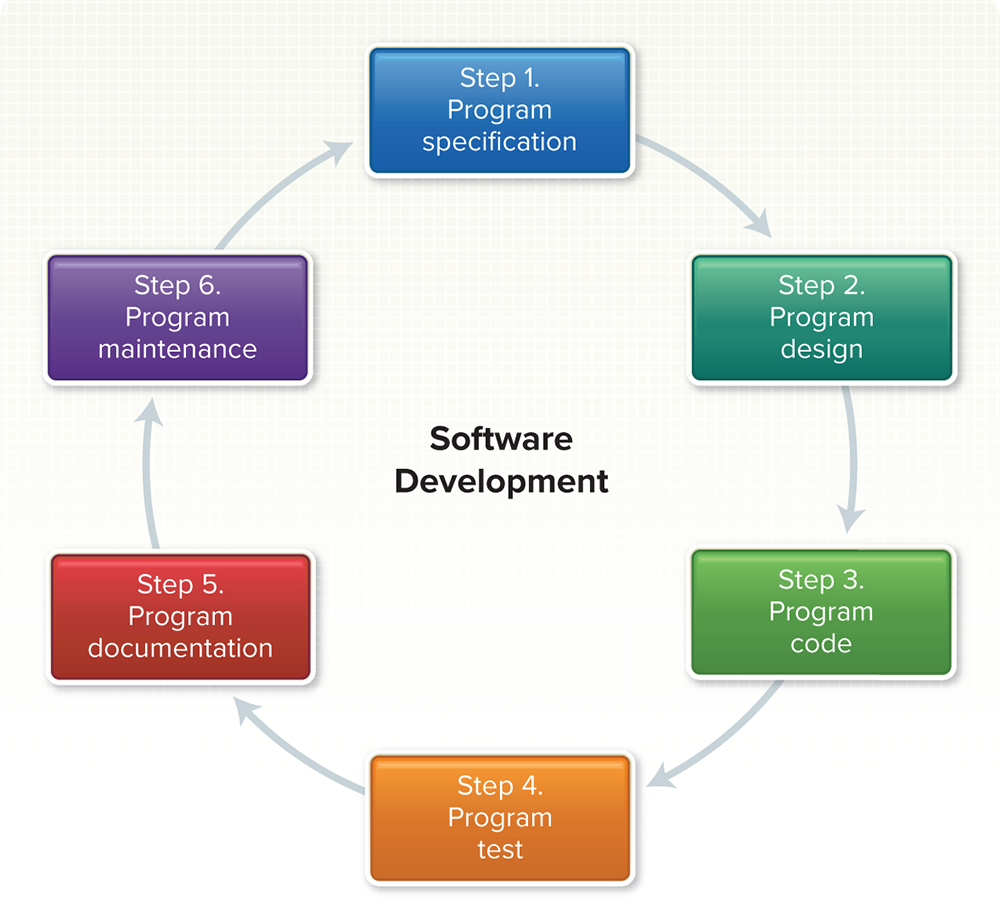

- Also known as software development.
- Follows a six-step process called the **Software Development Life Cycle
  (SDLC)**.

## Software Development Lifecycle Steps

1. **Program specification**: Determine objectives, outputs, inputs, and
   processing requirements.
2. **Program design**: Create a solution using programming techniques such as
   top-down program design, pseudocode, flowcharts, and logic structures.
3. **Program code**: Write or code the program using a programming language.
4. **Program test**: Test or debug the program for syntax and logic errors.
5. **Program documentation**: Formalize the written description and processes
   used in the program.
6. **Program maintenance**: Review completed programs for accuracy, efficiency,
   standardization, and ease of use, making changes as needed.

## Professionals in Programming

- Software engineers or programmers use the SDLC process.
- These professionals often work with systems analysts or directly with users.

## Conclusion

Programming is a problem-solving procedure that involves creating a list of
instructions for a computer to process data into information. Programs can be
application-based or custom-made. The programming process, also known as
software development, follows a six-step process called the Software Development
Life Cycle (SDLC). The SDLC involves specification, design, coding, testing,
documentation, and maintenance. Professionals in programming are often software
engineers or programmers who work with systems analysts or directly with users.

# Step 1: Program Specification

## Program Specification

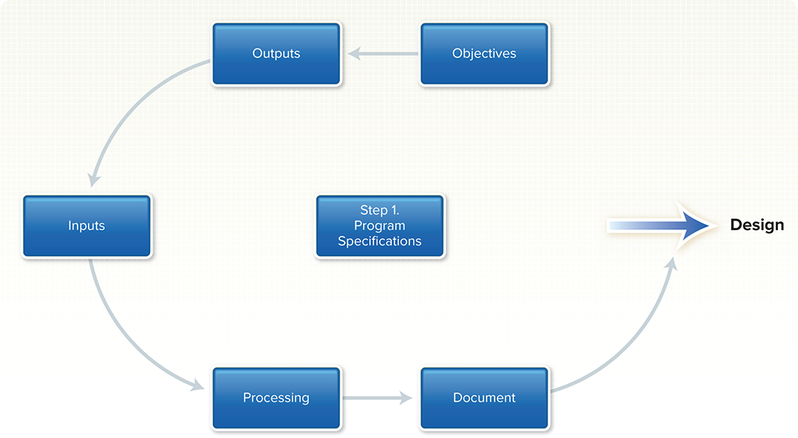

- Program specification is a process that involves specifying five items, which
  are:
    1. Program objectives
    2. Desired output
    3. Input data required
    4. Processing requirements
    5. Documentation
- It is also known as program definition or program analysis.

## Program Objectives

Program objectives are the problems that need to be solved through programming.

- The end user needs to make a clear statement of the problem they want to
  solve.
- An example could be creating a time-and-billing system to record the time
  spent on different jobs for different clients of Advantage Advertising.

## Desired Output

* Desired output should be specified before input.
* The end user should list what they want to get out of the computer system and
  how they want the output to look.
    * They should sketch or write a description of the output that they want.
    * For example, if they want a time-and-billing report, they might create a
      table of time spent on different jobs or bills for clients.

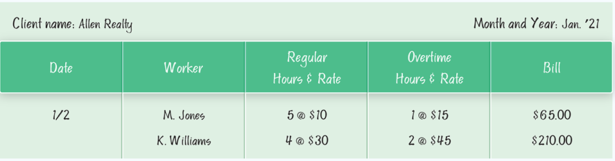

## Input Data

Once the desired output is known, the input data and the source of this data can
be determined.

- For example, for a time-and-billing report, one source of data
  could be time cards that are usually logs or statements of hours worked
  submitted either electronically or on paper forms.


## Processing Requirements

- Processing requirements define the processing tasks that must happen for input
  data to be processed into output.
- For Advantage Advertising, one of the processing tasks for the program could
  be adding the hours worked for different jobs for different clients.

## Program Specifications Document

Documentation is essential for program specifications. Program objectives,
desired outputs, input data, and processing requirements should all be recorded.
This leads to the next step, program design.

## Concept Check

- Program specification is the process of specifying program objectives, desired
  output, input data, processing requirements, and documentation.
- The first procedure is determining program objectives, which involves making a
  clear statement of the problem that needs to be solved. Desired outputs should
  be determined before input to help clarify the end goal.
- Processing requirements define the tasks that must be performed to process
  input data into output. Program specifications should be documented for
  ongoing reference and future use.

# Step 2: Program Design

## Program Design

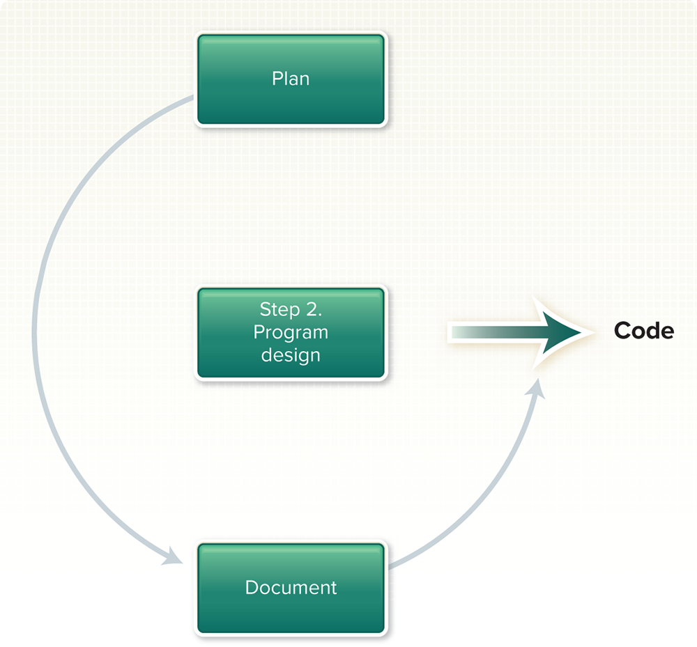

- Program design follows program specification.
- Use a structured programming technique for this step.
- Structured programming techniques include:
    1. Top-down program design
    2. Pseudocode
    3. Flowcharts
    4. Logic structures

## Top-Down Program Design

- First determine outputs and inputs for the program.
- Use top-down program design to identify program's processing steps (**program
  modules**, or just **modules**).
    - Each module is made up of logically related program statements
- Each module should have a single function.

### Example Top-Down Program Design

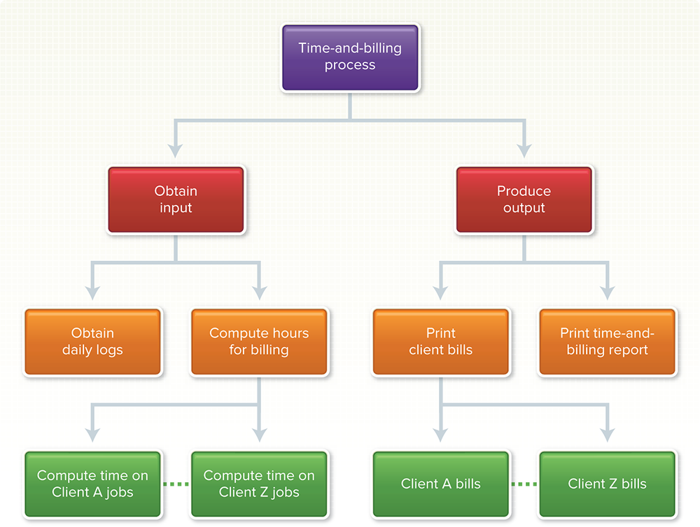

## Pseudocode

- Outline of the logic of the program.
- Summary of the program before it is written.

### Example Pseudocode

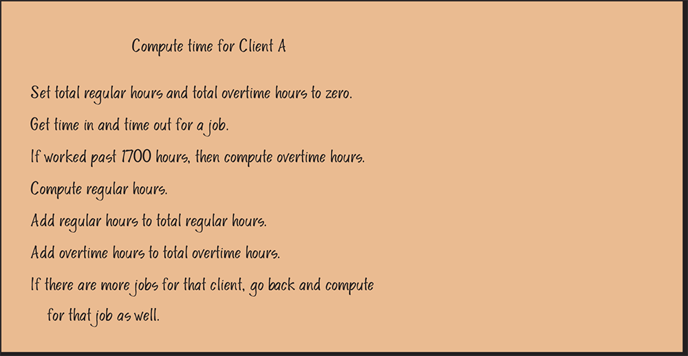

## Flowcharts

- Program flowcharts present the detailed sequence of steps needed to solve a
  programming problem.
- Standard flowchart symbols:
    - **Process**
    - **Input/output**
    - **Decision**
    - **Connector**
    - **Terminal**
- Flowcharts express the logic for program modules.

### Flowchart Symbols

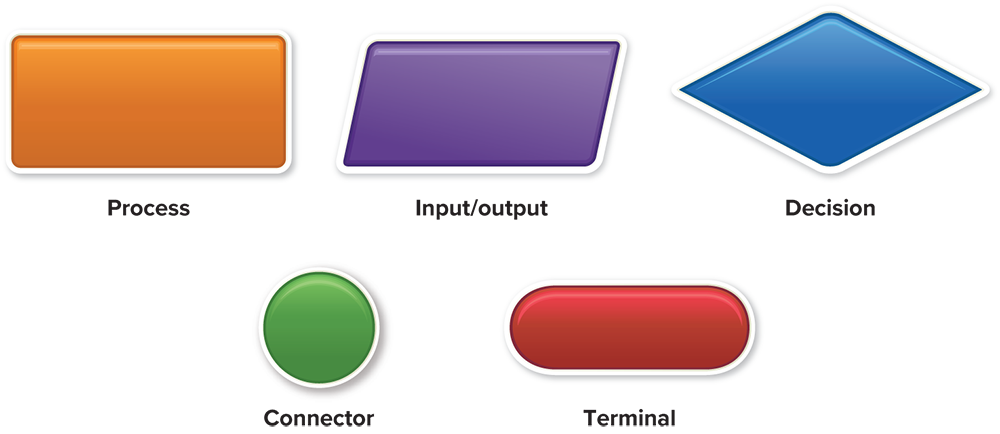

### Example Flowchart

This flowchart expresses all the logic for just one module&ndash;_“Compute time
on Client A jobs”_&ndash;in the top-down program design.

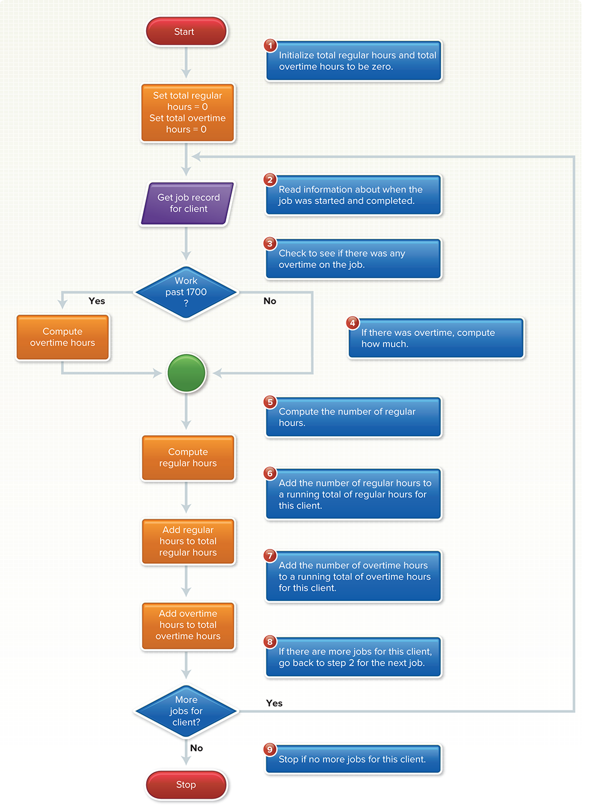

## Logic Structures

- The best way to link various parts of the flowchart is by using a combination
  of three **logic structures**:
    - **Sequential**
        - One program statement follows another
        - 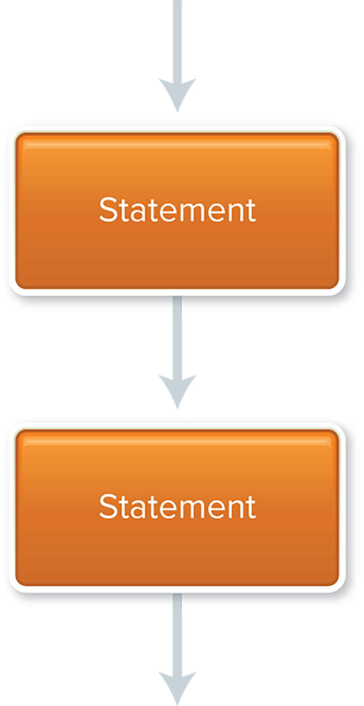
    - **Selection _(IF-THEN-ELSE)_**
        - A decision must be made and the outcome determines which of two paths
          to follow.
        - 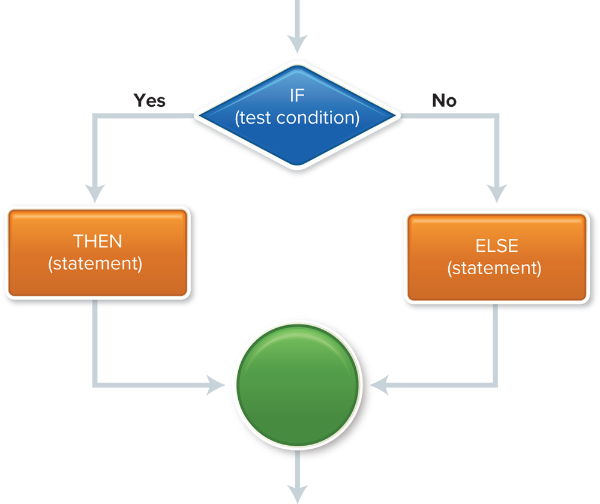
    - **Repetition structures**
        - A loop that repeats until a specific condition is met.
        - Also known as the **loop structure**.
        - 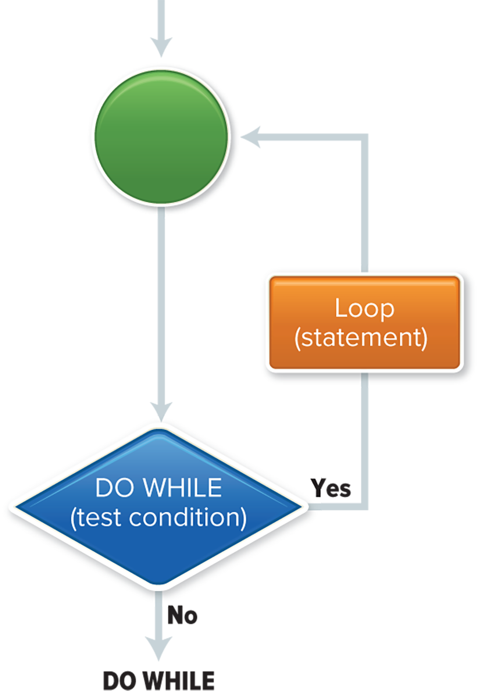

## Conclusion

- Program design is a crucial step in creating effective software.
- Structured programming techniques, such as top-down program design,
  pseudocode, flowcharts, and logic structures, help to organize and clarify the
  logic of a program.
- Using these techniques can improve the readability, maintainability, and
  overall quality of the resulting software.

# Step 3: Program Code

## What is coding?

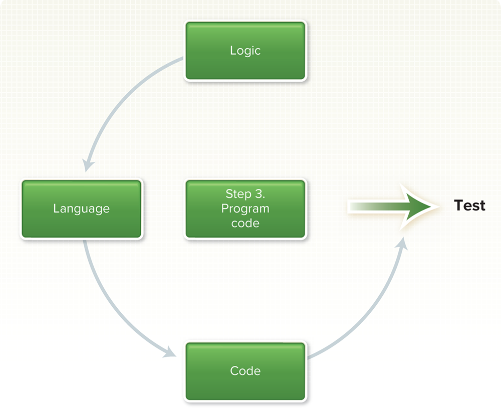

- Coding is the process of writing a program using the logic developed in the
  program design step.
- It is also known as "program code" which instructs the computer on what to do.

## The Good Program

- A good program should be reliable, catch obvious and common input errors, and
  produce correct output.
- It should be well-documented and understandable by programmers other than the
  person who wrote it.
- Structured programming is one of the best ways to write effective programs,
  using the logic structures described in **Step 2: Program Design**.

## Programming Languages

- A programming language uses a collection of symbols, words, and phrases to
  instruct a computer to perform specific operations.
- Programming languages process data and information for a wide variety of
  different types of applications.
- Examples of widely-used programming languages include
    - `C++`
    - `C#`
    - `Java`
    - `JavaScript`
    - `Python`
    - `Swift`

### Example `C++` Code

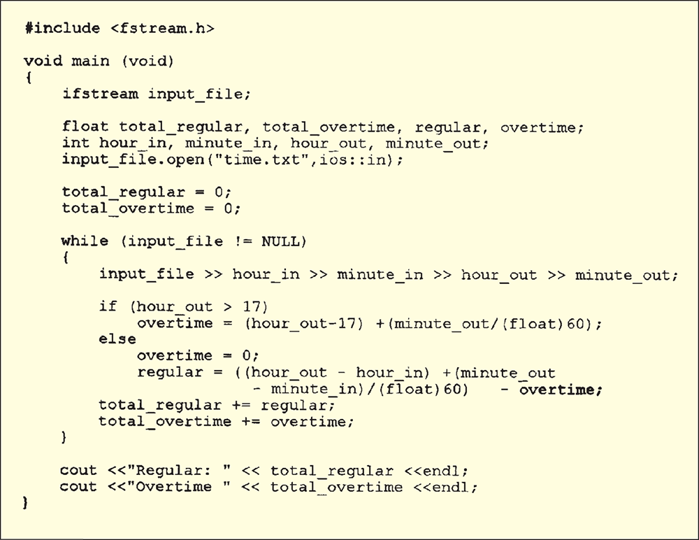

### Table Summary:

|   Language   | Description                                                                                                                |
|:------------:|:---------------------------------------------------------------------------------------------------------------------------|
|    `C++`     | Extends C to use objects or program modules that can be reused and interchanged between programs                           |
|     `C#`     | A programming language designed by Microsoft to extend C++ for developing applications in the Windows environment          |
|    `Java`    | Primarily used for Internet applications; similar to C++; runs with a variety of operating systems                         |
| `JavaScript` | Embedded into web pages to provide dynamic and interactive content                                                         |
|   `Python`   | General-purpose programming language that is simple and easy to learn. Frequently used in introductory programming courses |
|   `Swift`    | Uses graphical user interface and special code for touch screen interfaces to create apps for Apple iOS devices            |

## Testing and Debugging

- Once the program has been coded, the next step is testing or debugging the
  program.

## Conclusion

- In this section, we learned that coding is the process of writing a program
  using the logic developed in the program design step.
- A good program should be reliable, catch obvious and common input errors, and
  produce correct output.
- Programming languages use a collection of symbols, words, and phrases to
  instruct a computer to perform specific operations.
- Testing and debugging the program is the next step after coding.

# Step 4: Program Test

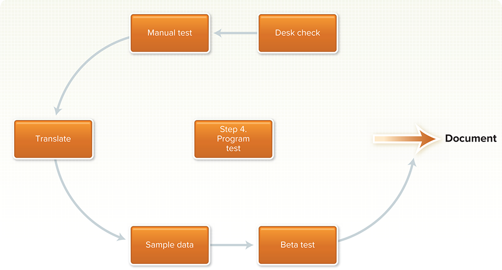

## Debugging

- Refers to the process of testing and then eliminating errors (“getting the
  bugs out”).
- Programming errors are of two types:
    - **Syntax errors**
    - **Logic errors**

## Syntax Errors

- Violation of the rules of the programming language.
- _Example: In `C++`, each statement must end with a semicolon (;). If the
  semicolon is omitted, then the program will not run or execute due to a syntax
  error._
- Testing of the compute time module in which a syntax error was identified.

## Logic Errors

- Occurs when the programmer uses an incorrect calculation or leaves out a
  programming procedure.
- _Example: A payroll program that did not compute overtime hours would have a
  logic error._

## Testing Process

Several methods have been devised for finding and removing both types of errors:

1. **Desk checking** or **code review**
    - A programmer sitting at a desk checks (proofreads) a printout of the
      program for syntax and logic errors.
2. **Manually testing with sample data**
    - A programmer follows each program statement and performs every calculation
      using sample data. The programmer compares the manually calculated values
      to those calculated by the program to look for programming logic errors.
3. **Attempt at translation**
    - The program is run through a computer, using a translator program. The
      translator attempts to translate the written program from the programming
      language (such as `C++`) into the machine language. Before the program
      will run, it must be free of syntax errors. Such errors will be identified
      by the translating program.
4. **Testing sample data on the computer**
    - After all syntax errors have been corrected, the program is tested for
      logic errors. Sample data is used to test the correct execution of each
      program statement.
5. **Testing by a select group of potential users (beta testing)**
    - It is usually the final step in testing a program. Potential users try out
      the program and provide feedback.

### Testing Process Summary

| Task | Description                                 |
|:----:|:--------------------------------------------|
|  1   | Desk check for syntax and logic errors      |
|  2   | Manually test with sample data              |
|  3   | Translate program to identify syntax errors |
|  4   | Run program with sample data                |
|  5   | Beta test with potential users              |

## Conclusion

- Debugging is the process of testing and then eliminating errors in a program.
- Syntax errors are violations of the rules of the programming language, while
  logic errors occur when the programmer uses an incorrect calculation or leaves
  out a programming procedure.
- The testing process includes desk checking, manually testing with sample data,
  attempting at translation, testing sample data on the computer, and beta
  testing with potential users.

# Step 5: Program Documentation

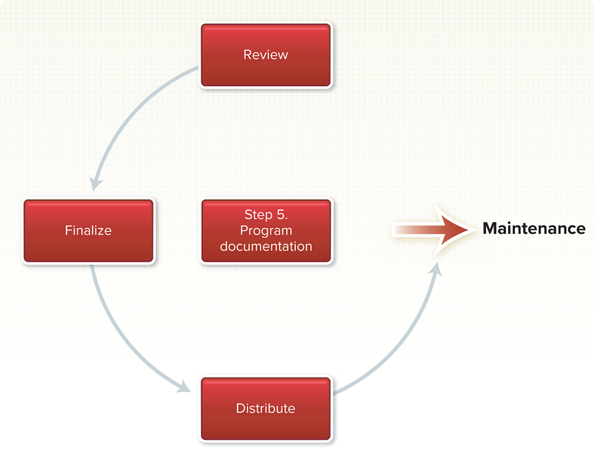

## Definition and Purpose of Documentation

- Documentation refers to written descriptions and procedures about a program
  and how to use it.
- It is not something done just at the end of the programming process, but
  rather carried on throughout all the programming steps.
- Documentation is important for people who may be involved with the program in
  the future, such as:
    - **Users**
    - **Operators**
    - **Programmers**

## Users and User Documentation

- Users need to know how to use the software.
- Printed manuals and the help option within most applications are two examples
  of user documentation.
- Some organizations may offer training courses to guide users through the
  program.

## Operators and Operator Documentation

- Documentation must be provided for computer operators.
- Operators need to know how to respond to error messages, for instance.

## Programmers and Programmer Documentation

- Other programmers wishing to update and modify the program may find themselves
  frustrated without adequate documentation.
- Programmer documentation should include text and program flowcharts, program
  listings, and sample output.
- It also might include system flowcharts to show how the particular program
  relates to other programs within an information system.

### Additional Information:

- Documentation is an essential aspect of software development that can help
  users, operators, and programmers to better understand and use the software.
- Program documentation occurs throughout all programming steps and not just at
  the end of the programming process.

## Conclusion

Program documentation is an essential aspect of software development that
ensures that people who may be involved with the program in the future can
easily understand and use it. The documentation should be written throughout all
the programming steps, including text and program flowcharts, program listings,
and sample output. Adequate documentation can help users, operators, and
programmers to better understand and use the software, while poor documentation
can lead to frustration and confusion.

# Step 6: Program Maintenance

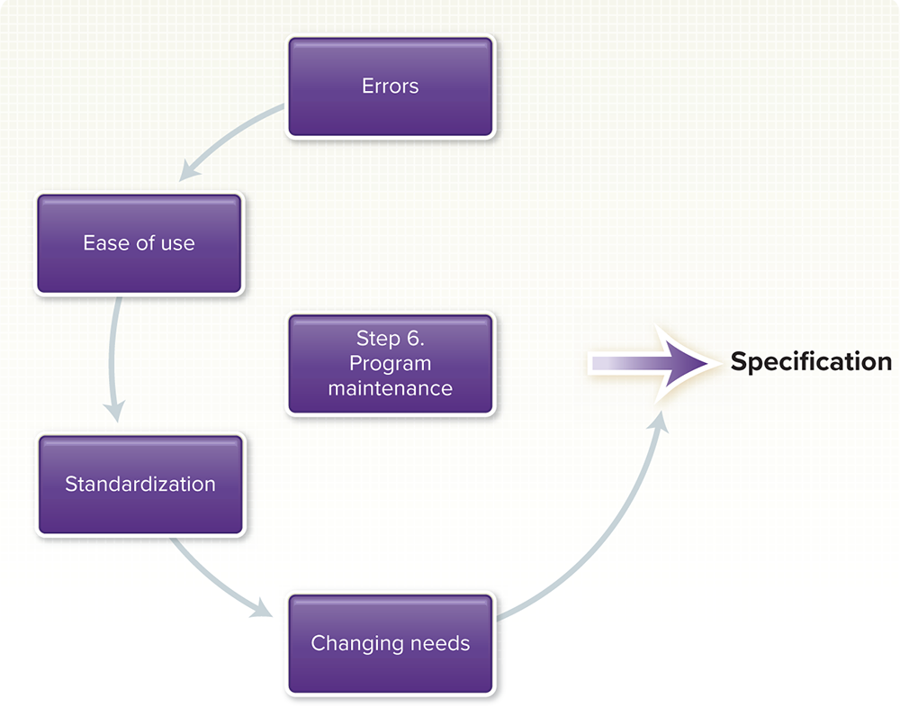

## Purpose of Program Maintenance

- The purpose of program maintenance is to ensure that current programs are
  operating error-free, efficiently, and effectively.
- Maintenance is responsible for locating and correcting operational errors,
  making programs easier to use, and standardizing software using structured
  programming techniques.
- Activities in this area fall into two categories:
    - **Operations**
    - **Changing needs**
- As much as 75 percent of the total lifetime cost for an application program is
  for maintenance.
    - This activity is so commonplace that a special job title, **maintenance
      programmer**, exists.

## Operations Activities

- Operations activities concern locating and correcting operational errors,
  making programs easier to use, and standardizing software using structured
  programming techniques.
- For properly designed programs, these activities should be minimal.
- Programming modifications or corrections are often referred to as **patches**.
    - If the patches are significant, they are known as **software updates**.
- For software that is acquired, it is common for the software manufacturer to
  periodically send patches or updates for its software.

## Changing Needs

- Programs need to be adjusted for a variety of reasons, including new tax laws,
  new information needs, and new company policies.
- Significant revisions may require that the entire programming process begin
  again with program specification.
- All organizations change over time, and their programs must change with them.

### Programming Process

- Ideally, a software project sequentially follows the six steps of software
  development.
- The six steps are **program specification**, **program design**, **program
  code**, **program test**, **program documentation**, and **program
  maintenance**.
- Some projects start before all requirements are known, in which case the SDLC
  becomes a more cyclical process, repeated several times throughout the
  development of the software.
- **Agile development**, a popular development methodology, starts by getting
  core functionality of a program working, and then expands on it until the
  customer is satisfied with the results.
- All six steps are repeated over and over as quickly as possible to create
  incrementally more functional versions of the application.

#### Summarizing The Six Steps of The Programming Process

| Step                     | Primary Activity                                                                                                                 |
|:-------------------------|:---------------------------------------------------------------------------------------------------------------------------------|
| 1. Program specification | Determine program objectives, desired output, required input, and processing requirements.                                       |
| 2. Program design        | Use structured programming techniques.                                                                                           |
| 3. Program code          | Select programming language; write the program.                                                                                  |
| 4. Program test          | Perform desk check (code review) and manual checks; attempt translation; test using sample data; beta test with potential users. |
| 5. Program documentation | Write procedure for users, operators, and programmers.                                                                           |
| 6. Program maintenance   | Adjust for errors, inefficient or ineffective operations, nonstandard code, and changes over time.                               |

## Conclusion

Program maintenance is an essential step in the software development process,
accounting for a significant portion of the total lifetime cost of an
application program. It involves two main categories of activities: operations
and changing needs. Operations activities focus on locating and correcting
operational errors, making programs easier to use, and standardizing software
using structured programming techniques. Changing needs refer to the need to
adjust programs for various reasons, including new company policies and tax
laws. The software development process typically follows the six steps outlined
in Figure 13-21, but it may become a more cyclical process if all requirements
are not known at the outset. Agile development, a popular methodology,
emphasizes quick iterations and core functionality.

# CASE and OOP

## CASE Tools

- **Computer-aided software engineering (CASE)** tools provide automation and
  assistance in program design, coding, and testing.
- CASE tools help in making professional programmers work easier, faster, and
  more reliable.
- Examples of CASE tools are Enterprise Architect from Sparx Systems and
  Smartdraw Software, LLC.

## Object-Oriented Software Development

- Traditional systems development focuses on the procedures needed to complete a
  certain objective.
- Object-oriented software development focuses on defining the relationships
  between previously defined procedures or "objects".
- Object-oriented programming (OOP) is a process by which a program is organized
  into objects.
- Each object contains both the data and processing operations necessary to
  perform a task.
- Programs built with objects are reusable, self-contained components, making
  the development process faster and easier.

### Object-Oriented Programming Example

- Object-oriented programming is like building a car from prefabricated parts
  instead of building it from scratch.
- Object-oriented programs assume that certain functions are the same and use
  reusable objects to accomplish them.
- For example, many programs have an instruction that will sort lists of names
  in alphabetical order. A programmer might use this object for alphabetizing in
  many other programs.

## Concept Check

- CASE tools are computer-aided software engineering tools that provide
  automation and assistance in program design, coding, and testing.
- Object-oriented software development is a development approach that focuses on
  defining relationships between previously defined procedures or "objects".
- Object-oriented programming is a process by which a program is organized into
  objects, each containing both data and processing operations necessary to
  perform a task.

## Conclusion

- CASE tools and object-oriented programming are two resources that help in
  making professional programmers work more efficient and reliable.
- While CASE tools assist in automation and program design, coding, and testing,
  object-oriented programming allows for faster development with reusable,
  self-contained components.

# Generations of Programming Languages

## Overview

- Computer professionals use levels or generations to classify programming
  languages.
- Programming languages are called lower level if they are closer to the
  language the computer uses and higher level if they are closer to the language
  humans use.
- There are five generations of programming languages:
    - Machine languages
    - Assembly languages
    - Procedural languages
    - Task-oriented languages
    - Problem and constraint languages

## Machine Languages: The First Generation

- Data in bits that consist of **1s** and **0s** is written in machine language.
- Example coding schemes developed from this two-state system are **EBCDIC**,
  **ASCII**, and **Unicode**.
- Machine languages are difficult to understand and vary according to the make
  of computer.

```
111100100111001111010010000100000111000000101011
```

## Assembly Languages: The Second Generation

- Assembly languages use abbreviations or mnemonics such as `ADD` that are
  automatically converted to machine language.
- Assembly languages are easier for humans to understand than machine languages.
- Assembly languages are also considered low level.

```sass
ADD 210(8, 13), 02 B(4, 7)
```

## High-Level Procedural Languages: The Third Generation

- High-level languages are considered **portable languages**.
- Procedural languages are also known as **3GLs (third-generation languages)**.
- Procedural languages are more English-like programming languages.
- Procedural languages are designed to express the logic that can solve general
  problems.
- Procedural languages must be translated into machine language so that the
  computer can process them.
- The translation is performed by either a compiler or an interpreter.
- `C++` is a procedural language widely used by today’s programmers.

```cpp
if (score > = 90) grade = ‘A’;
```

Like assembly languages, procedural languages must be translated into machine
language so that the computer processes them. Depending on the language, this
translation is performed by either a _compiler_ or an _interpreter._

- A **compiler** converts the programmer’s procedural language program, called
  the **source code**, into a machine language code, called the **object code**.
    - This object code can then be saved and run later.
    - The standard version of `C++` is a procedural language that uses a
      compiler.
- An **interpreter** converts the procedural language one statement at a time
  into machine code just before it is to be executed.
    - No object code is saved.
    - An example of a procedural language using an interpreter is the standard
      version of **BASIC**.

### Difference between Compiler and Interpreter

The following table summarizes the differences between a Compiler and an
Interpreter.

|      **Criteria**      | **Compiler**                                  | **Interpreter**                                                           |
|:----------------------:|:----------------------------------------------|:--------------------------------------------------------------------------|
| **Conversion process** | Converts entire source code to object code    | Converts one line of code to machine code                                 |
| **Execution process**  | Runs object code                              | Executes the converted code and repeats the process for each line of code |
| **Program execution**  | Faster execution once object code is obtained | Slower execution compared to compiled programs                            |
|    **Program size**    | More efficient for large programs             | Not as efficient for large programs                                       |
|    **Development**     | Programs are generally harder to develop      | Programs are easier to develop                                            |
|     **Debugging**      | Debugging is generally harder                 | Debugging is easier                                                       |

#### Steps

- **Compiler**
    1. Converts entire source code to object code
    2. Runs object code

- **Interpreter**
    1. Converts one line of code to machine code
    2. Executes the converted code
    3. Repeats the above steps for every line of code in the program

## Task-Oriented Languages: The Fourth Generation

### Overview

- Task-oriented languages are also known as 4GLs (fourth-generation languages).
- They require little special training on the part of the user.
- 4GLs are designed to solve specific problems.

### Comparison with 3GLs

- 3GLs require training in programming.
- 4GLs are nonprocedural and focus on specifying the specific tasks the program
  is to accomplish.
- 4GLs are more English-like and easier to program.

### Query Languages

- Query languages enable nonprogrammers to use certain easily understood
  commands to search and generate reports from a database.
- One of the most widely used query languages is SQL (Structured Query
  Language).
- Example SQL command to create a list of clients who incurred overtime charges:
    ```sql
    SELECT client FROM dailyLog WHERE serviceEnd >17
    ```
- Microsoft Access can generate SQL commands using its Query wizard.

### Application Generators

- Also known as a **program coder**
- An application generator provides modules of prewritten code.
- It greatly reduces the time to create an application.
- Access has a report generation application and a Report wizard for creating a
  variety of different types of reports using database information.

### Conclusion

- Task-oriented languages or 4GLs are useful because they require little special
  training on the part of the user.
- Query languages and application generators are examples of 4GLs that make it
  easy for nonprogrammers to search and generate reports from a database or
  quickly create a program by referencing prewritten code modules.

## Problem and Constraint Languages: The Fifth Generation

- The fifth-generation language (5GL) incorporates the concepts of artificial
  intelligence to allow a person to provide a system with a problem and some
  constraints and then request a solution.
- These languages enable a computer to learn and to apply new information as
  people do.
- Researchers are actively working on the development of 5GL languages.

```sql
Get patientDiagnosis from patientSymptoms “sneezing”,“coughing”, “aching”
```

## Summary of Generations of Programming Languages

| Generation                      | Sample Statement                                                             |
|:--------------------------------|:-----------------------------------------------------------------------------|
| First: Machine                  | `111100100111001111010010000100000111000000101011`                           |
| Second: Assembly                | `ADD 210(8,13),02B(4,7)`                                                     |
| Third: Procedural               | `if (score >= 90) grade = 'A';`                                              |
| Fourth: Task                    | `SELECT client FROM dailyLog WHERE serviceEnd > 17`                          |
| Fifth: Problems and Constraints | `Get patientDiagnosis from patientSymptoms "sneezing", "coughing", "aching"` |

## Concept Check

- A lower-level language is closer to the language the computer uses, while a
  higher-level language is closer to the language humans use.
- Machine languages are written in 1s and 0s and are difficult to understand,
  while assembly languages use abbreviations that are automatically converted to
  machine language and are easier for humans to understand.
- Procedural languages express the logic that can solve general problems, while
  task-oriented languages are designed to solve specific problems.
- Problem and constraint languages are fifth-generation languages that
  incorporate the concepts of artificial intelligence to allow a person to
  provide a system with a problem and some constraints and then request a
  solution.

## Conclusion

The generations of programming languages reflect the evolution of programming
from the use of low-level machine languages to more human-readable high-level
languages that allow for the creation of complex software applications. Each
generation of languages has its unique features and advantages, and programmers
should choose the language that best suits their project's requirements.

# Careers in IT

## Overview

- Computer programmers create, test, and troubleshoot computer programs.
- They may work on a project basis as consultants, employed by companies or
  other businesses.
- Demand for computer programmers with specializations in advanced programs
  continues to exist.
- The field requires at least a bachelor's degree in computer science or
  information systems, but a two-year degree could also lead to a position in
  the field.
- Employers looking for programmers usually prioritize previous experience.
- Necessary qualities for computer programmers are patience, logical thinking,
  attention to detail, and the ability to communicate technical information to
  non-technical people.
- The average annual salary for computer programmers is between $65,760 to
  $112,120.
- Talented programmers have advancement opportunities such as a lead programmer
  position or supervisory positions.
- Programmers with specializations and experience also may have an opportunity
  to consult.

## A Look to the Future: Your Own Programmable Robot

### Overview

- The field of robotics is continually advancing and making better programming
  tools.
- Several companies are already mass-producing programmable robots for
  individuals and educational institutions.
- A future where robots can understand human instructions instead of complex
  programming languages is possible.
- The hardware components needed to make robots are becoming cheaper.
- Developers will use sophisticated programming to give the robot the artificial
  intelligence necessary to understand natural language.
- Speech recognition continues to improve, but many improvements are necessary
  before a humanoid robot will be able to converse with humans.

### Examples

- The Roomba from iRobot was one of the earliest robots available to consumers
  and is essentially an automated, intelligent vacuum cleaner.
- Aldebaran Robotics created small, humanoid robots called Nao, which the
  end-user can program.
- Using a GUI, students can create programs that the robot will follow.
- The Nao robots are being mass-produced and are being marketed toward schools
  and research institutions.
- Developers will use sophisticated programming to give the robot the artificial
  intelligence necessary to understand natural language, which will be embedded
  in a chip within the robot.

### Useful tips and tricks

- Programming skills may be necessary to program robots in the future.
- Technology is making better programming tools that will make programming
  robots easier.
- Speech recognition continues to improve, but many improvements are necessary
  before a humanoid robot will be able to converse with humans.

### Conclusion

The field of computer programming requires patience, logical thinking, attention
to detail, and the ability to communicate technical information to non-technical
people. Programmers can expect to earn an annual salary in the range of $65,760
to $112,120, and there are advancement opportunities for talented programmers.
In the future, owning a programmable humanoid robot that understands natural
language is possible. However, many improvements are necessary in speech
recognition technology to achieve this goal.

